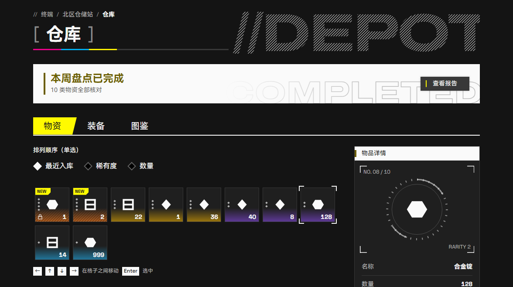
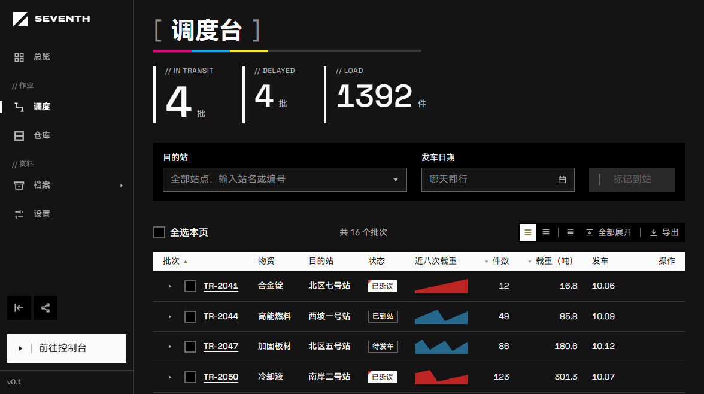
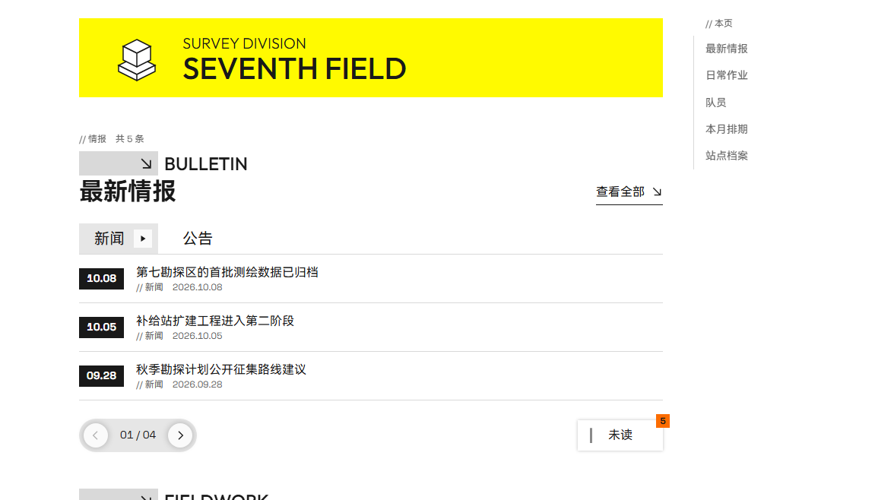
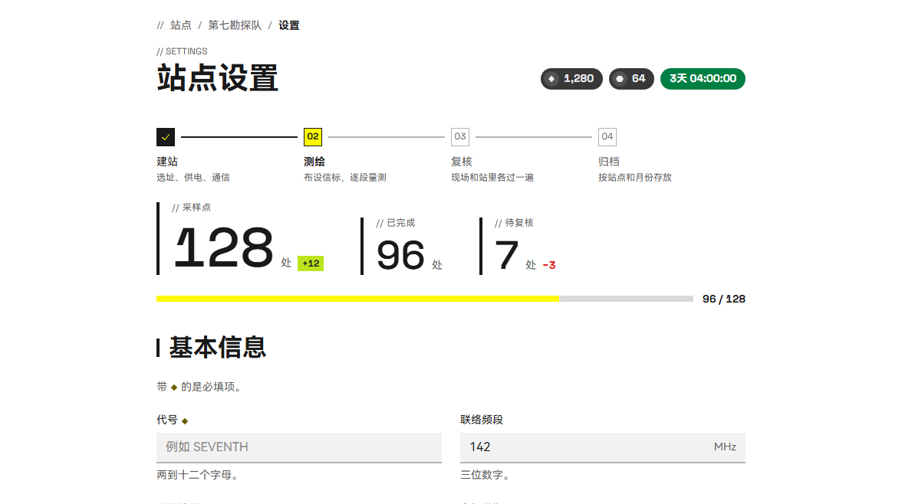
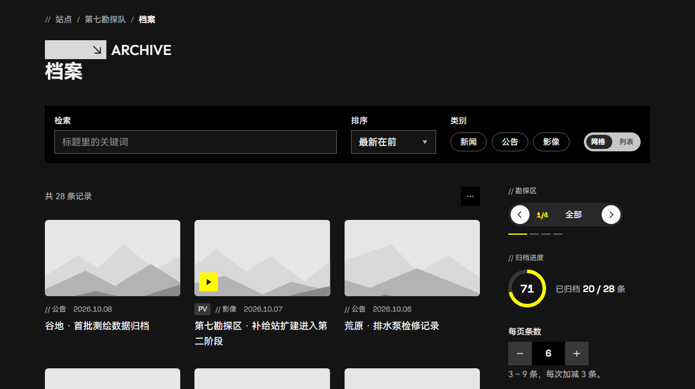
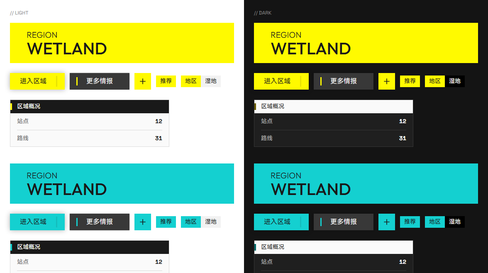

# endfield-ui

《明日方舟：终末地》设计风格指导文档，以及按这套文档实现的 React + Tailwind CSS v4 组件库。

> 非官方的爱好者项目，与鹰角网络（Hypergryph）无关。本仓库不包含任何官方素材。详见 [NOTICE](NOTICE.md)。

[在线预览](https://icaruszezen.github.io/endfield-ui/) · [设计文档](docs/README.md) · [组件库用法](packages/ui/README.md) · [路线](ROADMAP.md)

[](https://icaruszezen.github.io/endfield-ui/?path=/story/示例-仓库页--page&globals=theme:dark)

## 这个仓库是什么

四样东西，后一样建立在前一样上：

| | 是什么 | 位置 |
| --- | --- | --- |
| 设计风格文档 | 把终末地官网、游戏界面和宣传物料的视觉语言拆成能照着做的规范：色彩、字体、形状、布局、动效，标志性的母题，以及每个控件的规格 | [docs/](docs/README.md) |
| 设计令牌 | 文档里的取值落成一份 Tailwind CSS v4 的 `@theme`，可以脱离组件单独用 | [theme.css](packages/ui/src/styles/theme.css) |
| 组件库 | `@endfield-ui/react`：按规范实现的 React 控件，适配亮 / 暗主题 | [packages/ui/](packages/ui/README.md) |
| 预览站 | Storybook：每个控件的变体与状态，外加几个用它们搭出来的示例页 | [apps/docs/](apps/docs/README.md) |

这套风格可以叫**工业编辑风**：纸白或烟黑的底、墨黑的字、一处高饱和的信号黄，再叠一层克制的印刷与测绘痕迹。它不等于"黑底黄字加切角"，六条核心原则：

1. 纸与墨是主体，颜色是信号；
2. 主角偏心，信息靠边；
3. 形状有含义；
4. 中文负责阅读，英文负责结构；
5. 纹理有预算；
6. 动得短，动得硬。

展开见 [设计总纲](docs/design/overview.md)。

## 组件库展示

在线预览：<https://icaruszezen.github.io/endfield-ui/>。侧栏分三组——**示例**、**控件**、**母题**；工具栏上的主题开关默认把同一个控件的亮暗两套并排摆出来。

### 示例页

用库里的控件搭出来的完整页面，点图在线打开。上面那张是仓库页；另外四个：

| 调度台 | 内容页 |
| --- | --- |
| [](https://icaruszezen.github.io/endfield-ui/?path=/story/示例-调度台--page&globals=theme:dark) | [](https://icaruszezen.github.io/endfield-ui/?path=/story/示例-内容页--page&globals=theme:light) |
| 带外壳的一页：侧轨（窄屏换成顶栏加全屏菜单）、统计块、组合框与日期范围筛选，一张能排序、勾选、展开看明细、带行内操作和右键菜单的表格，表格上面一条工具栏；目的站是链接，悬停出一张悬浮卡 | 官网气质的一页：通栏色带与分节标题、页签、面板，往下是媒体轮播、头像切换和排期，最后一组能点开看大图的现场照片；够宽时右边一列页内目录 |

| 设置页 | 列表页 |
| --- | --- |
| [](https://icaruszezen.github.io/endfield-ui/?path=/story/示例-设置页--page&globals=theme:light) | [](https://icaruszezen.github.io/endfield-ui/?path=/story/示例-列表页--page&globals=theme:dark) |
| 表单与反馈：页头、步骤条、字段与校验、下拉选择与组合框、标签输入、文件上传、验证码输入、分段选择、滑块、折叠面板，带一次完整的"提交 → 报错 → 改正 → 保存" | 页头，检索、排序、筛选，网格与列表两种视图，分页；侧栏里是胶囊导航器、进度环、步进器和一条限高、在滚动区里滚的时间线 |

演示内容都是原创的占位图和虚构文案。

### 控件一览

| 类别 | 控件 |
| --- | --- |
| 基础 | Button / ButtonGroup、IconButton、Toolbar、Tag / TagPair、Badge、Kbd、SectionTitle、BracketTitle、Tabs、Panel |
| 表单 | Field、Input、OtpInput、Textarea、Select、Combobox、TagInput、DatePicker / DateRangePicker / Calendar、FileUpload / FileItem、Checkbox、Radio / RadioGroup、SegmentedControl、Switch、Stepper、Slider、FilterChip |
| 反馈 | Alert、Toast、Progress / ProgressRing、Spinner、Skeleton、EmptyState、Loader、CompletionBanner、RecIndicator |
| 浮层 | Tooltip、Popover、HoverCard、Dialog、Drawer、DropdownMenu、ContextMenu、FlyoutBar |
| 展示 | Table（行能展开）、Stat、Sparkline、DataRowList / DataRow、List / ListRow、Accordion、ScrollArea、MediaCard、PlayButton / PlayMark、Carousel、ImageViewer、ItemSlot / ItemGrid、Avatar、Timeline、Schedule、Term、ResourceChip、Countdown、Marquee、ScrollHint |
| 导航 | SideRail（含二级）、TopBar、NavMenu、NavAction、PageHeader、Breadcrumb、Pagination、Navigator、AvatarSwitcher、DashIndicator、Steps、Toc、BackToTop |
| 母题 | CornerBrackets、Viewfinder、GhostText、Hatch、Texture、RegistrationStrip、TickRing、HazardStripe |

- **亮、暗与局部主题。** 默认亮色，`data-theme="dark"` 写在 `<html>` 或任意容器上就是暗色。标题带这类"和页面相反"的区域是 `data-theme="inverse"`，放进去的按钮、复选框、焦点环按这条带子的底色取值，见 [色彩](docs/design/foundations/color.md#反转块里的局部主题)。
- **强调色可以换。** 信号黄能整体换成自己的主题色（下图的下半是换成青色的样子），见 [主题色接管](docs/design/foundations/color.md#主题色接管)。
- **母题同时是工具类。** 切角、斜楔、角括号、镂空字、斜纹、底纹除了组件，还是 Tailwind 工具类（`cut-tr`、`wedge-r`、`corner-brackets`、`dot-grid`…），见 [styles/README.md](packages/ui/src/styles/README.md#母题工具类)。
- **行为交给 Base UI。** 浮层和组合框的焦点、键盘、定位建立在 [Base UI](https://base-ui.com) 上，其余控件用的是原生元素。
- **链接接得上路由。** 能当链接用的控件除了 `href` 还收一个 `render`，用来接路由库的链接组件。

[](https://icaruszezen.github.io/endfield-ui/?path=/story/示例-主题色接管--takeover)

### 在本地看

```bash
pnpm install
```

```bash
pnpm dev
```

第二条命令启动 Storybook（`http://localhost:6106`）。其余命令见 [packages/ui/README.md](packages/ui/README.md#开发)。

每次推送到 `main`，[GitHub Actions](.github/workflows/deploy.yml) 会跑格式检查、代码检查、类型检查、测试和构建，把 Storybook 发布到上面的在线地址，并在真的浏览器里跑一遍键盘、焦点与布局的[实测](apps/docs/README.md#浏览器实测)。

## 仓库结构

```
endfield-ui/
├── docs/                      设计风格文档
│   ├── design/
│   │   ├── overview.md        设计总纲
│   │   ├── foundations/       基础：色彩、字体、形状、布局、动效、纹理、图标、图像
│   │   ├── elements/          母题：切角、括号、斜纹、分节标题、镂空字、底纹、测绘叠层
│   │   ├── surfaces/          载体：官网、游戏界面、宣传物料
│   │   ├── components/        组件：按钮、导航、卡片、表单、反馈、浮层、数据展示
│   │   ├── references/        依据：官网实测数据、官方来源、开源项目调研
│   │   └── assets/            原创 SVG 图解
│   └── screenshots/           这一页用的示例页截图
├── packages/
│   └── ui/                    组件库 @endfield-ui/react
│       └── src/
│           ├── components/    一组件一目录
│           ├── styles/        令牌、母题工具类、样式入口
│           ├── hooks/         通用 hooks
│           ├── lib/           工具函数
│           └── icons/         原创图标
├── apps/
│   └── docs/                  Storybook 预览站
│       ├── stories/           每个组件一个文件，外加几个示例页
│       └── browser-checks/    在真的浏览器里做的检查（键盘、焦点、布局）
├── pnpm-workspace.yaml
├── ROADMAP.md                 路线
├── NOTICE.md                  版权与商标声明
└── LICENSE
```

- 仓库按 pnpm monorepo 组织，需要 Node 22 以上与 pnpm 10。
- 依赖方向只有一个：`apps/docs → packages/ui`，所以 stories 放在预览站里，不在组件目录里。
- 视觉上的决定以 `docs/design` 为准；令牌的唯一来源是 [theme.css](packages/ui/src/styles/theme.css)，文档里的令牌表与它逐项对应。
- 三个目录各有一份说明：[docs/](docs/README.md)（完整索引与阅读建议）、[packages/ui/](packages/ui/README.md)（用法与命令）、[apps/docs/](apps/docs/README.md)（预览站与浏览器实测）。

## 使用

### 使用组件

```bash
pnpm add @endfield-ui/react
```

样式入口一行，然后直接用组件：

```css
@import "@endfield-ui/react/tailwind.css";
```

```tsx
import { Button, Field, Input, Tag } from "@endfield-ui/react";

<Button variant="action">前往游戏</Button>
<Tag variant="outline">限时活动</Tag>
<Field label="代号" help="两到十二个字母。">
  <Input placeholder="例如 SEVENTH" />
</Field>
```

默认亮色；在 `<html>` 或任意容器上加 `data-theme="dark"` 切到暗色。不用 Tailwind 的项目、主题切换的 hook 等见 [packages/ui/README.md](packages/ui/README.md)。

### 只使用设计令牌

令牌文件可以独立于组件使用。在一个已经装好 Tailwind CSS v4 的项目里：

```css
@import "tailwindcss";
@import "./theme.css"; /* 从 packages/ui/src/styles/ 复制 */
```

```html
<html data-theme="dark">
  <body class="bg-surface font-sans text-ink">
    <button class="bg-action px-6 py-3 text-lg font-medium text-on-action">
      前往游戏
    </button>
  </body>
</html>
```

注意：`theme.css` 会清掉 Tailwind 的默认色板、圆角、阴影与字阶，只保留这套系统自己的令牌。各令牌的含义见 [色彩](docs/design/foundations/color.md)、[字体](docs/design/foundations/typography.md)、[形状](docs/design/foundations/shape.md)、[动效](docs/design/foundations/motion.md)。

## 文档的依据

- **官网**：直接测量 [endfield.hypergryph.com](https://endfield.hypergryph.com/) 的样式，原始数据记录在 [measurements.md](docs/design/references/measurements.md)。
- **游戏界面与宣传物料**：本仓库没有实机截图，这部分主要整理自社区开源项目的归纳，文档中一律标注为"社区"。
- **开源项目**：调研了 GitHub 上十余个相关项目，逐项记录了可借鉴之处与许可证，见 [open-source-projects.md](docs/design/references/open-source-projects.md)。

文档里的每条规范都标了来源等级（实测 / 观察 / 社区 / 推断），方便判断哪些是事实、哪些是建议。

## 参与

做过什么、接下来打算做什么，见 [ROADMAP.md](ROADMAP.md)。欢迎补充与校正，尤其是：

- 游戏界面的实机观察（目前证据最薄的部分）；
- 官网改版后的重新测量；
- 文档中标为"推断"的数值的更好依据。

请只提交原创内容，不要提交官方截图、立绘、Logo、图标或字体文件。

## 许可

仓库内的原创内容以 [MIT License](LICENSE) 发布。《明日方舟：终末地》及其全部官方素材的权利归鹰角网络所有，不在本许可范围内，详见 [NOTICE](NOTICE.md)。
