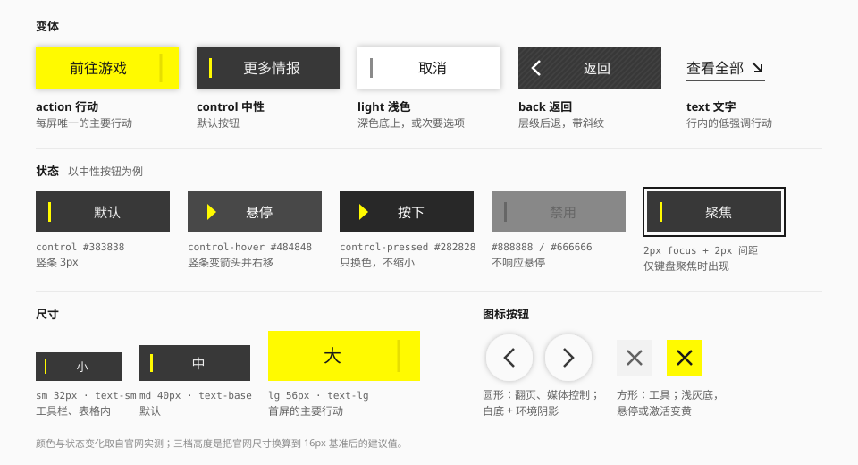

# 按钮

## 用途

触发一个行动。这套语言里按钮的特点：**直角、实色、左侧一条黄色竖条，悬停时竖条变成箭头**。

## 变体

| 变体 | 外观 | 用在哪 | 来源 |
| --- | --- | --- | --- |
| `action` | 信号黄底、墨字、右侧一条深黄分隔线 | 每屏唯一的主要行动 | 实测（官网首页大按钮） |
| `control` | 深灰底、浅字、左侧黄色竖条 | **默认。** 大多数按钮 | 实测（官网通用按钮） |
| `light` | 白底、墨字、左侧灰色竖条 | 深色底上；或与 `control` 并排时的次要项 | 实测 |
| `back` | 深灰底叠斜纹、左侧箭头 | 返回上一级 | 实测 |
| `text` | 无底、墨字、下划线、斜箭头 | 行内或列表末尾的低强调行动 | 推断 |
| `danger` | `control` 的结构，竖条换成红色 | 删除、不可逆操作 | 推断 |

### 关于"主要行动"

两个容易做错的地方：

- **黄色按钮一屏只有一个。** 官网只在首屏的核心入口用黄底；版块里的"更多情报""更多视频"都是深灰的 `control`。
- **最重要的按钮不一定是黄的。** 官网导航轨上的"前往游戏"是黑底白字，悬停才变黄。当页面已经有黄色的当前项、色带时，主要行动用墨黑反而更突出。

游戏界面另有一套：工具面上的主行动是**白色胶囊 + 圆形图标章**，次行动是深色胶囊（社区）。做游戏风格界面时可以把 `action` 与 `control` 的形状换成胶囊，颜色逻辑不变。

## 规格

| 项 | `sm` | `md` | `lg` |
| --- | --- | --- | --- |
| 高度 | 32px | 40px | 56px |
| 字号 | `text-sm` | `text-base` | `text-lg` |
| 字重 | Medium | Medium | Medium |
| 水平内边距 | 12px | 16px | 24px |
| 竖条 | 2 × 16px | 3 × 20px | 3 × 28px |
| 竖条到文字 | 8px | 10px | 12px |
| 最小宽度 | 64px | 96px | 160px |

| 项 | 值 | 来源 |
| --- | --- | --- |
| 圆角 | 0 | 实测 |
| 阴影 | `shadow-xs`；`action` 用 `shadow-md` | 实测 |
| 竖条高度 | 按钮高度的 55% 左右 | 实测 |
| 文字对齐 | 居中；竖条绝对定位在左侧，不参与居中 | 实测 |
| 行高 | 1 | 实测 |

官网的按钮宽高比很大（通用按钮 20 × 4.5rem，约 4.4:1）。按钮宁可宽一些，不要把文字挤到贴边。

实现里，带竖条的变体（`control`、`light`、`danger`）左右留白比上表更宽、并且对称：28 / 40 / 52px。多出来的部分是给"箭头盒 + 悬停位移"留的，保证文字再长也不会被箭头压到；文字仍然在整个按钮里居中。箭头的位移相应收到 4 / 6 / 8px——官网的 10px 位移是配 240px 宽的按钮的。

## 状态

### `control`

| 状态 | 底 | 字 | 竖条 |
| --- | --- | --- | --- |
| 默认 | `control` `#383838` | `on-control` `#EEEEEE` | 黄，竖条 |
| 悬停 | `control-hover` `#484848` | 白 | 黄，变成三角并右移约 10px |
| 按下 | `control-pressed` `#282828` | 白 | 保持三角 |
| 禁用 | `disabled` | `on-disabled` | `on-disabled`，竖条 |
| 聚焦 | 同默认 | — | 外加焦点环 |

### `action`

| 状态 | 底 | 字 | 分隔线 |
| --- | --- | --- | --- |
| 默认 | `action` `#FFFA00` | `on-action` `#191919` | `#FFF500` |
| 悬停 | 不变 | 不变 | `#EFE701` |
| 按下 | `action-pressed` `#EEEA00` | 不变 | `#E6DE01` |
| 禁用 | `disabled` | `on-disabled` | `on-disabled` 20% |

黄色按钮悬停时底色**不变**，只有分隔线加深（实测）。黄已经是最亮的颜色，再变亮没有意义，变暗又像是被按下。

实现里分隔线不写死这三个黄：用 `on-action` 以 10% → 15% → 20% 的不透明度叠在底色上。在信号黄上的结果约为 `#E8E303` → `#DDD804` → `#D1CD05`，比实测的三档略深一点，换来的是主题色接管时分隔线自动跟着变。

### `light`

默认白底墨字、灰色竖条（`#888888`，取 `neutral-500`）；悬停底变 `#F0F0F0`（取 `neutral-100`）；竖条同样变成箭头。

它在亮、暗两个主题下**都是白的**，不跟着 `surface` 翻转——这个变体本来就是给深色底用的。

### 禁用

官网的禁用按钮对比度很低（`#666666` 压 `#888888`，约 1.6:1），而且这个底色在暗色页面上比正常按钮还亮。实现改用按主题取值的 `disabled` / `on-disabled`（亮色 2.9:1，暗色 2.4:1），所有带底色的变体共用；`text` 变体的禁用是 `ink-disabled` 文字。

禁用态不要求达到正文对比度，但建议在旁边用文字说明不可用的原因。

## 悬停动效

竖条变箭头是这个按钮的标志。实现要点：

- 竖条与箭头是同一个伪元素，`clip-path` 在两个四点多边形之间过渡；
- 同时 `translateX` 右移；
- 时长 `--duration-base`，缓动 `ease-standard`；
- 套在 `@media (hover: hover)` 里，触屏上不触发（Tailwind v4 的 `hover:` 默认如此）。

代码见 [动效](../foundations/motion.md) 的"竖条变箭头"。

## 图标按钮

| 形态 | 变体名 | 外观 | 用在哪 | 来源 |
| --- | --- | --- | --- | --- |
| 圆形 | `floating` | 白底（`neutral-50`，两个主题下都是白的）、`shadow-sm`、墨色图标 | 翻页、媒体控制、浮在图像上的操作 | 实测 |
| 方形 | `plain` | 浅灰底（`surface-sunken`）、中灰图标 | 工具栏、顶栏 | 实测 |
| 方形强调 | `accent` | 悬停或激活时变信号黄 | 分页方钮 | 实测 |
| 方形反转 | `inverse` | 悬停或激活时变墨底、图标变黄 | 分享、开关类工具 | 实测 |

`inverse` 在暗色主题下反过来：底变近白（`surface-inverse`），图标用 `accent-ink-inverse`——黄色图标压在白底上是看不见的。

| 项 | `sm` | `md` | `lg` |
| --- | --- | --- | --- |
| 尺寸 | 32px | 40px | 48px |
| 图标 | 16px | 20px | 24px |

- 圆形按钮成对出现（上一个 / 下一个）时，可以包在一个浅灰或近黑的胶囊里。
- 关闭按钮在悬停时旋转 90°（实测）。
- 必须有 `aria-label`。

## 按钮组

- 并排的按钮之间留 8 – 12px。
- 主要行动放在最右（或最下）。
- 一组里最多一个 `action`。
- "取消 + 确认"用 `light` + `control`，而不是"灰 + 黄"——把黄色留给真正重要的时刻。
- 一白一黄的并列按钮对（如"×1 / ×10"）来自游戏内的抽取界面（社区），只在两个选项同等重要、且确实是页面核心行动时使用。

## 内容

- 文字 2 – 6 个汉字。动词开头："查看全部""前往游戏"。
- 不要在按钮里放两行文字。
- 图标在文字左侧；表示"前往"的箭头在右侧。
- 加载中：文字换成"处理中"并显示一个小的加载指示，按钮宽度不变，禁止重复点击。实现里加载指示是一个旋转的小方块，占的就是各变体自己的记号位——`control` 的竖条、`action` 分隔线右侧的窄条、`back` 的箭头、`text` 的斜箭头——所以不会挤动文字。

## 无障碍

- 用 `<button>`；跳转用 `<a>`。
- 禁用用 `disabled` 属性；需要在禁用时仍可聚焦以读出原因时，用 `aria-disabled="true"`。
- 竖条、箭头、纹理都是装饰。
- 焦点环：`focus-visible:outline-2 outline-offset-2 outline-focus`。

## 宜 / 忌

**宜**

- 默认用 `control`。
- 让按钮足够宽。
- 用位置和大小表达主次，再用颜色。

**忌**

- 一屏多个黄色按钮。
- 圆角按钮、渐变按钮、发光按钮。
- 悬停时上浮或放大。
- 给所有按钮切角。
- 用 `text` 变体做页面的主要行动。

## 来源

- 尺寸、颜色、状态、`clip-path`：[measurements.md](../references/measurements.md) 第 8.3 – 8.6 节。
- 游戏界面的胶囊行动：[Statrue/endfield-design-skill](https://github.com/Statrue/endfield-design-skill)。
