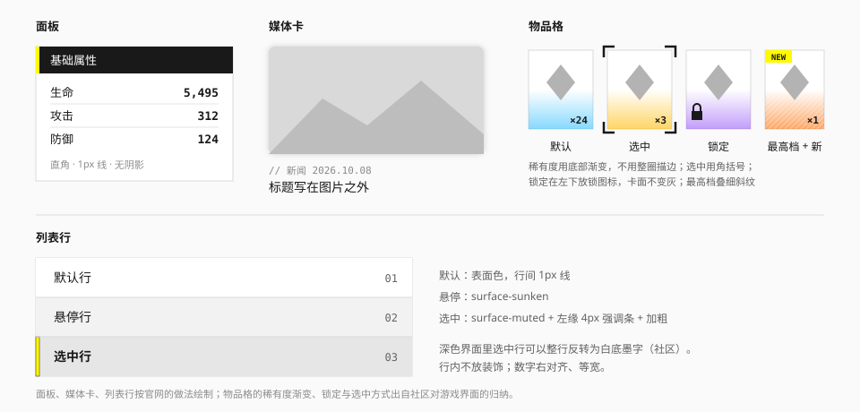

# 卡片

## 用途

把一组相关内容围起来。这套语言里**卡片用得很克制**：层次主要靠底色和线，而不是一张张带阴影的卡片。



## 先问：需要卡片吗

| 情况 | 做法 |
| --- | --- |
| 页面上的一个大区块 | 不用卡片。换底色，或用分节标题隔开 |
| 一组并列的同类条目 | 用卡片或列表行 |
| 一组属性、一段说明 | 用面板，或者只用一条左缘竖线 |
| 单个数字 | 不用卡片，见 [数据展示](data-display.md) 的统计块 |
| 浮在内容之上的东西 | 那是 [浮层](overlay.md) |

不要卡片套卡片。

## 面板

围住一组信息的容器。

| 项 | 值 | 来源 |
| --- | --- | --- |
| 底 | `surface-raised`；与页面底只差一档 | 实测 |
| 描边 | 1px `line`，或者不描边、只靠底色差 | 实测 |
| 圆角 | 0 | 实测 |
| 阴影 | 无 | 实测 |
| 内边距 | 16 – 24px | 推断 |

### 标题带

面板的标题是一条深色横带，左端一条黄色短竖条（社区：游戏界面的数据列分组头）。

- 高 28 – 32px，`surface-inverse` 底，`ink-inverse` 文字，`text-sm font-medium`；
- 左缘 3 – 4px 的 `action` 色竖条；
- 标题右侧可以放计数或一个小操作。

暗色主题下 `surface-inverse` 是近白，标题带跟着反转成浅色带，黄色竖条压在上面就看不见了；标题右侧的小操作也一样——按钮的焦点环按页面取色，压在带子上和底同色。所以实现里标题带是一个 [反转主题](../foundations/color.md#反转块里的局部主题)（`data-theme="inverse"`）：竖条用 `accent-ink`（亮色页面上是黄，暗色页面上是强调色的文字档），放进 `extra` 的按钮、标签、复选框都按这条带子的底色取值，不用另外处理。

官网的做法更轻：不用深色带，只用一条细线和一个小标题。两种都可以，同一个界面选一种。

### 属性行

面板里的"名称 — 数值"：名称左对齐，数值右对齐、等宽、加粗；行间 1px `line`。不要给每个属性单独做一张卡。

## 折叠面板

一摞可以各自展开收起的小节：常见问题、设置里不常用的那一组、长表单的分段。（推断：官网和游戏界面里没有见到这个控件，画法取自面板的"细线 + 小标题"那一种。）

| 项 | 值 |
| --- | --- |
| 分隔 | 小节之间 1px `line`，整摞的最上和最下各一条；没有外框、没有底色 |
| 标题行 | 高 48px（`sm` 40px），左右内边距 16px，`text-base font-medium`（`sm` 是 `text-sm`） |
| 记号 | 行尾一个 16px 的加号，展开时变成减号：竖的那一笔转 90° 和横的重合，`--duration-fast` |
| 悬停 | 标题行 `ink` 5% |
| 展开 | 标题加粗；内容区左右 16px、下 16px 的内边距 |
| 动效 | 内容区的高度从 0 过渡到实际高度，`--duration-base`、`ease-standard` |
| 禁用 | 标题变 `ink-disabled`，记号同色，不响应悬停 |

规则：

- **先问能不能不折叠。** 内容不多就直接排开；折叠是把东西藏起来，藏起来的东西有人会找不到。
- 标题要写成"里面是什么"，不要写"更多""详情"。
- 一摞里默认只开一个（开了这个那个就收起来），内容之间要对照着看的时候用 `multiple`。
- 不要折叠面板里再套折叠面板。
- 记号不用三角：三角在这套语言里是"展开一个浮层"（下拉、组合框），加号是"就地多出一块"。

### 实现

- `<Accordion multiple value defaultValue onValueChange size level searchable>` + `<AccordionItem value title extra disabled>`。`value` 是展开着的那几项的 `value`，总是数组。
- 标题是一个真的标题元素（`level` 默认 3，即 `<h3>`）里套一个按钮，按钮带 `aria-expanded` 并指向它的内容区；内容区是一个以标题命名的区域。
- 键盘：`Tab` 在各个标题之间走，回车或空格开合。**标题之间不能用方向键移动**——无障碍基元跟着 ARIA 实践指南的修订把它去掉了：标题本来就是一个个 Tab 停靠点，再加一套方向键反而和页面滚动抢键。
- `extra` 是标题右侧、记号之前的补充（计数、一个标签）。它在按钮里面，不能放能点的东西。
- `searchable`：收起的内容也留在页面里，浏览器的页内查找（`Ctrl+F`）找得到，找到时自动展开。常见问题这类"人是来找一句话的"内容值得开。
- 收起的内容默认不在 DOM 里；里面有不能丢状态的表单字段时，把整摞换成 `multiple` 并默认展开，或者把字段的状态提到外面。

## 滚动区

一块自己能滚的区域，滚动条是画出来的：面板里的长列表、限高的日志、横向排开的一排卡片。（推断：画法是 [页内目录](navigation.md#页内目录) 和侧轨二级的引线——一条 1px 的线，上面一段 3px 的粗条标出"现在在哪"。滚动条说的是同一件事。）

| 项 | 值 |
| --- | --- |
| 滚动条 | 贴着这一块的右缘（横向的贴着下缘），12px 宽——这是能抓、能点的范围 |
| 轨 | 滚动条正中一条 1px 的 `line`，从头贯到尾 |
| 滑块 | 正中 3px 宽的条，直角。平时 `ink-secondary`；指针在滚动条上、正在拖的时候 `ink` |
| 滑块的长度 | 看得见的部分占全部内容的比例，最短 16px |
| 让位 | 那个方向溢出时，内容在那一侧让出 12px，不会被滚动条压住 |
| 交角 | 两个方向都有滚动条时，右下角 12px 见方的一块空着 |

- **只有真的溢出才有滚动条**，也才让出那 12px。内容不够长的时候它就是一个普通的容器，不白占一条边。
- **滚动条一直在**，不是滚起来才出现、停下来就淡掉：那样没滚之前看不出这一块能滚。
- 滑块靠形状（粗条压在细线上）而不是底色差——暗色主题下凹陷的底是纯黑，靠底色分不出轨来。
- 高度由使用方给（`h-64`、`max-h-80`）。给的是上限时，内容短就跟着矮。

什么时候不用：

- **整页的滚动留给浏览器。** 不要把页面主体包进一个滚动区：地址栏的收放、`Ctrl+F` 之后的定位、打印、返回时恢复滚动位置都是按页面的滚动做的。
- "不想看到系统的滚动条"不是理由。要的是"这一块限高、里面自己滚"才用它。
- 库里已有控件内部的滚动（弹窗的正文、下拉的面板、表格）用的还是系统滚动条，没有换成它。

已实现为 `<ScrollArea orientation aria-label viewportRef>`：

```tsx
<ScrollArea aria-label="日程" className="max-h-64">
  <Timeline>…</Timeline>
</ScrollArea>
```

- `orientation`：`vertical`（默认）、`horizontal`、`both`。只管一个方向时，另一个方向不能滚。
- 行为建立在 Base UI 的 Scroll Area 上：真正在滚的是一个原生的滚动容器（滚轮、触屏的惯性、键盘都是浏览器自带的），系统滚动条藏起来了，画出来的那条跟着它的位置走；拖滑块、点轨道跳过去是基元做的。
- **键盘**：能滚的时候，可视区是一个能聚焦的区域——里面没有可聚焦的东西时，键盘也得能滚它。这时它带 `role="region"` 和 `aria-label` 给的名称，焦点环画在里面；不溢出的时候不占 `Tab` 停靠点。和 [表格](data-display.md#表格) 是同一条规则。所以 `aria-label` 是必填的。
- `className` 给外框；`viewportRef` 交出真正在滚的那个元素——[页内目录](navigation.md#页内目录) 和 [回到顶部](navigation.md#回到顶部) 的 `target` 要的就是它。其余属性（`onScroll` 等）也给可视区。
- 滚动条对读屏隐藏：读屏有自己的办法知道读到了哪。
- **没有做**：滚起来才出现的滚动条、上下缘的渐隐、滚到底时的回调。

## 媒体卡

图片 + 标题 + 元信息（实测 + 观察）。

| 项 | 值 |
| --- | --- |
| 图片圆角 | 0 – 6px（官网新闻卡为 0.5rem） |
| 图片阴影 | 轻微的环境阴影，或无 |
| 标题 | 在图片**之外**（下方），`text-base font-medium` |
| 元信息 | 微标行：`// 类目　日期`，`text-xs`，`ink-secondary` |
| 悬停 | 图片略微提亮或出现一条底边强调线；不放大、不上浮 |

标题和标签不要叠在图片上。必须叠的时候给文字垫实色底。

类型标签（如 `PV`）用深灰底的小块，放在图片下方的元信息行里。

已实现为 `<MediaCard media title category date tag href ratio>`：

- 媒体区圆角 6px（`rounded-md`），没有阴影；图片铺满并裁切，宽高比四档：`16/9`（默认）、`4/3`、`1/1`、`3/4`；
- 自上而下是图片 → 微标行 → 标题。微标行前的 `//` 由组件加，并对读屏隐藏；类型标签从 `tag` 传入，排在微标行的最前面；
- 传 `href` 时整卡可点：链接写在标题里，点击范围用伪元素铺满整张卡，整卡只有一个可点击元素；焦点环画在整张卡上；
- 悬停用上表的第二种做法：图片底边一条 4px 的 `action` 色线从左充出。图片不提亮——提亮的效果取决于图片本身，没法保证；
- 本库不带任何图片，`media` 由使用方给；预览站里用的是原创的灰色占位图；
- `video` 表示这张卡是一段影像：媒体区左下角多一个 [播放记号](#播放钮)，标题前多一句读屏才听得到的"视频："（`videoLabel` 可换）。记号不能点——整卡仍然只有一个可点击元素。

### 播放钮

影像的封面上那个"能播放"的记号。官网影像资料区的做法（实测）：一个**黄色小方块**，圆角 2px，里面是墨色的三角——不是半透明的圆形大按钮。

| 项 | 值 | 来源 |
| --- | --- | --- |
| 底 | `action` | 实测（`#FDFD1F`，和信号黄是同一个角色） |
| 圆角 | 2px（`rounded-xs`） | 实测 |
| 记号 | 实心三角，`on-action` | [图标](../foundations/iconography.md)：三角就是"播放" |
| 尺寸 | 24 / 32 / 40px 三档，三角占一半 | 建议值 |
| 位置 | 封面的左下角，内缩 8px | 推断：没有量到它在哪个角 |

- **不随主题变。** 它压在图上，和圆形翻页钮是同一条约定。
- 黄色压在浅色的图上边界不清楚，认它靠的是里面的墨色三角（对黄约 17:1）。所以三角不能省，也不能换成白色。
- 一屏可以有很多个：它是记号，不是行动按钮，不受"黄色按钮一屏只有一个"的限制。

已实现为两样：

- `<PlayMark size>`：只是记号，对读屏隐藏。媒体卡的 `video` 用的就是它；自己搭的卡片里，整张卡已经是一个链接时也用它。
- `<PlayButton size>`：同一个画法的真按钮，给"点了就在原地播放"的封面用。默认的可访问名称是"播放"，一页有好几个时用 `aria-label` 写明播的是什么。悬停时三角右移 2px（和按钮的竖条变箭头是同一种"记号让一步"），按下底色深一档；24px 那档的点击区用伪元素补到 40px。

## 媒体轮播

一次看一张的大幅媒体，前后翻。官网"玩法介绍"和"集成工业"两个版块是它的原型（观察）：

| 部件 | 做法 | 来源 |
| --- | --- | --- |
| 媒体 | 大幅截图或视频，**直角**，铺满并裁切 | 观察 |
| 翻页 | 压在媒体**左下角**的一对白色圆钮 | 观察 |
| 计数 | 媒体下方：小号的 `1 / 5`，等宽数字 | 观察 |
| 说明 | 计数下面是标题和一段正文，跟着当前这一张换 | 观察 |
| 进度短横 | 可选，排在计数旁边 | 推断（世界观版块的做法搬过来） |

规格：

| 项 | 值 |
| --- | --- |
| 宽高比 | `16/9`（默认）、`4/3`、`1/1`、`3/4`、`21/9` |
| 翻页钮 | [图标按钮](button.md) 的 `floating`，40px，两个之间 8px，离媒体的左、下边各 12px |
| 计数 | `font-tech text-xs`，`ink-secondary` |
| 标题 | `text-lg font-bold` |
| 正文 | `text-sm`，`ink-secondary` |
| 翻动 | 横向滑过去，`ease-standard`；"减少动态效果"时直接换 |

规则：

- **不自动播放。** 自己动的内容要配暂停钮，读屏会被它不停打断，正在读说明的人会被翻走；官网的这两个轮播也是手动翻的。
- 标题和正文放在媒体**外面**，不叠在图上（同媒体卡）。
- 三到七张。只有两张就并排放；多于七张没人会翻完，换成媒体卡的网格。
- 没有缩略图条：计数和短横已经说明了"共几张、在第几张"。
- 翻页钮的白底有意不随主题变——它要压在图像上（见 [色彩](../foundations/color.md) 的"哪些颜色有意不随主题变"）。

### 实现

`<Carousel aria-label index defaultIndex onIndexChange loop ratio indicator>`，里面直接放 `<CarouselSlide title description>`，媒体是它的子元素：

```tsx
<Carousel aria-label="玩法介绍">
  <CarouselSlide title="线路测绘" description="沿着管廊布设信标，…">
    
  </CarouselSlide>
</Carousel>
```

- **轨道是原生的横向滚动加滚动吸附**，不是自己算位移。触屏上滑、触控板横扫、按住 `Shift` 滚轮都是浏览器自带的，惯性和回弹也是；本库不写手势。滚动条藏起来了。
- 翻页钮和键盘改的是下标（`index`，从 0 起），下标变了轨道滚过去；用户自己滑的时候反过来——等滚动停稳，由停下的位置定下标。
- 默认到头时对应的翻页钮禁用；`loop` 打开后首尾相接。
- **键盘**：焦点在翻页钮或媒体上时，`←` `→` 翻页，`Home` `End` 到第一张和最后一张。
- **不在眼前的那几张是 `inert` 的**：里面的链接、视频控件 `Tab` 走不进去，读屏也读不到。否则键盘会走进一张看不见的图。
- 读屏：整体是一个有名称的分组，角色描述是"轮播"；每一张是"第 2 张，共 5 张"。说明区是 `aria-live="polite"`，翻页后播报新的标题和正文，开头带一句隐藏的"第 2 张，共 5 张"。
- 视觉上的 `1 / 5` 和短横对读屏隐藏——同样的话说明区里已经有了。
- `title` 和 `description` 是从子元素上读的，所以 `CarouselSlide` 要直接放在 `Carousel` 里。
- 媒体的替代文字由使用方写在 `` 上。标题已经说清楚的装饰图写 `alt=""`。

## 图片查看

一组缩略图，点一张放大到整屏看，前后翻。（推断：缩略图是 [媒体卡](#媒体卡) 的媒体区；大图那一层是 [弹窗](overlay.md#弹窗) 的深色标题带、[媒体轮播](#媒体轮播) 的翻页圆钮和计数、再加一圈 [取景角](../elements/hud-overlays.md)）

缩略图：

| 项 | 值 |
| --- | --- |
| 排法 | 自适应的网格：每张至少 112px 宽，之间 8px。使用方可以改成自己的排法 |
| 每一张 | 同媒体卡的媒体区：圆角 6px，`surface-muted` 底，图铺满并裁切。宽高比四档，默认 `4/3` |
| 悬停 / 聚焦 | 同媒体卡：底边一条 4px 的 `action` 色线从左充出。不放大、不提亮 |

大图层：

| 部件 | 做法 |
| --- | --- |
| 底 | 铺满整个视口的一层，**两个主题下都是深色**——和弹窗的标题带是同一条约定。看图的时候别的都让开；浅色的底会把图压灰 |
| 标题带 | 顶上 56px 的一条：弹窗的深色斜纹带。左边是计数 `2 / 5`（`font-tech`、等宽），右边是关闭钮（24px 的叉，悬停转 90°） |
| 舞台 | 中间剩下的全部。图按原比例**整张**放进去，不裁切、不放大过原尺寸；四周留 24px（宽屏 40px） |
| 取景角 | 舞台四角各一个 24px 的 L 形短线。[括号与标记](../elements/brackets-and-markers.md) 说它"只在正在瞄准的语境里用"——盯着一张图看正是 |
| 进出 | 整层淡入（`--duration-fast`）；淡入完了取景角落位（八段短线从角上伸出来，200ms）；大图取到了淡入（`--duration-fast`）。退场整层淡出（推断） |
| 翻页 | 底下一条的左端：一对白色圆钮，就是轮播的那一对 |
| 说明 | 圆钮右边：当前这张的标题（`text-base` 加粗）和一段说明（`text-sm`、`ink-secondary`） |

- **图是主角。** 标题、说明、圆钮都在图的外面，不压在图上；舞台上除了图只有四个取景角。
- 只有一张时没有翻页钮和计数，就是"点开看大图"。
- 标题带和取景角不随主题变，翻页钮本来就不随主题变：整层是一个 `data-theme="dark"` 的局部主题，里面的字、关闭钮、焦点环都按深色取值。

已实现为 `<ImageViewer aria-label index open loop ratio>`，里面直接放 `<ImageViewerItem title description thumbnail>`，图是它的子元素：

```tsx
<ImageViewer aria-label="现场照片">
  <ImageViewerItem title="三号管廊入口" description="北段复测当天拍的。">
    
  </ImageViewerItem>
  <ImageViewerItem
    title="信标 B-12"
    thumbnail={}
  >
    
  </ImageViewerItem>
</ImageViewer>
```

- 它在原地渲染成一个缩略图的列表（`<ul>`，以 `aria-label` 命名），每张是一个按钮，名称是"查看大图：三号管廊入口"（没有文字标题时是"查看大图：第 2 张，共 5 张"，或者在那一项上自己传 `aria-label`）。`thumbnail` 是另给的小图；不传就拿同一张图当缩略图。
- 点一张，大图层打开在那一张上。它建立在 Base UI 的 Dialog 上，是模态的：焦点锁在里面，背景不能滚、不能点，读屏只读得到这一层。
- 打开时焦点落在这一层自己身上（它不是一个能操作的东西，所以没有焦点环），`Tab` 依次走到关闭钮和两个翻页钮。
- **翻页**：圆钮；键盘 `←` `→`、`Home` `End`（焦点在这一层的哪儿都行）；触屏左右滑。默认到头时对应的圆钮禁用，`loop` 打开后首尾相接。
- **滑动用的就是轮播的那条轨道**——原生的横向滚动加滚动吸附，手势、惯性都是浏览器的。"下标和滚动位置互相跟"的那段逻辑从轮播里抽了出来，两个控件共用。
- **关**：关闭钮、`Esc`、点舞台上图以外的空处。关了之后**焦点回到当前这一张的缩略图**——翻到第四张再关，落在第四张上，不是当初点的那一张。
- **只渲染当前这张和左右各一张**，其余是空位：二十张图不会一打开就全去取。
- **大图取到了才露出来，淡入 200ms**（推断，见 [动效](../foundations/motion.md#方向位移)）：还没取到的时候舞台上只有取景角，不是一张图从上往下一截一截地画出来，也不是"啪"地一下出现。图是使用方给的元素，控件不碰它，只在外面听它的 `load`（取不到的 `error` 也算，替代文字要露出来）。只管直接放进来的 ``；视频和别的内容不等。翻页时旁边那一张多半已经取好了，直接在；翻页本身是原生的横向滚动，上面不再叠过渡。
- 读屏：大图层是一个以 `aria-label` 命名的对话框；说明区是 `aria-live="polite"`，翻页后播报"第 2 张，共 5 张"和新的标题、说明（同轮播）。看得见的 `2 / 5` 对读屏隐藏。
- `open` / `onOpenChange`、`index` / `onIndexChange` 可以受控：比如从地址里的参数恢复"正开着第几张"。
- 图的替代文字写在 `` 上；标题已经说清楚的写 `alt=""`。图要用 ``（或 `<video>`）——它们有自己的尺寸，舞台按这个尺寸把图整张放进去。
- 本库不带任何图片；预览站里用的是原创的灰色占位图。

没有做的：

- **缩放和拖动**（双指放大、滚轮放大、拖着看局部）。要细看一张大图纸，给一个"在新标签页打开原图"的链接。
- 下载、分享、旋转这些工具钮。
- 大图层底下的缩略图条：计数已经说明了"共几张、在第几张"（同轮播）。
- 不带缩略图、由别的按钮打开的形态。

## 物品格

矩阵里的一个格子：图标、数量、稀有度（社区）。

| 项 | 值 |
| --- | --- |
| 形状 | 直角矩形，宽高比约 4:5 或 1:1 |
| 底 | `surface-raised`（白卡） |
| 稀有度 | **底部向上消散的渐变**，高约为卡面的 30 – 50%，颜色取 `rarity-1` 到 `rarity-4` |
| 最高档 | 在渐变上叠细斜纹 |
| 数量 | 右下角，`font-tech`，等宽，加粗 |
| 间距 | 格子之间 6 – 8px |

```css
.item-slot {
  position: relative;
  overflow: clip;
}
.item-slot::before {
  content: "";
  position: absolute;
  inset: auto 0 0 0;
  height: 40%;
  background: linear-gradient(
    to top,
    color-mix(in srgb, var(--rarity) 55%, transparent),
    transparent
  );
  pointer-events: none;
}
```

### 状态

| 状态 | 表达 |
| --- | --- |
| 默认 | — |
| 悬停 | 描边加深到 `line-strong` |
| 选中 | **角括号**（见 [括号与标记](../elements/brackets-and-markers.md)）；或 2px 的白 / 墨色描边 |
| 锁定 | 左下角锁图标；**卡面不变灰** |
| 未获得（图鉴） | 内容换成准星占位符 |
| 新获得 | 左上角 `NEW` 黄签 |
| 已装备 | 一角叠一个圆形小头像 |
| 售罄 / 不可用 | 整卡压一层半透明黑 |

稀有度用底部渐变而不是整圈彩色描边，是为了不抢内容，也为了把"框"留给选中态。

已实现为 `<ItemSlot name count rarity …>`，图标作为子元素传入：

- **宽度跟着网格走**，宽高比两档：`1/1`（默认）与 `4/5`。格子之间留 8px；网格四周也要留出 4px 以上——角括号画在格子之外。
- **稀有度** `rarity` 取 1 – 4，对应 `rarity-1` 到 `rarity-4`：渐变高为卡面的 40%，底端是稀有度色的 55%。第 4 档在渐变上叠一层细斜纹。稀有度色两个主题下相同；压在上面的数量在最不利的一档（暗色下的黄）也有 4.6:1 以上。
- **不只靠颜色**：左缘中部竖排着同样个数的小菱形，读屏另有"稀有度 3"。
- 四个角各有分工：左上 `NEW` 签（`isNew`，黄底、右下切角）、右上小圆位（`badge`，放已装备者的头像）、左下锁（`locked`）、右下数量（`count`）。
- 状态一一对应上表：`selected` 是角括号，`unowned` 把内容换成准星占位符，`unavailable` 压一层 `scrim` 遮罩，传文字（"售罄"）会写在遮罩正中。悬停时描边加深。
- 传 `onClick` 整格是按钮（选中输出 `aria-pressed`），传 `href` 整格是链接（选中输出 `aria-current`），都不传是静态格——整格只有一个可点击元素。
- 格子里只有图标，`name` 是给读屏的名称。读屏听到的是一句完整的话："合金锭，数量 128，稀有度 3，已锁定"；看得见的数量、角标对它隐藏，不重复朗读。整句可以用 `label` 换掉。
- 选中的格子被键盘聚焦时，焦点环外移到角括号之外，两圈不重叠。高对比模式下角括号画不出来，换成一圈系统色的描边。
- 本库不带任何物品图标，预览站里用的是原创的几何图形。

### 矩阵

一组格子放进 `<ItemGrid aria-label>`：

- 它自带上面说的网格：自动填充、每格最小 72px、间距 8px、四周留 4px 给角括号。要别的排法用 `className` 改。
- **整个矩阵只占一个 Tab 停靠点。** 几十个格子挨个 Tab 过去太慢，所以进了矩阵之后用方向键走：停靠点是上次聚焦的那一格，没有就是选中的那一格，再没有就是第一格。
- 键盘：

  | 键 | 去哪 |
  | --- | --- |
  | `←` `→` | 同一行的前一格、后一格；到头不折到别的行 |
  | `↑` `↓` | 上一行、下一行里水平位置最近的那一格 |
  | `Home` `End` | 这一行的第一格、最后一格 |
  | `Ctrl+Home` `Ctrl+End` | 整个矩阵的第一格、最后一格 |

- 走到一格只是把焦点移过去，**不等于选中**：选中仍然是回车、空格或点击。禁用的格子和静态的格子走不到。
- 一行有几格不是属性——网格是自动填充的，随宽度变。按键的时候按各格子当时的实际位置算，所以换了排法、最后一行没排满也一样能走。
- 语义是一个有名称的分组（`role="group"`），里面的格子仍然是一个个按钮或链接。读屏的浏览模式不受影响。
- 页面上最好有一处写明"方向键移动"：只靠 Tab 的人会发现它跳过了大部分格子。

## 列表行

一行一个条目。

| 项 | 值 | 来源 |
| --- | --- | --- |
| 行高 | 40 – 48px | 推断 |
| 分隔 | 行间 1px `line` | 实测 |
| 悬停 | `surface-sunken` | 推断 |
| 选中 | `surface-muted` + 左缘 4px `action` 色条 + 文字加粗 | 实测（黄色左缘条）+ 推断 |
| 数字 | 右对齐、等宽 | — |

深色界面的两种做法（社区）：

- **深色行带**：浅色画布上一条条深色的行，行间留缝，见 [数据展示](data-display.md)；
- **白色反转**：深色列表里，选中行整行变成白底墨字。

行左缘的色条有两种含义，不要混用：黄色 = 选中；其他颜色 = 类目。同一个列表里只表达一种。

已实现为 `<List variant>` + `<ListRow start end description selected size>`：

- 行高两档：`sm` 40px、`md` 48px；
- 传 `href` 时整行是一个链接，传 `onClick` 时整行是一个按钮，都不传就是静态行——整行只有一个可点击元素；用路由库时把它的链接组件传给 `render`（见 [通用约定](README.md#链接与路由)），媒体卡和物品格同理；
- 悬停底用 `ink` 叠 5% 不透明度（`hover:bg-ink/5`），不用上表的 `surface-sunken`，理由和页签相同：`surface-sunken` 在暗色主题下是纯黑，会变成"悬停变暗、选中变亮"；
- 选中的链接行输出 `aria-current`，声明了 `selected` 的按钮行输出 `aria-pressed`；
- 标题与说明过长时截断成省略号，行尾的数值不被挤压。

- `completed` 是完成态：整行降一档对比，行尾数值前多一个低对比的描边词，见 [反馈](feedback.md) 的"完成与庆祝"。

深色界面的两种做法合成了一个变体，`<List variant="band">`：

- 列表自己铺一块 `surface-sunken` 的画布，四周留 12px；每一行是一条**固定深色**的带子，行间留 6px 的缝，不再画分隔线。
- 行带是一个 `data-theme="dark"` 的局部主题，底用 `surface`（`#141414`）：行里的次要文字、禁用色、焦点环都按深色底取值。
- **选中行整行反转成白底墨字**：这一行换成 `data-theme="light"`，标题加粗。不用黄色左缘条——行带里左缘的色条留给类目（见 [数据展示](data-display.md) 的数据行带），黄色再出现在那里就分不清了。
- 悬停把行带提亮一档（`surface-raised`），不用 `ink/5`：那是一层半透明的底，换上去会把画布透出来。选中行悬停不变。
- 每条行带有一圈 1px 的 `line`。亮色页面上看不出来；暗色页面上画布是纯黑、行带是 `#141414`，靠它分开。
- 其余（整行链接或按钮、`description`、`completed`、`disabled`、两档行高）和默认的 `plain` 一样。

## 主题与稀有度色

卡片的强调色通过局部变量传入，不写死：

```html
<li class="item-slot" style="--rarity: var(--color-rarity-3)">…</li>
```

主题接管时（角色页、活动页），面板标题带的竖条和选中色条跟着 `--ef-action` 走。

## 无障碍

- 整卡可点击时，用一个覆盖整卡的链接或按钮，不要嵌套多个可点击元素。
- 选中态用 `aria-selected` 或 `aria-pressed`。
- 锁定、售罄等状态要有文字替代，不只靠图标和遮罩。
- 稀有度不能只靠颜色：提供文字或图标（如星级）。

## 宜 / 忌

**宜**

- 用底色差和 1px 线分层。
- 让一组卡片的结构完全一致，只变内容。
- 把颜色留给稀有度和选中。

**忌**

- 8 – 16px 的大圆角卡片配投影。
- 卡片套卡片。
- 悬停时上浮、放大、加重阴影。
- 每张卡片一条黄色顶边。
- 用整圈彩色描边表示稀有度。
- 锁定时把整张卡变灰到看不清内容。

## 来源

- 面板底色、新闻卡圆角：[measurements.md](../references/measurements.md) 第 3、9 节。
- 物品格的稀有度渐变、选中与锁定、分组标题带：[Statrue/endfield-design-skill](https://github.com/Statrue/endfield-design-skill)。
