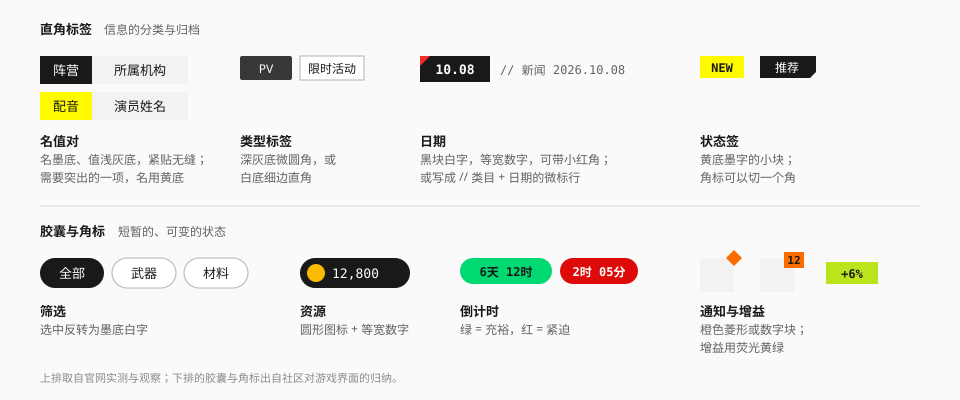
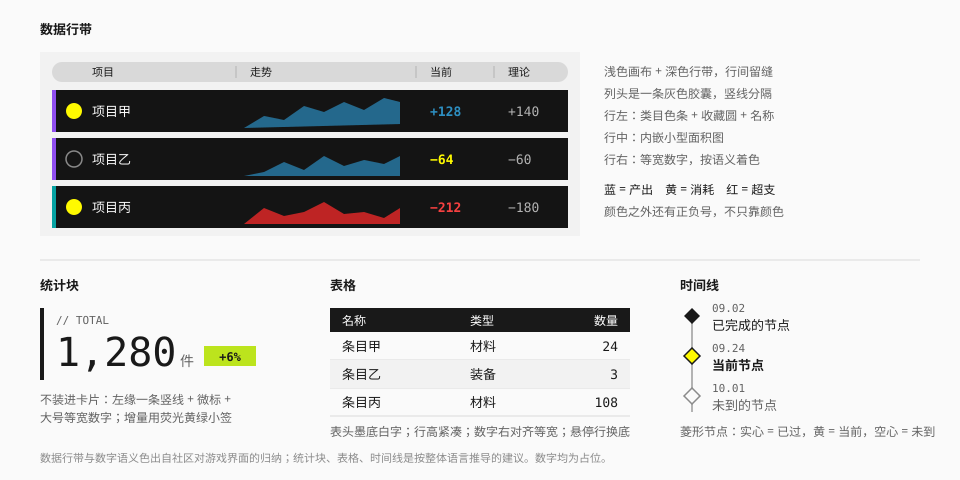

# 数据展示

## 用途

呈现信息：标签、数字、表格、时间。

## 标签与徽章



分两族，形状就是语义：**直角 = 归档性的、不变的信息；胶囊 = 短暂的、会变的状态。**

### 直角标签

| 类型 | 外观 | 用在哪 | 来源 |
| --- | --- | --- | --- |
| 名值对 | "名"墨底白字 + "值"浅灰底墨字，紧贴无缝 | 属性：阵营、种族、配音… | 实测 |
| 名值对（强调） | "名"换成黄底墨字 | 一组里需要突出的那一项 | 实测 |
| 类型标签 | 深灰底（`#38383A`）白字，圆角 2px | 媒体类型：`PV`、`OST` | 实测 |
| 类型标签（浅） | 白底、1px `line-strong` 描边、直角 | 活动类型、分类 | 观察 |
| 日期块 | 墨底白字，等宽数字；可在左上加一个小红角 | 时间轴上的日期锚 | 观察 |
| 微标行 | `// 类目　日期`，无底色 | 新闻、列表的元信息 | 观察 |
| 状态签 | 黄底墨字的小块 | `NEW`、推荐 | 社区 |

规格：

| 项 | `sm` | `md` |
| --- | --- | --- |
| 高度 | 20px | 28px |
| 字号 | `text-xs` | `text-sm` |
| 字重 | Medium | Medium |
| 水平内边距 | 6px | 10px |

名值对的两半**紧贴**，中间没有缝也没有分隔线；多组名值对之间留 8px。

已实现的写法：

| 类型 | 写法 |
| --- | --- |
| 名值对 | `<TagPair name="阵营" value="…" />` |
| 名值对（强调） | `<TagPair emphasis … />` |
| 类型标签 | `<Tag variant="solid">` |
| 类型标签（浅） | `<Tag variant="outline">` |
| 日期块 | `<Tag variant="inverse" numeric>`；加 `marked` 出现左上角的小红角 |
| 状态签 | `<Tag variant="accent">` |
| 增益签 | `<Tag variant="gain" numeric>`，见下一节 |

名值对在暗色主题下整体反转："名"是近白底墨字，"值"是纯黑底白字。

小红角是一个 6px 的 `alert` 色三角，用来在一组日期块里标出需要留意的那一个；它在两个主题下取值相同。

### 胶囊与角标

| 类型 | 外观 | 用在哪 | 来源 |
| --- | --- | --- | --- |
| 筛选胶囊 | 白底细边；选中反转为墨底白字 | 类目筛选 | 社区 |
| 资源胶囊 | 深色胶囊，圆形图标 + 等宽数字 | 货币、材料数量 | 社区 |
| 倒计时 | 实色胶囊，等宽数字；绿 = 充裕，红 = 紧迫 | 限时内容 | 社区 |
| 通知角标 | 橙色菱形（无数字）或橙色小方块（带数字） | 未读、待处理 | 社区 |
| 增益签 | 荧光黄绿底墨字，直角 | `+6%`、增量 | 社区 |

规则：

- 一个元素上的徽章不超过两个。
- 徽章的颜色严格按 [色彩](../foundations/color.md) 的角色表：橙 = 提醒与数量，红 = 紧迫，绿 = 充裕，黄 = 新。
- 通知角标压在元素的右上角，向外偏移半个自身大小。
- 数字超过 99 显示 `99+`。

已实现的写法：

| 类型 | 写法 | 取色 |
| --- | --- | --- |
| 筛选胶囊 | `<FilterChip selected onSelectedChange>` | 未选是细边（`line-strong`）；选中反转为 `surface-inverse` 底、`ink-inverse` 字 |
| 资源胶囊 | `<ResourceChip icon label>` | `control` 底、`on-control` 字，两个主题下相同 |
| 倒计时 | `<Countdown to urgentWithin onExpire>` | 充裕 `success` 底、紧迫 `danger` 底，字都是 `ink-inverse`；到期后 `surface-muted` 底 |
| 通知角标 | `<Badge count={12}>`、`<Badge dot>` | `notice` 底、墨字 |
| 增益签 | `<Tag variant="gain" numeric>` | `gain` 底、`neutral-900` 字（11.9:1），两个主题下相同 |

几处实现时定下的细节：

- **筛选胶囊**是一个切换按钮（`aria-pressed`），几个并排就是多选筛选；几项里只能选一项时用页签的 `capsule` 变体。两者共用一份样式。
- **资源胶囊**不带图标：本库不收录资源图标，由使用方传入，放进左端的圆形底托。
- **倒计时的两种状态色**没有直接用角色色。`alert` 红作底时墨字白字都不到 4.5:1（见 [色彩](../foundations/color.md)），所以改用按主题切好的文字档语义色作底、`ink-inverse` 作字：亮色下充裕 5.1:1、紧迫 5.1:1，暗色下 9.3:1、4.8:1。
- **紧迫态不只靠红色**：数字前多一个 `!`。默认在剩余不到 24 小时时进入紧迫态，门槛可调。
- 倒计时超过一天写成 `3天 04:12:09`，不到一天写成 `04:12:09`；到期后显示"已结束"并停表。
- **增益签**形状是直角，所以做成了 `Tag` 的一个变体，而不是胶囊。下降不用它：用 `danger` 色的文字加 `−`。

## 数据行带



游戏内数据面板的范式（社区）：**浅色画布上一条条深色的行**。

| 部件 | 做法 |
| --- | --- |
| 画布 | `surface-sunken`（浅） |
| 列头 | 一条灰色胶囊带（`neutral-300`），列名之间用短竖线分隔 |
| 行 | 深色（`neutral-950`），直角，行间留 6px 缝 |
| 行左 | 4px 类目色条 → 收藏圆（黄色实心 = 已收藏）→ 名称 |
| 行中 | 内嵌一个小型面积图或走势线 |
| 行右 | 当前值（语义色）与参考值（`neutral-400`），等宽数字 |

数字语义色固定：

| 含义 | 颜色 | 令牌 |
| --- | --- | --- |
| 产出、正向 | 蓝 | `info` / `data` |
| 消耗、关注 | 黄 | `signal` |
| 超支、异常 | 红 | `danger` / `alert` |

颜色之外还要有正负号或图标，不只靠颜色。

行底用 `neutral-950` 而不是更浅的深灰，是为了让蓝色与红色的数字达到 4.5:1（在 `#141414` 上分别约为 5.1:1 与 5.0:1；换成 `#282828` 会降到 4.1:1）。

行内图表保持极简：没有坐标轴、没有网格、没有图例，只有一个填充的面积形状。

### 实现

`<DataRowList label columns>` + `<DataRow name categoryColor favorite series value tone reference>`：

- `columns` 给列名：`{ name, trend, value, reference }`。不给 `trend` 或 `reference` 就没有那一列。
- **语义是表格**（`role="table"`、`row`、`columnheader`、`rowheader`、`cell`），各行用 CSS 子网格对齐到同一组列。没有用真的 `<table>`：行间的缝、整行的底和行内的按钮用它很难画。
- 行带和列表的 `band` 变体是同一份画法（见 [卡片与列表](card.md)）：固定深色的局部主题、`surface` 底、一圈 1px 的 `line`，行高 44px。
- **列头**没有照上表用 `neutral-300`：它在暗色页面的纯黑画布上是一条亮带。改用 `surface-muted`（亮色 `#E6E6E6`、暗色 `#282828`），列名之间的短竖线是 `line-strong`。
- **类目色条**由 `categoryColor` 给，是一个 CSS 颜色值，通常传令牌变量（`var(--color-special)`）。类目是哪几种、各用什么颜色由产品自己定；不要用黄色——黄色是"选中"和"收藏"。
- **收藏圆**直径 16px：已收藏是实心的 `action` 黄，未收藏是一个空心的圆环——形状也不同，不只靠颜色。传了 `onFavoriteChange` 它是一个切换按钮（`aria-pressed`，点击区补到 36px）；只传 `favorite` 它是一个静态标记，读屏另有"已收藏"。
- **当前值**按 `tone` 着色，用的是库里已有的词：`info`（产出、正向）、`accent`（消耗、关注）、`danger`（超支、异常）、`neutral`。行是局部暗色主题，这三档文字色在上面正好是上表的取值（`#2D8FC2`、`#FFFA00`、`#F74040`），对比度都在 4.5:1 以上。正负号由使用方连同数值一起传。
- **走势**传 `series`（一串数值），画成下面的小型面积图：平时是 `data` 蓝，这一行是 `danger` 时换成 `alert` 红。消耗行的图仍然是蓝的——黄色在图上留给"进度"。
- 容器变窄时先收起走势列（512px 以下），再收起参考值列（384px 以下）；列头跟着收。名称过长时截断。
- 行本身不可点：行里已经有收藏按钮，整行再做成链接就是按钮套按钮。要点进详情时把名称写成链接。

### 小型面积图

`<Sparkline data variant tone label>` 是行内图表单独拿出来的版本，统计块旁边、表格的单元格里也能用。

| 项 | 值 |
| --- | --- |
| 形状 | `area`（默认）是一块填充的面积，75% 不透明；`line` 是一条 1.5px 的折线 |
| 颜色 | `info` 用 `data` 蓝（默认），`danger` 用 `alert` 红，`accent` 用强调色的文字档，`neutral` 用 `ink-secondary` |
| 尺寸 | 撑满给它的盒子；默认高 32px、通宽 |
| 纵向范围 | 默认从数据的最小值往下再留四分之一，让最低的那一点也有厚度；可以用 `min` / `max` 钉死 |

- 没有坐标轴、网格和图例；折点不做平滑——这套语言里线是直的。
- `data` 和 `alert` 是不随主题变的角色色，在白底和深色行带上都够 3:1（图形的门槛）。
- 默认对读屏隐藏，旁边的数字才是内容。它独自承担含义时传 `label`，这时它是一张有名称的图。
- 数据少于两个点时什么都不画。

## 统计块

一个需要被一眼看到的数字（推断）。

```
// TOTAL                 ← 微标
1,280 件  [+6%]          ← 大号等宽数字 + 单位 + 增量签
```

| 部件 | 做法 |
| --- | --- |
| 容器 | **不用卡片**。左缘一条 3 – 4px 的 `ink` 竖线 |
| 微标 | `text-xs`，`ink-secondary`，`//` 起头 |
| 数字 | `font-tech`，`text-4xl` – `text-5xl`，Medium，等宽 |
| 单位 | `text-sm`，`ink-secondary`，基线对齐 |
| 增量 | 增益签（荧光黄绿）；下降用 `danger` 色文字加 `−` |

多个统计块并排时，用留白和竖线分隔，不要各自装进卡片。让其中最重要的一个明显更大。

加载页的百分比是它的原型：数字 4.375rem、符号 3.25rem，数字与单位两种字号（实测）。

已实现为 `<Stat label value unit delta trend size>`：

- `size="md"` 是 `text-4xl`，`size="lg"` 是 `text-5xl`——并排几个时给最重要的那个用 `lg`；
- 微标前的 `//` 由组件加，并对读屏隐藏；
- `delta` 连同正负号一起传；`trend="up"`（默认）渲染为增益签，`trend="down"` 渲染为 `danger` 色文字；
- 容器很窄时数字允许在任意位置折行，不会撑破版面。

## 头像

代表一个人或一个角色的圆形图。头像是这套语言里少数用正圆的东西之一：圆表示"人"，直角表示"物"和"机器"（见 [形状](../foundations/shape.md)）。

| 项 | 值 | 来源 |
| --- | --- | --- |
| 形状 | 正圆，图片铺满并裁切 | 实测（官网的头像切换） |
| 尺寸 | `sm` 32px、`md` 40px、`lg` 56px、`xl` 80px | 推断 |
| 没有图 | `surface-muted` 底，`ink-secondary` 的名字首字，字号约为直径的 40% | 推断 |
| 描边、阴影 | 没有 | 实测 |
| 选中 | 外面一圈 3px 的 `action` 色环，和头像隔 2px | 实测（"选中者带黄环"） |

- **选中环外面还有一圈 1px 的墨线。** 黄色在白底上只有 1.1:1，单靠它在亮色页面上看不出来；官网的黄环是压在灰底和图像上的。墨线在暗色主题下是近白，和黄环并在一起，不碍事。
- 首字的取法：中文名取第一个字；拉丁字母的名字取前两个词的首字母并大写。
- 头像旁边已经写了名字时，头像是装饰，对读屏隐藏；单独出现时它是一张以名字命名的图。
- 不要用方形或带圆角的方形头像：那是"物品格"的形状。

已实现为 `<Avatar name src size selected>`：

- 图没给、还没加载出来、或者加载失败时显示首字；图加载好了才换上去，不会先闪一下破图。
- `alt` 默认取 `name`。旁边已经有名字时传 `alt=""`，头像变成纯装饰。
- 要在没有图时显示别的东西（一个图标），把它当子元素传进去。
- 头像自己不能点。要点的话外面包按钮或链接；一列头像里选一个，用 [头像切换](navigation.md)。

## 表格

（推断）

| 项 | 值 |
| --- | --- |
| 表头 | `surface-inverse` 底、`ink-inverse` 文字，`text-sm font-medium`，高 28 – 32px |
| 行高 | 36 – 44px |
| 行分隔 | 1px `line`；不画竖线 |
| 悬停行 | `ink` 叠 5%（`hover:bg-ink/5`） |
| 选中行 | `surface-muted` + 左缘 4px `action` 色条 |
| 数字列 | 右对齐，`font-tech`，等宽 |
| 文字列 | 左对齐 |
| 斑马纹 | 不用；行数很多时可以每隔五行加重一条线 |

- 表头墨底白字是这套语言里"标题带"的通用样子（面板标题、弹窗标题栏同理）。
- 可排序的列：列名右侧一个小三角，当前排序列的三角变黄（深底上）。
- 行内操作用图标按钮或 `text` 按钮，悬停时才显示也可以，但键盘聚焦时必须显示。
- 窄屏：横向滚动并冻结首列；或把每行改成一张属性卡。

浅表头的变体：`surface-muted` 底、`ink` 文字——用在页面已经有很多深色块的时候。

悬停行原先写的是 `surface-sunken`，改成了全库统一的 `ink` 5%：`surface-sunken` 在暗色主题下是纯黑，悬停会变暗而选中变亮，方向相反（页签、列表行是同一条理由）。

### 实现

包一层原生 `<table>`，组合着用：

```tsx
<Table label="运输批次">
  <TableHead>
    <TableRow>
      <TableHeaderCell>批次</TableHeaderCell>
      <TableHeaderCell numeric sort={direction} onSort={setDirection}>
        件数
      </TableHeaderCell>
    </TableRow>
  </TableHead>
  <TableBody>
    <TableRow selected>
      <TableCell rowHeader>TR-2041</TableCell>
      <TableCell numeric>12</TableCell>
    </TableRow>
  </TableBody>
</Table>
```

| 部件 | 属性 |
| --- | --- |
| `Table` | `label`（名称，必填）、`headerVariant`、`size`、`stickyFirstColumn`、`stickyHeader`、`ruled` |
| `TableHeaderCell` | `numeric`、`align`、`sort`、`onSort` |
| `TableRow` | `selected` |
| `TableCell` | `numeric`、`align`、`rowHeader`、`reveal` |

- **表头** 32px 高。`headerVariant="band"`（默认）是反转的标题带，和面板的标题带是同一个样子；`"muted"` 是上面说的浅表头。
- **行高**两档：`sm` 36px、`md` 44px（默认）。行间 1px `line`，最后一行下面不画；`ruled` 打开后每隔五行换成 `line-strong`。
- **单元格默认不折行。** 放不下的时候表格在自己的容器里横向滚动，不把字挤成两行，也不撑破页面。确实要折行的长文字列，自己加 `whitespace-normal` 并给一个最小宽度。
- **只有真的溢出时**（横向或纵向），滚动的那一层才是一个能聚焦的区域（`role="region"`，名称同表格）：键盘得能滚它，但不溢出的时候不该白占一个 Tab 停靠点。
- **`stickyFirstColumn` 冻结首列**，溢出时它的右缘多一条线。冻结的那一格必须不透明，否则滚过去的内容会从它下面透出来——所以它的底不是透明的：平时是表格所在的底色，悬停时是"`ink` 5% 混进这个底色"算出来的实色（看上去和其余单元格上那层半透明的悬停底一样），选中时是 `surface-muted`。表格默认认为自己压在 `surface` 上；压在别的底色上（比如面板里）时，给 `Table` 加 `className="[--table-surface:var(--ef-surface-raised)]"`。
- **`stickyHeader` 表头吸顶**：表身在容器里纵向滚动时表头留在容器的上沿。容器要有一个高度上限才滚得起来，由使用方给：`<Table stickyHeader className="max-h-96">`。和 `stickyFirstColumn` 同开时，左上角那一格压在两者之上。
  - **表头吸不到页面的上沿。** 表格要在自己的容器里横向滚动，而 CSS 的 `sticky` 只认最近的那个滚动容器——容器一旦能横向滚，表头就只能相对它吸附。行数多到要整页滚着看时，给容器一个 `max-h-[70vh]` 之类的上限，让表身在容器里滚。
- **排序**的状态由使用方自己拿着。传了 `onSort` 的列，列名变成一个铺满整格的按钮，右侧一个 8px 的实心三角；`onSort` 拿到的是点了之后该换成的方向（没排或降序时是升序，升序时是降序）。
  - 没按这一列排时三角是 40% 的不透明度，朝下；按它排时三角指明方向（升序朝上、降序朝下），颜色换成强调色。
  - 强调色在反转的标题带上用 `accent-ink-inverse`——暗色主题下标题带是近白，黄色压在上面看不见；浅表头上用 `accent-ink`。焦点环同理：标题带上的焦点环也用 `accent-ink-inverse`，普通的焦点色在那上面看不见。
  - 数字列的三角放在列名**左边**，列名的右缘才能和下面的数字对齐。
  - `aria-sort` 只写在当前排序的那一列上。
- **选中行**：`surface-muted` 底 + 左缘 4px 的 `action` 色条，输出 `aria-selected`。色条是第一格上的一道内阴影，冻结首列时跟着它不动。
- **整行不可点。** 要进详情，把名称写成链接；要勾选，在第一列放 `Checkbox`，表头里放一个全选（部分选中时是半选）。表头里要放复选框时用 `muted` 表头：反转的标题带上，已选的方格和底是同一个颜色，只剩一个对勾。
- **行内操作**放在加了 `reveal` 的单元格里：有鼠标的设备上平时藏着，悬停这一行、或者键盘焦点进了这一行就显示；触屏上没有悬停，所以常显。藏着的时候它们仍然在 Tab 序列里。
- 没有数据时，放一行通栏的单元格（`colSpan`），里面是 [空状态](feedback.md)。
- 窄屏的另一种做法——每行改成一张属性卡——没有做成表格的属性：那是另一种布局，不是同一张表换个样子。需要时用 [面板](card.md) 的属性行另搭，按断点切换。

## 时间线

（推断，参照版本日历的日期锚）

| 部件 | 做法 |
| --- | --- |
| 轴 | 2px `line-strong` 竖线 |
| 节点 | 16px 菱形 |
| 已过 | 实心墨色菱形 |
| 当前 | 黄色菱形，墨色描边 |
| 未到 | 空心菱形，`ink-tertiary` 描边 |
| 日期 | 节点右侧上方，`font-tech text-xs`，`ink-secondary` |
| 内容 | 日期下方；当前项加粗，未到的项用 `ink-secondary` |

横向的时间轴（排期、日历）见 [宣传物料](../surfaces/promotional.md) 的版本日历：日期是墨底白字的小块，条目从起始日的位置开始、长度表示持续时间。

已实现为 `<Timeline>` + `<TimelineItem status date title>`，`status` 取 `past`（默认）、`current`、`upcoming`：

| 状态 | 节点 | 文字 |
| --- | --- | --- |
| `past` | `ink` 实心 | `ink` |
| `current` | `action` 底 + 1px `ink` 描边 | `ink`，加粗 |
| `upcoming` | 2px `ink-tertiary` 描边，空心 | `ink-secondary` |

- 当前节点的描边只有 1px，是能画的最细一档。两头都试过：2px 的一圈黑框在亮色界面上显得重；完全不描边，黄色菱形对白底的明度差又太小，只靠色相认出来。1px 刚好够把形状勾出来。
- 描边用 `ink`，跟着主题走：亮色下是墨色，暗色下是近白。暗色下如果仍用墨色，描边会融进页面，节点看上去比前后两个小一圈。
- "当前"不只靠节点表达：标题同时加粗，读屏另有 `aria-current`。
- 轴只画在节点之间，不从节点后面穿过，空心菱形不需要垫底色，放在哪种表面上都是空的。
- 没有日期时节点对齐标题的第一行；标题换行时节点不跟着居中。
- 列表是 `<ol>`；当前项带 `aria-current="step"`，节点与轴线对读屏隐藏。

## 富文本里的语义着色

游戏内的技能与效果描述会在正文里给机制词上色，并配一个小图标（社区）：

- 数值用黄色或加粗；
- 机制、属性按固定的颜色映射着色。

用在组件库里：

- 同一个产品内，"颜色 → 含义"的映射必须唯一并写成表；
- 亮色表面上用各语义色的文字档（`danger`、`success`、`warning`、`info`、`accent-ink`），不要直接用填充色；
- 着色的词同时加粗或配图标，不只靠颜色。

已经做成组件 `<Term tone icon>`，渲染成 `<strong>`：

| `tone` | 颜色 | 建议的含义 |
| --- | --- | --- |
| `accent`（默认） | `accent-ink` | 数值、一般的强调 |
| `info` | `info` | 中性的机制 |
| `success` | `success` | 增益、获得 |
| `warning` | `warning` | 消耗、代价 |
| `danger` | `danger` | 伤害、减益 |

"建议的含义"只是起点：每个产品自己定一张表，然后全产品只用这一张。这些都是页面表面上的文字档颜色，压在反转块上不够亮，不要用在那里。

## 行为与无障碍

- 表格用语义化的 `<table>`；表头用 `<th scope>`；排序状态用 `aria-sort`。
- 徽章如果承载信息（未读数），要有文字替代："12 条未读"。
- 纯装饰的色条、菱形对辅助技术隐藏。
- 倒计时不要每秒播报；用 `aria-live="off"`，并提供静态的截止时间。
- 图表提供文字摘要或数据表替代。

## 宜 / 忌

**宜**

- 用形状区分"归档信息"与"可变状态"。
- 数字一律等宽、右对齐。
- 让一个数字成为主角。

**忌**

- 每个指标一张等大的卡片。
- 彩虹色的图例和标签。
- 用同一种胶囊徽章表达所有东西。
- 表格画满横竖线。
- 给标签加圆角渐变和图标"让它更好看"。

## 来源

- 名值对、类型标签、加载页数字：[measurements.md](../references/measurements.md) 第 8.13、9 节。
- 数据行带、数字语义色、徽章分工、富文本着色：[Statrue/endfield-design-skill](https://github.com/Statrue/endfield-design-skill)。
- 菱形时间线节点：[VBeatDead/ReEnd-Components](https://github.com/VBeatDead/ReEnd-Components)。
