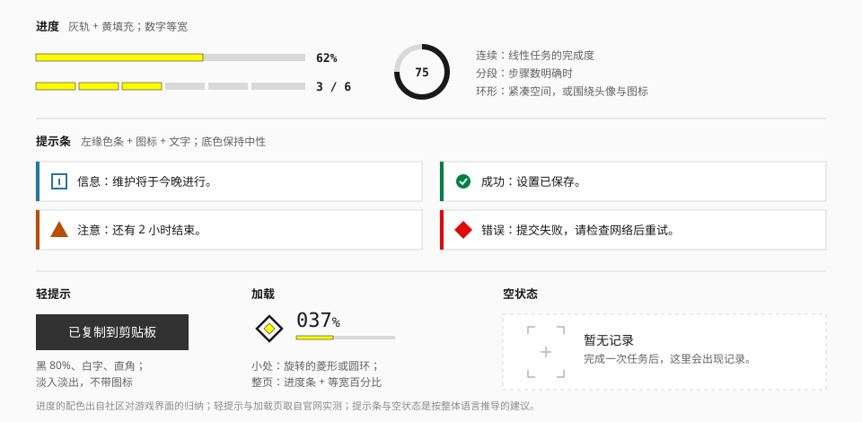

# 反馈

## 用途

告诉用户"发生了什么、进行到哪了"：进度、提示、加载、空状态。

## 实现状态

| 控件 | 写法 | 状态 |
| --- | --- | --- |
| 进度条 | `<Progress value max size showValue animate>` | 已实现 |
| 分段进度 | `<Progress segments={6} value={3}>` | 已实现 |
| 不确定进度 | `<Progress>`（不传 `value`） | 已实现 |
| 提示条 | `<Alert tone title action onClose>` | 已实现 |
| 骨架 | `<Skeleton variant lines pulse>` | 已实现 |
| 空状态 | `<EmptyState title description action>` | 已实现 |
| 按钮提交中 | `<Button loading>`，见 [按钮](button.md) | 已实现 |
| 进度环 | `<ProgressRing value size showValue>` | 已实现 |
| 轻提示 | — | 未做，等浮层基元选定后与浮层一起做 |
| 加载页 | `<Loader value tagline open>` | 已实现 |

## 进度

**灰轨 + 黄填充。** 游戏内的任务、经验、通行证进度条都是这个组合（社区）。

### 进度条

| 项 | 值 | 来源 |
| --- | --- | --- |
| 轨道 | `line`（亮）/ `control`（暗），直角 | 社区 |
| 填充 | `action` | 社区 |
| 高度 | 4px（细）/ 8px（标准） | 推断 |
| 数值 | 条的右侧或上方，`font-tech`，等宽，加粗 | 实测（加载页）|
| 入场 | 从左充填：`animate-fill`，`transform-origin: left` | 实测 |

亮色表面上，黄色填充和浅灰轨道之间的对比度偏低。两种补救（推断）：

- 给填充加一条 0.5 – 1px 的墨色描边；
- 或者亮色主题下把填充换成 `ink`（墨色），只在完成时变黄。

实现**两种都没用**：填充就是纯色的 `action`，没有描边。

- 试过第一种（填充四周 1px 的墨色描边）。对比度是够了，但亮色界面上一圈黑框显得重，和"反馈保持安静"相悖，所以去掉了。
- 代价是亮色主题下填充对轨道只有 1.3:1，靠的是色相差（黄对中性灰）而不是明度差。进度的确切数值不要只靠这根条表达：需要读数时打开 `showValue`，或者在旁边写出来。
- 轨道统一用 `line`：它在暗色主题下的取值（`#383838`）正好等于上表要的 `control`。
- 数值在条的右侧，留出"100%"的宽度：几条并排、位数不同时，轨道仍然对齐。

**进度归黄，量值归蓝。** 表示"完成了多少"用这里的进度条；表示"数量有多少"用图表，颜色是 `data` 蓝。

### 分段进度

步骤数明确时（`3 / 6`），把轨道切成等长的小段，段间留 4px。已完成的段是黄色，未完成的是灰色。

官网世界观版块的"一排短横、当前一根为黄"是它的指示器版本（实测），见 [导航](navigation.md)。

### 进度环

| 项 | 值 |
| --- | --- |
| 轨道 | 细圆环，`line` |
| 填充 | 从 12 点方向顺时针；`ink` 或 `action` |
| 线宽 | 直径的 8 – 10% |
| 中心 | 数值（不带 `%`）或图标 |

用在紧凑空间，或者围住一个头像、图标。游戏内的技能冷却用的就是弧线（社区）。

已实现为 `<ProgressRing value max size showValue>`：

- `size` 是直径的像素值，默认 48；线宽取直径的 9%，最细 2px，也可以用 `thickness` 指定；
- 填充和进度条一样是纯色的 `action`、不描边，轨道是 `line`；亮色下的对比同样偏低，需要读数时打开 `showValue`（中心显示不带 `%` 的百分比）；
- 中心也可以放图标或头像（作为子元素传入），这时不显示数值；
- 不传 `value` 是不确定进度：四分之一圈的弧匀速旋转。系统开启"减少动态效果"时换成**一圈虚线**——静止的一段弧会被看成"进度 25%"。

### 不确定进度

不知道总量时：

- 条形：一段固定长度的黄色块在轨道上匀速往返；
- 小处：旋转的菱形或圆环（`animate-spin`）。

条形的实现：色块宽为轨道的 40%，用 `animate-indeterminate` 往返（1.2 秒一程）。系统开启"减少动态效果"时色块停在轨道正中——停在左端会被看成"进度 40%"。

## 提示条

页面内的一条常驻消息。

| 项 | 值 |
| --- | --- |
| 底 | `surface-raised`，1px `line` |
| 左缘 | 4px 语义色条 |
| 图标 | 语义色，16 – 20px |
| 文字 | `ink`，`text-sm` |
| 圆角 | 0 |
| 操作 | 右侧可放一个 `text` 按钮或关闭图标 |

| 色调 | 色条与图标 | 图标形状 |
| --- | --- | --- |
| `info` | `info` | 方框 |
| `success` | `success` | 圆 + 对勾 |
| `warning` | `warning` | 三角 |
| `danger` | `danger` | 菱形 |

四种色调用**四种不同形状**的图标，不只靠颜色区分。

底色保持中性，不做成整块的浅红、浅绿。理由和整套语言一致：颜色是信号，点到为止。

危险操作的确认区可以在顶边加一条 [警示条纹](../elements/stripes-and-strips.md)。

这一节是推断；官网没有对应的组件。

实现：

- 色条与图标用文字档的语义色（`info`、`success`、`warning`、`danger`），它们已经按主题切好。
- 四个图标是原创的 `StatusInfo`、`StatusSuccess`、`StatusWarning`、`StatusDanger`，外形依次是方框、圆、三角、菱形；输入框的错误图标用的也是这个菱形。
- 有标题时标题加粗、正文降为 `ink-secondary`；没有标题时正文就是 `ink`。
- 提示条自己不隐藏：`onClose` 只负责通知，显示与否由使用方决定。

## 轻提示

短暂浮现的一句话（实测）。

| 项 | 值 |
| --- | --- |
| 底 | 黑 80% |
| 文字 | 白，16px，行高 1.4 |
| 圆角 | 0 |
| 位置 | 视口正中（官网）；或底部居中 |
| 动效 | 透明度淡入淡出 |
| 内边距 | 垂直 10 – 12px，水平 20 – 24px |

官网的轻提示非常朴素：没有图标、没有颜色、没有关闭按钮。

需要区分成功与失败时，在文字前加一个小的语义色图形（◆ / ●），不要把整块底色换掉。

- 停留 2 – 4 秒；有操作按钮时延长，并允许手动关闭。
- 同时只显示一条，新的替换旧的。
- 重要的、需要用户处理的信息不要用轻提示，用提示条或弹窗。

## 加载

| 场景 | 做法 |
| --- | --- |
| 整页首次加载 | 加载页：近黑底、黄色进度条、等宽大号百分比、一行标语。见 [动效](../foundations/motion.md) |
| 区块内容加载 | 骨架：与内容等大的 `surface-muted` 色块；不闪烁，或只做很轻的明度往返 |
| 按钮提交中 | 按钮内的小型旋转指示，按钮宽度不变 |
| 行内 | 12 – 16px 的旋转菱形或圆环 |

加载页的规格（实测）：

| 项 | 值 |
| --- | --- |
| 底 | `#141414` |
| 进度条 | `#FFFA00`，圆角 0.25rem，`scaleX` 从 0 到 1 |
| 百分比 | 数字 4.375rem Medium，`%` 3.25rem Regular |
| 标语 | 1.5rem Regular |

规则：

- 保持布局稳定：加载前后内容区的尺寸不变。
- 不伪造进度。不知道真实进度就用不确定进度。
- 内容就绪后立即显示，不为了播完动画而等待。
- 骨架屏只画大块，不画细节。

加载页已实现为 `<Loader value tagline open>`：

- **固定的近黑底**，不随主题变：`neutral-950` 底、`neutral-0` 字、`neutral-800` 轨道、`action` 进度条。字号直接落在字阶上：数字 `text-5xl`、`%` `text-4xl`、标语 `text-xl`，和上表的实测值只差 2px 以内；容器很窄时各降一到两档。
- 内容靠左下角：数字 → 标语 → 进度条。进度条高 6px、圆角 4px，用 `scaleX` 充填。
- `value` 是真实进度（0 – 100）。不知道进度就不传：进度条换成往返的色块，**不显示数字**——不伪造进度。
- 大号数字只是给眼睛看的；读屏拿到的是进度条的 `aria-valuenow`，名称默认"加载中"。
- 内容就绪后把 `open` 置为 `false`：遮罩**立刻**开始向上滑出（600ms），不等进度条走完；滑出结束后卸载，并触发 `onExited`。"充满后停留片刻"这一步没有做成内置的延时，理由同上面的第三条规则。
- 默认铺满视口（`fullscreen`），加载期间锁住页面滚动、把焦点收进来并拦住 `Tab`；开始退出的那一刻就全部放开，滑出中的遮罩不挡点击。关掉 `fullscreen` 则铺满所在的定位容器，不碰页面。
- 层叠值是 `--z-loader`，全库最高，见 [布局](../foundations/layout.md) 的"层叠顺序"。

骨架的实现：

- 色块用 `surface-muted`，不用最初设想的 `surface-sunken`：后者在亮色的面板（`surface-raised`）上几乎看不见，在暗色主题下是纯黑，会像一个洞。
- 三种形状：`block`（尺寸由使用方给）、`text`（几行，行高跟随所在位置的字号，末行短一截）、`circle`。
- 默认静止；`pulse` 打开后用 `animate-pulse` 做不透明度 1 ↔ 0.6 的往返，不做扫光。
- 骨架自身对辅助技术隐藏，"正在加载"由外层区域的 `aria-busy="true"` 表达。

## 空状态

没有内容时的占位（推断）。

| 部件 | 做法 |
| --- | --- |
| 容器 | 虚线描边（`line-strong`，4px 间隔），或无边框 |
| 图形 | 取景角 + 准星；或一个简单的等距线稿 |
| 标题 | 一句话说明现状："暂无记录" |
| 说明 | 一句话说明原因或下一步："完成一次任务后，这里会出现记录。" |
| 行动 | 可选的一个 `control` 按钮 |

游戏内图鉴用准星占位符表示"未获得"（社区），空状态沿用这个符号。

- 说明为什么为空、接下来能做什么。
- 搜索无结果、筛选无结果、出错、无权限是不同的空状态，文案分开写。
- 不要用大幅插画填满空白。

实现：默认图形是一个 56px 的原创线稿——四个取景角加中心的准星，`ink-tertiary`、1.5px 线宽；可以替换或去掉。虚线描边用浏览器的 `dashed`，间隔由浏览器决定，不保证正好 4px。放进面板里时把描边关掉，避免框套框。

## 完成与庆祝

游戏内的任务完成态是一次**明暗反转**（社区）：深色底 + 黄色区块 + 巨型描边词（`COMPLETED`）+ 领取章；同一列表里未完成的项相应降为浅灰。

用在组件库里：

- 列表项完成后，整行降低对比并叠一个低对比的描边词；
- 一个阶段全部完成时，可以让头部区域反转为深底黄字。

只在真正的里程碑上用，日常的"保存成功"用轻提示就够了。

## 行为与无障碍

- 进度条用 `role="progressbar"`，带 `aria-valuenow` / `aria-valuemin` / `aria-valuemax`；不确定进度不设 `aria-valuenow`。
- 提示条：`danger` 与 `warning` 用 `role="alert"`，其余用 `role="status"`。
- 轻提示所在的容器是 `aria-live="polite"` 区域；不要把唯一的错误信息只放在会消失的轻提示里。
- 加载中的区域设 `aria-busy="true"`。
- 所有循环动画遵守"减少动态效果"。

## 宜 / 忌

**宜**

- 反馈保持安静，颜色只点在左缘和图标上。
- 进度数字用等宽字体。
- 给每种色调配不同形状的图标。

**忌**

- 整块彩色底的提示条。
- 圆角、带图标带按钮带进度条的"豪华"轻提示。
- 骨架屏上持续的扫光动画。
- 用假进度条安抚用户。
- 把蓝色或绿色用在进度条上。

## 来源

- 轻提示、加载页：[measurements.md](../references/measurements.md) 第 8.11、8.13 节。
- 进度配色、完成态反转、准星占位：[Statrue/endfield-design-skill](https://github.com/Statrue/endfield-design-skill)。
