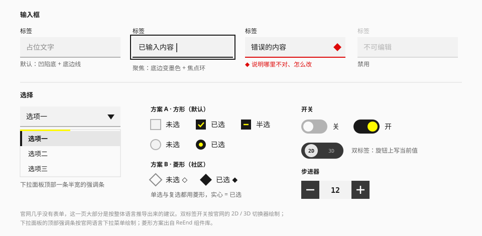

# 表单

## 用途

收集输入。

> **证据说明。** 官网几乎没有表单控件（只有账号 SDK 的登录框，那是另一套样式）。本页除了个别有实测依据的地方，其余都是按整体语言做的**推断**——可用、自洽，但不是官方界面的对应。实现时可以调整。



## 实现状态

| 控件 | 写法 | 状态 |
| --- | --- | --- |
| 字段 | `<Field label help error required>`；一组控件用 `<Field group>` | 已实现 |
| 输入框 | `<Input variant size start end invalid>` | 已实现 |
| 多行文本 | `<Textarea variant showCount maxLength>` | 已实现 |
| 验证码输入 | `<OtpInput length value type groupSize mask name onComplete>` | 已实现 |
| 复选框 | `<Checkbox indeterminate>` | 已实现（方案 A，可整体切到方案 B） |
| 单选 | `<RadioGroup>` + `<Radio value>` | 已实现（方案 A，可整体切到方案 B） |
| 开关 | `<Switch>`；两个值都要显示时加 `offLabel` `onLabel` | 已实现 |
| 筛选胶囊 | `<FilterChip>`，见 [数据展示](data-display.md) | 已实现 |
| 下拉选择 | `<Select items value placeholder variant size panelVariant invalid>`；分组用 `SelectGroup` / `SelectItem` / `SelectSeparator` | 已实现 |
| 组合框 | `<Combobox items value multiple loading filter>`，属性比照下拉选择 | 已实现 |
| 标签输入 | `<TagInput value name max separators validate>` | 已实现 |
| 步进器 | `<Stepper value min max step size>` | 已实现 |
| 分段选择 | `<SegmentedControl value name size variant>` + `<Segment value>` | 已实现 |
| 滑块 | `<Slider value min max step showValue marks>`；`value` 传两个数是范围滑块 | 已实现 |
| 日期选择 | `<DatePicker value min max format>`；选一段用 `<DateRangePicker>`；只要月历用 `<Calendar>` | 已实现 |
| 文件上传 | `<FileUpload value multiple accept maxSize maxFiles name>`；单独的一行用 `<FileItem>` | 已实现 |
| 菱形符号（方案 B） | `<html data-choice="diamond">` | 已实现 |

实现时对下文规格做的调整都写在各节里，并标了"实现"。

## 设计思路

把表单控件当成"图纸上的填写栏"：

- **凹陷的底 + 一条底边线**，而不是四边描边的圆角框。
- **直角。**
- **状态靠底边线的颜色变化**：默认灰、聚焦墨、错误红。
- **选中的控件是墨底配黄色记号**，和"墨底黄图标"的工具按钮同一个逻辑。

## 输入框

| 项 | 值 |
| --- | --- |
| 高度 | 32 / 40 / 56px |
| 底 | `surface-sunken` |
| 底边线 | 2px `line-strong` |
| 圆角 | 0 |
| 水平内边距 | 12px |
| 文字 | `text-base`，`ink` |
| 占位文字 | `ink-tertiary` |
| 标签 | 在输入框上方，`text-sm font-medium`，间距 6px |
| 帮助 / 错误文字 | 在输入框下方，`text-sm`，间距 6px |

### 状态

| 状态 | 底边线 | 其他 |
| --- | --- | --- |
| 默认 | `line-strong` | — |
| 悬停 | `ink-secondary` | — |
| 聚焦 | `ink` | 加焦点环；光标用 `ink` |
| 错误 | `danger` | 右侧菱形图标；下方红色说明文字 |
| 禁用 | `line` | 文字 `ink-disabled`；标签同步变浅 |
| 只读 | 无底边线 | 底变透明 |

为什么不用四边描边：`line`（`#D9D9D9`）在白底上只有 1.4:1，做输入框边界不够清楚；而加深到够清楚的描边又会让表单显得很重。凹陷底 + 加粗的底边线在两者之间取得平衡。

确实需要四边描边时（比如输入框放在 `surface-sunken` 的区域里），用 1px `line-strong`。

这一种写成 `variant="outline"`（默认是 `sunken`），输入框和多行文本都有：

| 项 | `sunken` | `outline` |
| --- | --- | --- |
| 边 | 只有底边，2px | 四边，1px |
| 底 | `surface-sunken` | `surface` |
| 用在哪 | 页面与面板上，默认 | 凹陷底色的工具条、筛选栏里 |

两种变体的状态色完全相同（默认 `line-strong` → 悬停 `ink-secondary` → 聚焦 `ink` → 错误 `danger`）。`outline` 的底用 `surface` 而不是透明：放进凹陷的区域后，它要比周围亮一档才看得出是一个可以填写的格子。

实现：

- 字号跟随通用的三档：`sm` 用 `text-sm`、`md` 用 `text-base`、`lg` 用 `text-lg`。
- 焦点环画在外框上，不画在里面的 `<input>` 上，前后缀因此也在环内。
- 悬停的底边线只在没有聚焦时生效，聚焦中的输入框不会因为鼠标经过而变浅。
- 只读时保留一条透明的底边线，和可编辑时一样高，切换时布局不跳。

### 前后缀

图标、单位、清除按钮放在输入框内部的左右两端，用 `ink-secondary`。数字输入的单位（"件""%"）用 `text-sm`。

### 多行文本

同样的底与底边线；最小高度 3 行；字数统计放在右下角，`font-tech text-xs`。

实现：字数统计放在框内、文字区域的下方，不压在文字上；有上限时写成 `29 / 200`。

## 验证码输入

一格一位的短码：短信验证码、交接口令、六位的站点编号。（推断：就是把 [输入框](#输入框) 切成一格一位——同样的凹陷底、同样的 2px 底边线、同样的状态色）

| 项 | 值 |
| --- | --- |
| 格子 | 见方，32 / 40 / 56px 三档；`surface-sunken` 底 + 2px 底边线，直角 |
| 字 | 居中，`font-tech`、等宽数字、`font-medium`；三档是 `text-base` / `text-lg` / `text-2xl` |
| 间距 | 格子之间 8px（`sm` 是 6px） |
| 分组 | 可选：每几格之间多一道 8px 宽、2px 高的短横（`line-strong`）。六位的码分成三位一组好念、好对 |
| 状态 | 和输入框一样只看底边线：默认 `line-strong` → 悬停 `ink-secondary` → 聚焦 `ink` → 错误 `danger`。聚焦的那一格另有焦点环 |
| 禁用 / 只读 | 同输入框：禁用是 `line` 的底边线和 `ink-disabled` 的字；只读没有底边线、底变透明 |
| `outline` | 同输入框的 `outline`：四边 1px、`surface` 底，放在凹陷底色的区域里用 |

- **空格子就是空的**，不放占位的圆点或横线：格子自己已经说明了"这里要填一位"，再放一个记号会被看成已经填了。
- 填没填满不换颜色。填了的那一格里有字，这就够了。
- **容器窄了格子等比变窄**（高度不变），不换行、不溢出：六格的 `lg` 在 320px 宽的屏上也排得下。
- 只收数字，或者字母加数字。要收别的（带符号的密码）用输入框。

已实现为 `<OtpInput length value defaultValue onValueChange onComplete type uppercase mask groupSize size variant invalid disabled readOnly required name autoSubmit slotLabel>`：

```tsx
<Field label="交接口令" help="六位数字，在交接单的右上角。">
  <OtpInput length={6} groupSize={3} name="code" onComplete={verify} />
</Field>
```

- 行为建立在 Base UI 的 OTP Field 上。**每一格是一个真的输入框**：打一位自动跳到下一格；`Backspace` 删掉这一位并退一格；`←` `→` 在格子之间走，`Home` `End` 到两头；整组在 `Tab` 顺序里只停一次。
- **粘贴一整串会分到各格**，里面的空白去掉；不合规的字符不收（`type="numeric"` 只收数字，是默认；`"alphanumeric"` 收字母和数字）。`uppercase` 把字母统一成大写——值也是大写，不只是看起来。
- 第一格带 `autocomplete="one-time-code"`：手机收到短信验证码时，键盘上方那一条"来自信息"可以直接填进来。数字的那种会唤出数字键盘。
- 填满时调 `onComplete(value)`；`autoSubmit` 是填满就提交所在的表单。`mask` 把字遮成圆点。
- 值是拼起来的一个字符串。带 `name` 时有一个隐藏字段随表单提交。
- **读屏**：第一格的名称是字段的标签（放进 `Field` 自动关联，或者自己传 `aria-label`）；后面每格是"第 2 位，共 6 位"（`slotLabel` 可换）。分组的短横是装饰，读屏不读。
- `className` 给外面那一排，`ref` 也是。

没有做的：

- **重发倒计时**。那是页面的事：旁边放一个按钮，上面用现成的 [`Countdown`](data-display.md)。
- 每一格各自的错误态：对不对是整串码的事，`invalid` 一亮六格一起亮。

## 下拉选择

**触发器**：外观同输入框，右侧一个实心倒三角。

**面板**：

| 项 | 值 | 来源 |
| --- | --- | --- |
| 底 | `surface-raised` + 1px `line`；或深色（`surface-inverse`） | 推断 / 实测 |
| 顶部强调条 | 一条半宽的 `action` 色细条，高 3 – 4px | 实测（官网语言菜单：顶部 0.375rem 的黄条，宽 50%） |
| 选项高 | 32 – 36px | 推断 |
| 悬停 | 提亮一档（`ink/5`） | 推断 |
| 当前项 | `surface-muted` + 左缘墨色条 + 加粗；深色面板里是整行黄底墨字 | 推断 / 实测 |
| 圆角、分隔线 | 都没有 | 实测 |
| 阴影 | `shadow-sm` | 推断 |

官网的语言下拉是深色面板 + 黄色当前项（实测，黄色取值是偏金的 `#FFCC1A`）。本规范提供浅、深两种面板，默认跟随主题。

实现：

- 触发器直接用输入框的外框（[`control-box.ts`](../../../packages/ui/src/components/input/control-box.ts)）：两种变体、三档尺寸、各状态的边线颜色都和输入框一样，并排放不会走样。焦点环同样画在外框上。面板开着的时候边线保持聚焦的墨色。
- 右侧的实心三角闭合时朝下，展开时翻成朝上。
- 面板落在触发器**下方**，和它等宽、左对齐，离它 4px；下面放不下时翻到上面。没有用"面板盖住触发器、当前项对齐到原位"的那种做法——顶部的强调条需要一个固定的位置。
- 面板最高 320px，选项多了在面板里滚动。
- 面板的画法和 [下拉菜单](overlay.md) 共用：`panelVariant="plain"`（默认，跟随主题）或 `"strong"`（固定深色，当前项整行黄底墨字）。悬停底从推断的 `surface-sunken` 改成了全库统一的 `ink/5`：前者在暗色主题下是纯黑，悬停会变暗而当前项变亮，方向相反。
- 放进 `Field` 后标签、帮助文字、错误说明自动关联。点标签会打开面板——触发器是一个按钮，点它的标签等于点它。
- 带 `name` 时选中的值随表单提交。值的类型是字符串。
- 键盘：回车、空格、上下方向键打开；方向键移动；回车选中；按字母跳到以它开头的项；`Esc` 关闭。选中或关闭后焦点回到触发器。
- 选项只有两三个、又都该一眼看到时，用单选或页签，不用下拉。

### 多选

加 `multiple`，值变成字符串数组。

- **选项行首是一个 16px 的小方格**（和下拉菜单的复选项是同一个），勾上的项文字加重。不再用"当前项"的整行底色：单选时只有一行是当前项，多选时会有好几行，整片的底色会把面板涂花，也分不清哪些是悬停。
- 选了不关面板，可以连着选；点外面或按 `Esc` 收起。
- 触发器里把已选项用顿号连起来，放不下时截断成省略号；选了两项以上时，后面跟一个不会被截掉的计数（"3 项"）。要换一种写法用 `renderValue`。
- 带 `name` 时每个选中的值各提交一份，同一个字段名。
- 读屏：面板是一个可多选的列表框，每一项报出选没选。
- 选项很多、需要搜索时它不合适——那是 [组合框](#组合框) 的事。

## 组合框

一个能打字的下拉：选项多到要找的时候用它（推断——官网和游戏界面里没有这个控件，画法全部沿用输入框与下拉选择）。

|  | 下拉选择 | 组合框 |
| --- | --- | --- |
| 选项数量 | 十来个以内，扫一眼就能找到 | 几十个以上，或者使用者记得名字 |
| 触发器 | 一个按钮 | 一个输入框 |
| 找选项 | 方向键，或者按首字母跳 | 打字筛选 |

值只能是选项里有的。它不是"带建议的输入框"：打了一半没选就离开，输入框会回到原来的值。

已实现为 `<Combobox items value onValueChange>`，属性比照下拉选择：

- **外框就是输入框的外框**：两种变体、三档尺寸、各状态的边线颜色都一样。里面从左到右是输入框、错误图标、清除钮（有值时才出现）、和下拉选择一样的实心三角。
- **面板、选项、分组小标题和下拉选择是同一份画法**，`panelVariant` 同样有 `plain` 和 `strong`。一个都没匹配上时，面板里是一行次要色的说明（`emptyText`，默认"没有匹配的选项"），面板不会空着或者消失。
- `items` 是 `{ value, label, keywords?, disabled? }`；要分组就传 `{ label, items }` 的数组。`label` 必须是字符串——要拿它检索。
- **检索**匹配 `label` 和 `keywords`，不分大小写。`keywords` 放别名：编号、缩写、旧称，它们不显示。拼音检索没有做；需要的话把拼音放进 `keywords`。
- **"移到了哪一项"只靠底色表示。** 焦点一直留在输入框里（读屏靠 `aria-activedescendant` 知道移到了哪），选项上没有焦点环可画。所以当前项被移到时底色再深一档（`line`；深色面板里是 `action-pressed`），否则它原有的底色会把"移到"盖住。
- 键盘：打字即筛选并打开面板；`↓` `↑` 移动，回车选中；`Esc` 先关面板，再按一次清空。
- 放进 `Field` 后标签、帮助文字、错误说明自动关联。带 `name` 时选中的值随表单提交。
- 选项要从服务器取时见下面的"远程检索"。

### 远程检索

选项多到不能一次给全时，由服务器按输入的文字返回：

```tsx
<Combobox
  items={results}
  filter={false}
  loading={pending}
  onInputValueChange={search}
/>
```

- `onInputValueChange` 拿到输入的文字，自己去取，取回来换 `items`。
- `filter={false}`：不在本地再筛一遍，`items` 给什么就显示什么。服务器按拼音、按编号匹配出来的结果，本地按文字再筛会被筛掉。
- `loading`：面板里出一行"正在查找…"（一个行内的加载方块 + 文字，`loadingText` 可换），这时不显示"没有匹配的选项"。上一批选项照常留着，新的回来再换——面板不会先空一下。
- 这一行和"没有匹配"那一行都是读屏的状态区，换内容时会播报。
- **选中的那一项不在后来的这批选项里也没关系**：组合框记得见过的选项，输入框里的文字、提交的值都还在。只有一种情况找不到——值是从外面给的，而对应的选项从来没有出现在 `items` 里；这时把那一项也放进 `items`。
- 请求的防抖、取消过期的请求由使用方做。

### 多选

加 `multiple`，值变成字符串数组。

- **已选项在框里排成一个个直角的小块**：`surface-muted` 底，右端一个删除叉。用直角不用胶囊——它是已经定下来的值，不是会自己变的状态（见 [数据展示](data-display.md) 的"形状就是语义"）。
- 小块放不下就换行，外框跟着长高：三档尺寸在多选时是**最小**高度。小块的高度是 20 / 24 / 32px，和它排在一起的输入框同高。
- 选项行首是和下拉多选一样的小方格。
- **选了之后面板关不关，看有没有打字**：没打字直接从列表里选，面板不关，可以连着选；打了字搜出来再选，这一次搜索就结束了——文字清空、面板关上，焦点留在输入框里，接着打字会再打开。（这是基元的行为：搜索结果在选中后会整个换掉，留着面板反而跳。）
- 输入框空着时按 `Backspace` 删掉最后一个；`←` 能走到小块上，在小块上按 `Backspace` 或 `Delete` 删掉它。
- `Esc` 关面板的同时把没选完的字清掉（单选时要按第二次才清）。
- 清除钮一次清空全部。

## 标签输入

自己打出来的一串短词：关键词、标签、收件人。（推断：外框是输入框的，小块是上面组合框多选里的那一种）

| 要的是 | 用 |
| --- | --- |
| 从一批现成的选项里挑几个 | [组合框](#组合框) 的多选 |
| 自己打，打什么是什么 | 标签输入 |
| 几个固定的条件各自开关 | [筛选胶囊](data-display.md) |

| 项 | 值 |
| --- | --- |
| 外框 | 输入框的外框：两种变体、各状态的边线颜色都一样。三档尺寸是**最小**高度（32 / 40 / 56px），小块多了换行、外框长高 |
| 小块 | 直角，`surface-muted` 底、`ink` 字，高 20 / 24 / 32px；右端一个删除叉（`ink-secondary`，悬停 `ink` + `line` 底）。和组合框多选是同一份画法 |
| 计数 | 传了 `max` 才有：右端一个 `3 / 8`，`font-tech`、等宽、`text-xs`、`ink-secondary`；满了变成 `ink`。小块换了行它贴着最后一行（和多行文本的计数同一个位置） |
| 重复时 | 已有的那个小块闪一下：填充反转（`surface-inverse` 底、`ink-inverse` 字）400ms。不用黄色——这不是"选中" |

已实现为 `<TagInput value onValueChange placeholder name max maxLength validate separators commitOnBlur onReject variant size invalid disabled readOnly>`：

- **怎么加**：回车；或者打出分隔符（默认是半角和全角的逗号，`separators` 可换）；粘贴一串带分隔符或换行的文字会拆成几个。离开输入框时，没提交的字也加进去（`commitOnBlur`，不要就关掉）。前后的空白去掉，空的不加。
  - 分隔符是在"框里的字变了"的时候处理的，不看按的是哪个键：中文输入法打出来的"，"、粘贴进来的，走的都是这一条。**输入法正在组字时按的回车不算提交**——那是在选字。
- **三种不加的情况都不是静悄悄的**。每一种都会调 `onReject(文字, 原因)`，读屏也会听到一句：
  - `"duplicate"` 已经有了：那一个小块闪一下，框里的字留着，方便改；
  - `"max"` 到了上限：计数已经是满的；
  - `"invalid"` 没过 `validate`：`validate` 返回一句话就是不让加，这句话交给 `onReject`，由使用方放进 `Field` 的 `error`（控件自己不画错误文字，那是字段的事）。
- **怎么删**，键盘和组合框多选一致：框里空着时 `Backspace` 删最后一个；`←` 走到小块上，在小块上 `Backspace` / `Delete` 删掉它，焦点落到旁边那个，一个都不剩就回到框里；`→` 走回框里。小块上的叉是一个按钮（"移除某某"），鼠标和读屏的浏览光标都点得到，但 `Tab` 不停在上面——整个控件只占一个停靠点。
- 加了、删了、没加成，都有一句读屏听得到的播报（"已添加北岭""已移除北岭""已经有北岭了"）。
- 带 `name` 时每个标签一个同名的隐藏字段，随表单提交。放进 `Field` 后标签、帮助文字、错误说明自动关联。
- `readOnly`：只列出来，不能加也不能删，小块上没有叉。

没有做的：

- **候选列表**（一边打一边提示已有的标签）。只能选现成的用组合框的多选；"能选也能新建"两者都不是，没有做。
- 拖动排序；标签带颜色或图标。

## 复选与单选

两套符号方案。**全库选一套**，不要混用。

### 方案 A：方形与圆形（默认）

| 控件 | 未选 | 已选 |
| --- | --- | --- |
| 复选框 | 20px 方形，`surface-sunken` 底，2px `line-strong` 描边 | 墨底（`surface-inverse`）+ 黄色对勾 |
| 半选 | — | 墨底 + 黄色短横 |
| 单选框 | 20px 圆形，同上 | 墨底 + 黄色圆点 |

用户最熟悉，适合通用产品。默认方案。

### 方案 B：菱形

| 控件 | 未选 | 已选 |
| --- | --- | --- |
| 复选 / 单选 | ◇ 空心菱形 | ◆ 实心菱形 |

出自社区组件库 ReEnd，风格更强。问题是复选和单选长得一样，用户分不出"能选几个"——用它时必须靠分组标题或说明文字讲清楚。适合游戏风格的界面。

实现：它**不是组件上的属性**，而是和主题一样的全局开关——"全库选一套"由写法来保证：

```html
<html data-theme="dark" data-choice="diamond">
```

也可以写在局部容器上，容器里的复选与单选一起换。组件的用法、语义、键盘都不变。

| 状态 | 外观 |
| --- | --- |
| 未选 | 空心菱形：`surface-sunken` 底、2px `line-strong` 描边 |
| 已选 | 实心菱形，`surface-inverse`：亮色下是墨色，暗色下是近白。不再画对勾和圆点 |
| 半选（仅复选） | 实心菱形上一条 `accent-ink-inverse` 的短横 |
| 禁用 | 描边降到 `ink-disabled`；已选的保持实心（`ink-disabled`），否则和未选分不出来 |
| 错误 | 描边换成 `danger` |

- 菱形是把 14px 的方格转 45°，对角线正好还是 20px，行高与对齐都和方案 A 一样。
- 焦点环跟着菱形走，也是菱形的。
- 开关不受影响：它本来就不是方或圆的"选中符号"。

### 共同规则

- 文字标签在控件右侧，间距 8px，点击标签等同点击控件。
- 点击区域不小于 40px 高。
- 禁用：描边与记号都降到 `ink-disabled`。
- 暗色主题下，已选态反过来：浅底（`surface-inverse` 此时是近白）+ 墨色记号，或直接用黄底墨色记号。

实现：

- 已选的底用 `surface-inverse`，记号用 `accent-ink-inverse`——和面板标题带的竖条是同一条约定。亮色下是墨底黄记号；暗色下 `surface-inverse` 是近白，黄色压上去只有 1.1:1，记号自动换成强调色的深档（6.3:1），也就是上面说的"浅底 + 墨色记号"。
- 悬停时未选的描边加深到 `ink-secondary`；鼠标在文字标签上同样触发。
- 记号（勾、半选的短横、圆点）出现和消失是 200ms 的淡入淡出，和方格换底色的那一下同时走；半选和全选互换时两个记号交叉淡化。菱形方案没有记号，"已选"就是方块自己换底色。（推断，见 [动效](../foundations/motion.md#状态的记号要有过渡)）
- 标签换行时，控件对齐第一行，不居中。
- 错误态描边换成 `danger`，同时必须有文字说明。
- 一组单选都没选时，浏览器会让它们全部命中 `:indeterminate`，所以半选的样式只写在复选框上。

## 分段选择

两到五个值里选一个，选项并排摆在一条轨道里，一眼看得全。（推断：官网和游戏界面里没有这个控件。轨道是输入框的"凹陷的底 + 一条底边线"，选中的那一段是这套语言里的"填充反转"——和选中的胶囊、月历的选中格是同一个做法。）

| 项 | 值 |
| --- | --- |
| 轨道 | `surface-sunken` 底 + 2px 的底边线，直角，四周 2px 内边距 |
| 高度 | 32 / 40 / 56px，和输入框同三档：并排时对得齐 |
| 段 | 等宽，按最宽的那一段定；水平内边距 12 / 16 / 24px |
| 未选 | `ink-secondary`；悬停 `ink` + 墨色 5% 的底 |
| 选中 | `surface-inverse` 底、`ink-inverse` 字 |
| 禁用 | `ink-disabled`；选中又禁用的那一段是 `disabled` 底、`on-disabled` 字 |
| 底边线 | 默认 `line-strong`，里面有焦点时 `ink`，错误 `danger`——和输入框一样靠这条线说状态 |

- `variant="outline"` 把轨道换成四边 1px 的描边加页面底色，放在凹陷底色的工具条里用，和输入框的两种变体一一对应。
- **选中不加粗。** 加粗会让那一段变宽，整条跟着跳。选中靠的是填充反转，不只是换个字色。
- **各段等宽。** 选中的块从一段换到另一段时大小不变，看上去是同一个块在挪。
- 默认按内容定宽；要撑满所在的一栏加 `className="w-full"`。放不下时每一段的文字截断成省略号，不换行、不撑破——所以每段两到四个字为好。

用哪个：

| 情况 | 用 |
| --- | --- |
| 两到五个短选项，要一眼看全 | 分段选择 |
| 选项要带说明、要竖排、或者多于五个 | [单选](#复选与单选) 或 [下拉选择](#下拉选择) |
| 切换的是下面显示哪一块内容 | [页签](navigation.md)：它切的是内容，不是一个表单值 |
| 可以同时选几个 | 筛选胶囊 |
| 只有开和关 | [开关](#开关)；两个值都要写出来时用双标签开关 |

已实现为 `<SegmentedControl value defaultValue onValueChange name size variant disabled required>` + `<Segment value icon disabled>`：

- **语义是单选组**：每一段里是一个真的单选按钮。方向键换值（到头绕回去）、`Tab` 只停一次、带 `name` 时值随表单提交，都是浏览器原生的行为。
- 焦点环画在有焦点的那一段上，并提到相邻段之上。
- 放进 `Field` 后标签、帮助文字、错误说明、禁用、必填自动关联；不在 `Field` 里时自己传 `aria-label`。
- 只有图标的段要给 `aria-label`。
- 只做了单选。能同时按下几个的那种（加粗、斜体）是工具栏里的开关按钮，不是表单值，这里没有做。

## 开关

胶囊轨道 + 圆形旋钮。这是全库少数的圆形控件之一——"胶囊 = 短暂可变的状态"。

| 项 | 值 |
| --- | --- |
| 轨道 | 52 × 28px，全圆角 |
| 旋钮 | 20px 圆 |
| 关 | 轨道 `neutral-400`，旋钮 `surface-raised` |
| 开 | 轨道 `surface-inverse`，旋钮 `action` |
| 过渡 | 旋钮平移，`--duration-fast` |

"开"的状态是**墨色轨道 + 黄色旋钮**，而不是整条黄色轨道：黄色只点在旋钮上。

实现：

| 状态 | 轨道 | 旋钮 | 说明 |
| --- | --- | --- | --- |
| 关 | `line-strong` | `surface-raised` | 亮色取值就是上表的 `neutral-400`；暗色是 `#626262`，不会比"开"更抢眼 |
| 关 · 悬停 | `ink-tertiary` | 同上 | — |
| 开 | `surface-inverse` | `accent-ink-inverse` | 亮色是墨轨黄钮；暗色是近白轨道 + 深色旋钮，理由同复选框 |
| 禁用 | `surface-muted` | `ink-disabled` | 开与关只靠旋钮位置区分 |

语义上是 `<input type="checkbox" role="switch">`，读屏读作"开关"。立即生效的设置用开关；要点"保存"才生效的用复选框。

### 双标签开关

两个值都要显示时（如 `2D` / `3D`），用官网的切换器样式（实测）：

- 半透明深色胶囊轨道（`rgba(0,0,0,.5)` – `.7`）；
- 浅色圆形旋钮（`#E6E6E6`），**旋钮上写着当前值**；
- 另一个值写在轨道的空位上，低对比；
- 文字用 `font-tech`。

实现：给 `Switch` 同时传 `offLabel` 与 `onLabel`。

| 部位 | 取值 | 说明 |
| --- | --- | --- |
| 轨道 | `surface-inverse` 的 80% | 两个值都是有效值，轨道不随开关变色。亮色下是上面的半透明深色；实测的 `rgba(0,0,0,.5)` 放到暗色页面上会和页面融在一起，所以跟着主题反转成浅色轨道 |
| 旋钮 | `surface-muted` | 亮色下正好是实测的 `#E6E6E6` |
| 旋钮上的值 | `ink` | — |
| 轨道上的另一个值 | `ink-inverse` 的 70% | "低对比"但仍然读得清：两个主题下都在 4.5:1 以上 |
| 禁用 | 轨道 `surface-muted`，旋钮 `surface-raised`，字 `ink-disabled` | — |

- 两个值各占一格、等宽，按较宽的那个定宽；旋钮是盖住半条轨道的胶囊，所以两个汉字（"列表" / "网格"）也放得下。
- 语义仍然是开关：读屏读到的是"开关，开 / 关"，轨道上的字对它隐藏。名称要写成"开 = 第二个值"的说法，比如 `aria-label="三维视图"`，而不是"视图"。

## 步进器

`−` 按钮 + 数字 + `+` 按钮，三段紧贴。

- 两端是 `control` 色的方形按钮；
- 中间是 `surface-sunken` 底，数字 `font-tech`、等宽、加粗、居中；
- 到达上下限时对应按钮禁用。

已实现为 `<Stepper value min max step size>`，高度是通用的三档（32 / 40 / 56px），两端按钮是等高的正方形：

- **中间可以直接输入。** 输入到一半不打断（敲 `5` 不会因为下限是 10 而被立刻改掉），失焦或回车时才落定，并夹到范围内；清空后失焦还原成原来的值；字母进不了输入框。
- **键盘**：`↑` `↓` 加减一步，`PageUp` `PageDown` 十步，`Home` `End` 到上下限（没设上下限时不响应）。语义是 `role="spinbutton"`，带 `aria-valuenow` / `aria-valuemin` / `aria-valuemax`。
- **两端的按钮不占 Tab 顺序**：键盘用户在输入框里按方向键就够了，免得一个数字要 Tab 三次。按钮仍然有名称（"减少""增加"），读屏和触屏照常能用。
- **按住连续加减**：按下先走一步，400ms 后每 80ms 一步，松开、移出或到头时停。
- 小数步长（`step={0.1}`）按步长的小数位数取整，不会出现 `0.30000000000000004`。
- 颜色：两端 `control` / `on-control`（两个主题下相同），禁用时 `disabled` / `on-disabled`；错误态在数字下方出现一条 2px 的 `danger` 线，同时必须有文字说明。
- 放进 `Field` 后标签、帮助文字、错误说明自动关联；焦点环画在整个步进器的外框上。

## 滑块

在一个范围里拖着选一个数：音量、缩放、透明度。（推断。）

|  | 步进器 | 滑块 |
| --- | --- | --- |
| 要的是 | 一个确切的数 | 一个大概的位置 |
| 改的时候 | 一步一步地加减，或者直接输入 | 边拖边看效果 |
| 范围 | 可以没有上下限 | 必须有上下限 |

| 项 | 值 |
| --- | --- |
| 轨道 | 高 4px，`line`，直角 |
| 走过的一段 | `ink`。不用进度条的黄色：滑块的位置要看得清，黄色在浅灰轨道上看不清 |
| 滑块 | 12 × 20px 的直角墨块（`surface-inverse`），和按钮里的竖条是一家；四周一圈 2px 的 `surface` 色，把它和轨道分开 |
| 按住 | 墨块正中亮一条 2px 的强调色细线（`accent-ink-inverse`），200ms 淡入淡出 |
| 聚焦 | 滑块外 2px 的 `focus` 色环 |
| 数值 | 可选，在轨道右侧，`font-tech`、等宽、加粗 |
| 刻度 | 可选，轨道下方：1px × 6px 的短线（`line-strong`）+ `text-xs` 的标注 |
| 高度 | 整个控件占 32 / 40px（`sm` / `md`），和同一行的其他控件对齐；轨道居中 |
| 禁用 | 走过的一段和滑块变 `ink-disabled` |

- 切到菱形方案（`data-choice="diamond"`）时，滑块换成一个 14px 的菱形。
- 触屏上滑块的点击区补到 40 × 40px。
- 点轨道的任意位置，滑块跳过去并且可以接着拖。
- **按键和外部改值时滑过去，拖动时不过渡。** 方向键、`PageUp` / `PageDown`、`Home` / `End`，或者外面把值改了，滑块和走过的一段在 200ms 里滑到新位置。拖动中位置贴着指针，没有过渡——加了的话滑块会追着手指跑。点轨道也没有：按下的那一刻就已经算开始拖了。（推断，见 [动效](../foundations/motion.md#跟手的不加过渡)）

### 实现

- `<Slider value defaultValue onValueChange onValueCommitted min max step largeStep size showValue format marks name disabled>`。默认范围 0 – 100、步长 1。
- **`value` 传两个数就是范围滑块**：两个滑块，走过的一段在它们之间；`minStepsBetweenValues` 规定两者至少隔几步，两个滑块互相推不过去。
- `onValueChange` 在拖动的每一步都触发；`onValueCommitted` 只在松手（或一次按键）之后触发——要发请求的事放在后者里。
- `showValue` 在右侧显示当前值；`format` 是 `Intl.NumberFormat` 的选项（百分比、单位、小数位）。范围滑块显示成 `20 – 60`。数值区按最宽的那个值留宽，拖动时轨道不会跟着伸缩。
- `marks` 是 `{ value, label? }` 的数组。刻度只是标注，不改变步长；要"只能停在刻度上"，把 `step` 设成刻度的间距。
- **键盘**：`←` `↓` 减一步，`→` `↑` 加一步；`PageUp` `PageDown`（或 `Shift` + 方向键）走 `largeStep`（默认 10）；`Home` `End` 到两端。
- 语义是原生的范围输入：每个滑块里有一个真的 `<input type="range">`，读屏读到的是"滑块，40，最小 0，最大 100"。带 `name` 时值随表单提交（范围滑块提交两个同名的值）。
- 放进 `Field` 后标签自动关联。范围滑块是一个以标签命名的分组，两个滑块各叫"最小值""最大值"（`thumbLabels` 可换）。不在 `Field` 里时自己传 `aria-label`。
- 一处和别的字段不一样：**点标签不会把焦点移到滑块上**。滑块里那个原生输入的 `id` 是无障碍基元自己生成的，标签的 `for` 指不到它；名称是用 `aria-labelledby` 关联的，读屏不受影响。
- 轨道两端各缩进半个滑块的宽度：滑块到头时它的外缘和别的字段对齐，不伸到外面去。只做了横向的。

## 日期选择

选一天，或者选一段。（推断：官网和游戏界面里没有日期控件；月历的画法取自这套语言里"格子"的做法——直角、等宽数字、选中是填充反转。）

值是 `YYYY-MM-DD` 的字符串，和原生的 `<input type="date">` 一样：没有时间，也没有时区，存取和比较都不会差出一天。

### 月历

| 项 | 值 |
| --- | --- |
| 结构 | 一行月份标题和一对翻月的钮；一行星期；六行日期 |
| 月份标题 | `2026年10月`，`text-sm`、加粗；居中 |
| 翻月钮 | 32px 的方形 [图标按钮](button.md)，在标题两侧 |
| 星期行 | `text-xs`，`ink-tertiary`，一个字（一、二、三…） |
| 日期格 | 40px 见方，直角，没有间距；数字 `font-tech`、等宽、`text-sm` |
| 悬停 | `ink` 5% |
| 选中 | 填充反转：`surface-inverse` 底、`ink-inverse` 字，加粗 |
| 今天 | 数字下面一条 12 × 2px 的强调色短线（`accent-ink`；压在选中格上时是 `accent-ink-inverse`） |
| 不在本月 | `ink-tertiary`；仍然可以点，点了翻到那个月 |
| 不可选 | `ink-disabled` 加删除线 |
| 行数 | 永远六行：翻月时高度不跳 |

- **"今天"不只靠颜色**：它是一条线，不是换个字色。选中和今天可以是同一天，两个记号各管各的。
- 一周从星期一开始（`weekStartsOn={0}` 改成星期日）。
- 月份标题、星期、读屏听到的日期名称按 `locale` 走（默认 `zh-CN`），用的是浏览器的 `Intl`。

已实现为 `<Calendar value onValueChange month onMonthChange min max isDateDisabled weekStartsOn locale today>`：

- **键盘**（ARIA 实践指南的日期网格）：方向键走一天 / 一周；`Home` `End` 到这一周的头尾；`PageUp` `PageDown` 换月，加 `Shift` 换年；回车或空格选中。走出当前这个月时月历跟着翻。
- **整个网格只占一个 `Tab` 停靠点**：停在选中的那一天，没选时是今天。
- `min` `max` 之外的日子、`isDateDisabled` 返回真的日子不可选。键盘走到范围外会被夹回边界；不可选的日子仍然走得到（读屏要能读到它为什么不能选），只是选不了。整个月都在范围外时，对应的翻月钮禁用。
- 语义是一张 `role="grid"` 的表，以月份标题命名；每个日子是一个按钮，名称是完整的日期（"2026年10月9日星期五"），选中的那一格带 `aria-selected`，今天带 `aria-current="date"`。翻月时标题会播报。
- `today` 默认取本地时间的今天；要在服务端渲染、或者要一个固定的"今天"时自己传。

### 日期选择

一个字段：点开是一块面板，里面是月历。

- **外框就是输入框的外框**（两种变体、三档尺寸、各状态的边线），里面是日期和一个日历图标。日期写成 `2026.10.09`——和日期块、微标行是同一种写法；`format` 可换。
- **触发器是一个按钮，不能打字。** 生日这类离今天很远、使用者又记得住的日期，直接打字比翻月历快——那种字段用原生的 `<Input type="date">`。
- 面板是 [气泡卡片](overlay.md) 的那一块：`surface-raised` + 1px `line` + 顶部半宽的强调条，在外框下方、左对齐。底下一行两个文字钮："今天"和"清除"（必填的字段没有"清除"）。
- 打开时焦点落在月历里选中的那一天（没选时是今天）；选了就关，焦点回到触发按钮；`Esc`、点外面也会关。
- 带 `name` 时值随表单提交；放进 `Field` 后标签、帮助文字、错误说明自动关联。

已实现为 `<DatePicker value onValueChange placeholder name variant size min max isDateDisabled format invalid disabled required>`。

### 选一段

起止两天。月历加 `range`，值从一个日期变成一对 `[起, 止]`（和滑块一样：传一个值是一个，传两个是一段）。

| 项 | 值 |
| --- | --- |
| 两端 | 和选中格一样的填充反转：`surface-inverse` 底、`ink-inverse` 字，加粗 |
| 中间 | 墨色 10% 的浅带。日期格之间本来就没有间距，所以它是连续的一条 |
| 预览 | 起始日定了、结束日还没定时，起始日到指针（或键盘）所在那天之间是墨色 5% 的浅带 |
| 今天 | 短线照旧；压在两端的块上时是 `accent-ink-inverse` |

- **点两下。** 第一下定起始日，第二下定结束日；后点的那天更早也行，会自动排成先后。同一天点两下是只有一天的一段。选完之后再点是重新开始。
- 一段不只靠颜色：两端是实心的块，中间是连着的带子，形状上就是"从这到那"。浅带用的是墨色的不透明度，跟着主题走——暗色面板上它是比面板亮一档的带子。
- 起始日定了之后按 `Esc` 取消这次选择，回到原来的那一段。
- **两端必须是可选的日子；不可选的日子可以被夹在中间。** "周末不发车"的日历上选周五到下周一是合理的。要禁止的话在 `onValueChange` 里自己判。
- 读屏：范围里的每一天都带 `aria-selected`，两端的名称后面加"起始日""结束日"；起始日定了之后有一句隐藏的播报："再选结束日"。键盘和选一天时完全一样。

`<DateRangePicker>` 是它的字段形态，属性比照日期选择：

- 显示成 `2026.10.03 – 2026.10.12`；起止是同一天时只写一个日期。
- **结束日选完面板才关**，焦点回到触发按钮。面板底下左边是一句提示（"先选起始日，再选结束日"），右边是"清除"（必填时没有）；没有"今天"——对一段来说它没有意义。
- 表单字段名是两个：`startName` 和 `endName`。
- 外框、气泡面板、日历图标这层壳和日期选择是同一份。

没有做的：

- **双月并排。** 两个月在窄屏放不下，要另写一套键盘和响应式的逻辑。一个月的网格本来就带着相邻月份的头尾几天，跨月的短区间直接点得到；长的翻一次月。
- 快捷区间（近 7 天、本月）。放在字段旁边用几个 [筛选胶囊](data-display.md) 或一个下拉更合适，值照样传给 `value`。
- 带时间；限制最短、最长天数。

## 文件上传

选文件，或者把文件拖进来。（推断：虚线框是 [空状态](feedback.md) 的——"这里现在是空的"；底是输入框的凹陷底；拖到上面时四角的 [取景角](../elements/brackets-and-markers.md#取景角) 是"正在瞄准"；文件行是组合框多选那种"已经定下来的值"的直角块，前面的扩展名是一个 [直角标签](data-display.md)）

**它只管"选"和"列"，不管"传"。** 发请求、算进度是使用方的事；控件收文件、按类型和大小把关、把选好的列出来，每一行能显示使用方给的进度和结果。

### 投放区

| 项 | `md`（默认） | `sm` |
| --- | --- | --- |
| 高 | 两行，上下内边距 16px | 一行，40px |
| 底与线 | `surface-sunken` 底，1px `line-strong` 虚线，直角 | 同左 |
| 内容 | 左对齐：一个 24px 的上传图标；一行字（"把文件拖到这里，或者 选择文件"，后四个字带下划线）；一行说明（`description`，`text-sm`、`ink-secondary`） | 图标 20px，字和说明排成一行 |

| 状态 | 画法 |
| --- | --- |
| 悬停 | 线变 `ink-secondary` |
| 键盘聚焦 | 2px 的焦点环画在投放区上 |
| 文件拖到上面 | 线变成**实线**、`ink`；四角出现取景角；字换成"松开，放进来"。三样一起变，不只靠颜色 |
| 错误 | 线变 `danger`（仍是虚线） |
| 禁用 | 线 `line`、字 `ink-disabled`；拖进来不收 |

- **里面是一个真的 `<input type="file">`**，看不见，铺满整个投放区：点哪儿都是打开系统的文件框，键盘聚焦后按空格或回车也是。所以它的名称、必填、随表单提交都是原生的。
- 选的、拖进来的、删掉之后剩下的，都会写回这个输入框——表单提交的就是下面列出来的那几个。
- 说明里把限制写清楚："PDF 或图片，单个不超过 10 MB，最多 5 个"。这句话不是装饰，是让人少碰一次壁。

### 把关

`accept`（扩展名和 MIME，`image/*` 这种通配也认）、`maxSize`（字节）、`maxFiles`；文件夹不收；同一个文件（名字、大小、修改时间都一样）不重复加。不是 `multiple` 时新选的替掉原来的。

没收的不会静悄悄地消失：投放区下面出一行——错误色的菱形图标加一句话，"2 个文件没有加进来：`a.exe` 类型不对；`b.zip` 超过 10 MB"——读屏会播报，同时 `onReject` 拿到每个文件和原因（`"type"` / `"size"` / `"count"`）。下一次加文件时这一行换掉。

### 文件行

| 项 | 值 |
| --- | --- |
| 行 | 40px 高，直角，`surface-muted` 底；行与行之间留 4px |
| 扩展名 | 直角标签：`surface-inverse` 底、`ink-inverse` 字，`font-tech`、加粗、大写（`PDF`）；没有扩展名时写 `FILE` |
| 文件名 | `text-sm`，过长截断，完整的名字在 `title` 里 |
| 大小 | `font-tech`、等宽、`text-xs`、`ink-secondary`：`1.2 MB` |
| 移除钮 | 右端 32px 的方钮，一个叉；名称是"移除某某" |

| `status` | 画法 |
| --- | --- |
| 不传 | 只是列出来 |
| `"uploading"` | 行底一条 4px 的 [进度条](feedback.md#进度条)，大小的位置换成百分比；`progress` 不传就是不确定进度 |
| `"done"` | 大小后面一个成功图标（`success`），读屏多听到一句"已上传" |
| `"error"` | 文件名下面一行 `danger` 的说明（`error`），前面是错误图标；传了 `onRetry` 就多一个"重试" |

已实现为 `<FileUpload>` 和 `<FileItem>`：

```tsx
<Field label="交接附件" help="PDF 或图片，单个不超过 10 MB。">
  <FileUpload
    multiple
    accept=".pdf,image/*"
    maxSize={10 * 1024 * 1024}
    maxFiles={5}
    name="attachments"
    value={files}
    onValueChange={setFiles}
  />
</Field>
```

- 值是 `File[]`。默认每个文件渲染一行不带状态的 `FileItem`；选了就要传的，用 `renderFile(file, { remove })` 自己返回带 `status` / `progress` 的那一行。
- `FileItem` 单独导出：不经过投放区、只是列"已有的附件"时直接用它（`name`、`size`、`href` 都是你给的）。
- **移除之后焦点有去处**：落到下一行的移除钮上，没有下一行就是上一行，一个都不剩就回到投放区。
- 放进 `Field` 后标签、帮助文字、错误说明自动关联；点标签也是打开文件框。

没有做的：

- **发请求**、分片、断点续传。
- 缩略图预览；从剪贴板粘贴；收整个文件夹。

## 表单布局

- 标签在上、控件在下。不用左右对齐的标签列——它在窄屏和长标签下都不好用。
- 字段之间 20 – 24px；分组之间 40px 以上，或用一个小的分组标题隔开。
- 一行一个字段；只有关系紧密的短字段（如起止日期）才并排。
- 必填标记：标签后加一个强调色的小菱形或星号，并在表单开头说明其含义。实现里菱形用 `accent-ink` 而不是 `action`：行动色在亮色表面上只有 1.1:1，看不见。
- 提交区：主要按钮在右（或通宽），`control` 或 `action`；取消用 `light` 或 `text`。
- 整表的错误汇总放在表单顶部的 [提示条](feedback.md) 里，并逐项链接到对应字段。

## 行为与无障碍

- 每个控件都有关联的 `<label>`。`Field` 自动把标签、帮助文字、错误说明和里面的控件关联起来。
- 一组控件（几个复选、一个单选组）用 `<Field group>`：它渲染成 `<fieldset>` + `<legend>`，禁用时里面的控件一起禁用。
- 错误信息用 `aria-describedby` 关联到控件，并设 `aria-invalid="true"`。错误说明排在帮助文字之前，两者同时保留。
- 错误说明要写"哪里不对、怎么改"，不只是"格式错误"。
- 不要只用颜色表示错误：加图标和文字。
- 不要用占位文字代替标签。
- 下拉、日期等复合控件用成熟的无障碍基元实现（下拉选择用的是 Base UI 的 Select）。
- 自动完成、输入类型（`inputmode`、`autocomplete`）按字段设置。

## 宜 / 忌

**宜**

- 保持表单安静：中性色，状态只在需要时出现。
- 用底边线的颜色变化表达状态。
- 把黄色限制在"已选"的记号上。

**忌**

- 圆角输入框配彩色发光的聚焦态。
- 给输入框切角——它需要完整的边界。
- 整条黄色的开关轨道、整块黄色的复选框。
- 在表单页上加网格、斜纹、巨字等装饰。
- 方形和菱形两套符号混用。

## 来源

- 语言下拉、双标签开关：[measurements.md](../references/measurements.md) 第 8.12、9 节。
- 菱形表单符号：[VBeatDead/ReEnd-Components](https://github.com/VBeatDead/ReEnd-Components)。
- 其余为本规范的推断。
