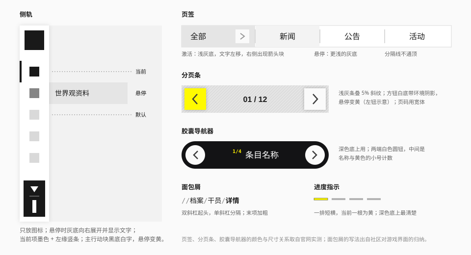

# 导航

## 用途

告诉用户"我在哪、能去哪"。这套语言里导航的共同点：**贴边、窄、当前项用填充或边条表示**。



## 侧轨

桌面端的主导航。官网的做法是一条只放图标的窄轨（实测）。

### 结构

自上而下：标志 → 导航项 → 工具组 → 主行动块 → 次要入口。

### 规格

| 项 | 官网（rem / 1920 稿） | 建议值 |
| --- | --- | --- |
| 轨宽 | 7.5rem / 90px | 64 – 72px |
| 导航项高 | 4.5rem / 54px | 44 – 48px |
| 图标 | 1.5rem / 18px | 20 – 24px |
| 展开宽度 | 19.5rem / 234px | 200 – 240px |
| 展开后的文字 | Medium 1.125rem | `text-sm font-medium` |
| 底 | `#FFFFFF` | `surface` |
| 阴影 | `0 0 1rem` 黑 10% | `shadow-rail` |
| 主行动块 | 4.5 × 9.75rem | 宽同导航项，高约 2 倍 |

### 状态

| 状态 | 图标 | 底 | 其他 |
| --- | --- | --- | --- |
| 默认 | `#D9D9D9` | 透明 | — |
| 悬停 | `#858585` | 一块 `#E5E5E5` 的底向右展开 | 文字出现 |
| 当前 | `#191919` | 透明 | 左缘出现墨色短竖条 |

主行动块：默认黑底、白色图标与竖排文字；悬停时黄色底层淡入，文字与图标变墨色。

### 两种形态

官网默认只显示图标。这在七个固定栏目的展示站上成立，但对通用场景不够友好，所以组件提供两种形态：

| 形态 | 说明 | 适用 |
| --- | --- | --- |
| `collapsed` | 只显示图标，悬停或聚焦时浮出文字 | 栏目少且固定；屏幕空间紧张 |
| `expanded` | 图标 + 文字常驻，宽 200 – 240px | **默认。** 栏目多、用户不熟悉、需要二级导航 |

`collapsed` 形态下的调整（推断）：

- 默认图标色用 `ink-secondary` 而不是 `#D9D9D9`——后者在白底上只有 1.4:1；
- 每个项必须有 `aria-label` 或视觉隐藏的文字；
- 键盘聚焦时同样展开文字。

展开的底块浮在内容之上，不推挤页面。

## 顶栏

移动端和窄屏的主导航（实测）。

| 项 | 官网（竖屏 rem / 1080 稿） | 建议值 |
| --- | --- | --- |
| 高度 | 9.625rem / 154px（约视口宽的 14%） | 56px |
| 底 | `#FFFFFF` | `surface` |
| 阴影 | `0 0 2rem` 黑 30% | `shadow-lg` |
| 图标钮 | 4.75rem 见方，`#F2F2F2` 底 | 40px |
| 主行动 | 15.5 × 4.75rem，`#191919` 底白字 | 高 40px |

内容从左到右：标志 → （弹性空白）→ 工具图标钮 → 主行动 → 菜单钮。

### 全屏菜单

点菜单钮后，一个白底的全屏面板盖住页面：

- 导航项：高约 56px，`surface-sunken` 底，项间留 3 – 4px 缝；内容是图标 + 竖向分隔线 + 文字 + 右侧箭头。
- **当前项整条变信号黄**，图标与分隔线变墨色。
- 导航项下方：一排工具按钮（`surface-muted` 底）。
- 底部：一到两个通宽的深色按钮。
- 背景：一行镂空巨字，裁切在底部。

## 页签

在同一层级的几块内容之间切换（实测）。

| 项 | 官网 | 建议值 |
| --- | --- | --- |
| 高度 | 3.75rem / 45px | 36 – 40px |
| 文字 | Medium 1.75rem | `text-lg font-medium` |
| 分隔线 | 0.1875 × 2.5rem，`#D9D9D9` | 2px 宽，高为页签的三分之二 |
| 箭头块 | 2.3125rem 见方，`#FAFAFA` | 高度的 60% |

| 状态 | 底 | 其他 |
| --- | --- | --- |
| 默认 | 透明 | — |
| 悬停 | `#F3F3F3` | — |
| 激活 | `#E5E5E5`（`surface-muted`） | 文字左移约 1.75rem，右侧箭头块淡入 |

悬停底在实现里是 `ink` 以 5% 不透明度叠上去（`hover:bg-ink/5`），不用 `surface-sunken`：亮色下的结果约为 `#F3F3F3`，与实测一致；暗色下约为 `#202020`，比页面亮一档。`surface-sunken` 在暗色主题下是纯黑，用它会变成"悬停变暗、激活变亮"，方向相反。

要点：

- 页签是**直角的格子**，之间用不通顶的竖线分隔，不是下划线式的。
- 紧挨激活项的两条竖线不画，让给激活项的底色。
- 激活不用黄色，用浅灰底 + 位移。黄色留给更高层级的导航。
- 文字左移与箭头淡入同时发生，时长 `--duration-base`。
- 页签很多时横向滚动，不换行。

变体（推断）：

| 变体 | 外观 | 用在哪 |
| --- | --- | --- |
| `block` | 上述的格子式 | 默认 |
| `capsule` | 横向胶囊，选中反转为墨底白字 | 筛选、类目切换（游戏界面的做法，社区） |
| `wedge` | 选中项为黄底墨字、一侧斜切 | 游戏风格界面的一级页签（社区） |

`block` 与 `capsule` 已实现；`wedge` 要等切角工具类落地后再做。

## 分页

### 分页条

用于列表的翻页（实测）。

| 项 | 官网 | 建议值 |
| --- | --- | --- |
| 条高 | 5.25rem / 63px | 48 – 56px |
| 条底 | `#E6E6E6` 叠 5% 斜纹 | `surface-muted` + `hatch` |
| 方钮 | 4.625rem 见方，`#FAFAFA`，`0 0 0.625rem` 阴影 | 比条高小 8 – 12px |
| 页码 | Novecento Wide Medium 1.5rem | `font-display text-lg` |

方钮状态：默认 `#FAFAFA` → 悬停信号黄 → 按下 `#EEEA00`；禁用时箭头变 `#AAAAAA`。

深色变体：条底 `rgba(30,30,30,.8)`。

页码写成 `01 / 12`，等宽数字。需要跳页时在页码处提供输入，而不是列出一长串数字按钮。

### 胶囊导航器

在少量条目间前后切换，并显示当前条目的名称（实测）。

- 近黑的胶囊（`#131315`），高约 56px；
- 两端各一个白色圆钮（`#FAFAFA`）；
- 中间：小号的黄色计数（`1/4`）+ 条目名称（白，常规字重）。

用在深色底上。浅色底上把胶囊换成 `surface-muted`，圆钮保持白色并加 `shadow-sm`。

### 进度短横

一排短横线表示"共几项、在第几项"，当前一根为黄（深色底）或墨色（浅色底）。只做指示，一般不可点击。

### 圆形翻页钮

压在媒体角落的一对白色圆钮。见 [按钮](button.md) 的"图标按钮"。

## 面包屑

显示层级路径。

```
// 档案 / 干员 / 详情
```

- 双斜杠起头，单斜杠分隔（社区：游戏界面左上角的 `// 模块 / 子页`）。
- 斜杠用 `ink-tertiary`；末项加粗、不可点击。
- 字号 `text-sm`。
- 路径很长时，折叠中间项为 `…`。

## 行为与无障碍

- 导航容器用 `<nav>` 并加 `aria-label`。
- 当前项加 `aria-current="page"`。
- 页签用 `role="tablist"` / `tab` / `tabpanel`，方向键切换。
- 分页按钮有明确的可访问名称（"上一页""下一页"），禁用时用 `disabled`。
- 全屏菜单打开时锁定背景滚动、把焦点移入菜单，`Esc` 关闭并把焦点还给菜单钮。
- 胶囊导航器的计数变化用 `aria-live="polite"` 播报。

## 宜 / 忌

**宜**

- 让导航贴边、尽量窄。
- 用填充或边条表示当前项。
- 桌面用侧轨，窄屏换顶栏 + 全屏菜单——重新设计，而不是把侧轨缩小。

**忌**

- 居中的顶部导航栏配下划线。
- 当前项只靠文字加粗或颜色变化。
- 图标导航没有任何文字替代。
- 页签用圆角胶囊配发光。
- 分页列出几十个数字按钮。

## 来源

- 全部尺寸与状态：[measurements.md](../references/measurements.md) 第 8.1、8.2、8.6、8.7 节。
- 胶囊页签、斜切页签、面包屑写法：[Statrue/endfield-design-skill](https://github.com/Statrue/endfield-design-skill)。
