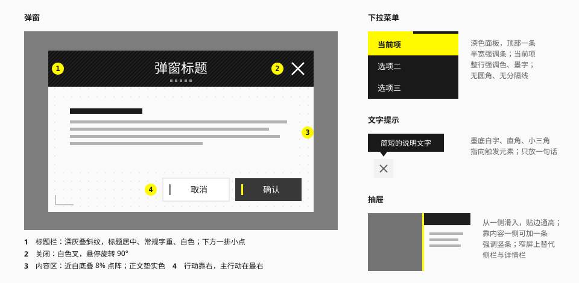

# 浮层

## 用途

浮在页面之上的内容：弹窗、抽屉、下拉菜单、右键菜单、展开条、文字提示、气泡卡片、悬浮卡。



## 实现状态

| 控件 | 写法 | 状态 |
| --- | --- | --- |
| 文字提示 | `<Tooltip content side align delay arrow>` 包住触发元素；一组相邻的提示外面包 `<TooltipProvider>` | 已实现 |
| 弹窗 | `<Dialog trigger title description footer size alert ornament cornerArt>`；"点了就关"的按钮包进 `<DialogClose>` | 已实现 |
| 抽屉 | `<Drawer trigger title description footer side size accent>` | 已实现 |
| 下拉菜单 | `<DropdownMenu trigger variant side align>` + `DropdownMenuItem` / `Group` / `Separator` / `RadioGroup` / `RadioItem` / `CheckboxItem` / `Sub` | 已实现 |
| 右键菜单 | `<ContextMenu menu variant>` 包住被右键的区域；`menu` 里放下拉菜单的那一组选项 | 已实现 |
| 展开条 | `<FlyoutBar trigger side>` + `FlyoutBarItem` | 已实现 |
| 气泡卡片 | `<Popover trigger title description side align>`；"点了就关"的按钮包进 `<PopoverClose>` | 已实现 |
| 悬浮卡 | `<HoverCard trigger title description side align delay closeDelay>` | 已实现 |

下拉选择见 [表单](form.md)，轻提示见 [反馈](feedback.md)。

行为与无障碍（焦点、键盘、定位、关闭时机）交给 [Base UI](https://base-ui.com)，本库只管长相。实现时对下文规格做的调整都写在各节里，并标了"实现"。

## 共同规则

- **直角。** 浮层没有圆角。
- **环境阴影。** 零偏移的黑色柔影，把浮层从页面上分出来。
- **中性底。** 浮层自身不带颜色，黄色只出现在强调条和主要行动上。
- **遮罩是纯黑半透明**：亮色主题 50%，暗色主题 70%（`scrim`）。不做模糊、不带色彩。

## 弹窗

官网的弹窗结构很有辨识度（实测）：深色斜纹标题栏 + 点阵底的内容区。

### 结构

| 部件 | 规格（官网） | 建议 |
| --- | --- | --- |
| 宽度 | 109rem，约视口的 68% | `min(90vw, 1040px)`；提供 `sm` 480 / `md` 640 / `lg` 1040 三档 |
| 底 | `#FAFAFA` | `surface-raised` |
| 底纹 | 点阵，1.5em 方格，8% | `dot-grid`，见 [网格、等高线、点阵](../elements/grid-contour-dots.md) |
| 标题栏高 | 8.75rem / 105px；小标题变体 5.625rem | 56 – 72px |
| 标题栏底 | `#1F1F1F` 叠斜纹 | 暗色固定值 + `hatch` |
| 标题 | 常规字重，3.75em，白色，**居中** | `text-xl` – `text-2xl`，`font-normal` |
| 标题装饰 | 标题下方一排小方点，白 50% | 可选 |
| 关闭 | 标题栏右侧，白色叉 | 24px 图标，40px 点击区 |
| 角落装饰 | 左下角一个小线稿 | 可选 |

要点：

- **标题用常规字重。** 全站的标题大多是粗体，弹窗标题是例外——深底白字本身已经足够醒目。
- 标题栏在亮、暗两个主题下都是深色。
- 内容区有正文时，给正文垫一层实色底，不让点阵穿过文字。

### 关闭

- 关闭图标悬停时**旋转 90°**，按下时变 `#CCCCCC`（实测）。
- 另外支持：`Esc`、点击遮罩（破坏性操作的确认弹窗除外）。

### 底部行动

- 按钮靠右，主要行动在最右。
- "取消 + 确认"用 `light` + `control`。
- 破坏性操作的确认用 `danger` 变体，并在按钮文字里写明后果（"删除 3 个条目"）。
- 行动区与内容区之间用 1px `line` 分隔，或留出 24px 以上的间距。

### 入场

遮罩淡入（`--duration-fast`）；弹窗淡入并从略小处放大到原大，或从下方上移 8 – 16px（`--duration-base`，`ease-exit`）。不回弹。

### 实现

- 用的是"淡入 + 从 95% 放大到原大"那一种；退场走同一条路倒回去。
- **标题带是一块固定的深色。** 它自己是一个 `data-theme="dark"` 的局部主题，底用 `surface-raised` 叠 `hatch`：里面的标题、关闭图标、焦点环都按深色底取值，不用逐个写死。标题带和内容区之间有一条 1px 的线——暗色主题下两者的底色相同，靠它和斜纹分开。
- 标题带高 64px，标题 `text-xl`；关闭图标 24px、点击区 40px。标题很长时换行，标题带跟着变高。
- 内容区铺 `dot-grid`，正文垫在一块实色底上，离四边 16px：点阵正好露出一圈。
- 内容过长时只有正文滚动，标题带与行动区不动；弹窗整体不超出视口，四周留 16px。
- 宽度三档是**上限**（`sm` 480 / `md` 640 / `lg` 1040），窄屏上通宽。
- **打开时焦点落在内容区第一个能聚焦的元素上**：有表单时是第一个字段，否则是行动区的第一个按钮。行动区的约定是"取消在前"，所以破坏性确认不会一回车就执行。内容区里什么都没有时才落在关闭图标上。可以用 `initialFocus` 改。
- 破坏性确认写 `alert`：角色是 `alertdialog`，点遮罩不关；`Esc` 和关闭图标仍然可用——关闭方式始终可见。
- 两处可选装饰都默认关着：
  - `ornament`：标题下方一排六个 4px 的小方点，标题带里正文色的 50%。标题带的高度不变（64px 里放得下）。
  - `cornerArt`：左下角的线稿。它是一个插槽——本库不带线稿，使用方传自己的原创图形，最好用 `currentColor` 画，这样会跟着取 `ink-tertiary`。线稿高 48px，排在正文那块实色底的下面、压在点阵上，跟着内容一起滚动，不压正文也不挡点击。
  - 两处都对读屏隐藏。抽屉没有这两项。

### 什么时候用

| 用 | 不用 |
| --- | --- |
| 需要用户做决定才能继续 | 只是展示一条信息——用提示条或轻提示 |
| 聚焦完成一个小任务（填几个字段） | 内容很多、需要滚动很久——用独立页面或抽屉 |
| 展示媒体的大图 | 表单验证错误——就地显示 |

不要弹窗套弹窗。

## 抽屉

从屏幕一侧滑入的面板。

| 项 | 值 |
| --- | --- |
| 位置 | 右侧（详情、设置）或左侧（导航） |
| 宽度 | 320 – 480px；窄屏上通宽 |
| 高度 | 通高 |
| 底 | `surface-raised` |
| 标题栏 | 与弹窗相同的深色带，但更矮（48 – 56px），标题**左对齐** |
| 强调 | 靠内容一侧可以加一条 3 – 4px 的 `action` 色竖条 |
| 阴影 | `shadow-lg` |
| 入场 | 从所在边缘平移进入，`--duration-base`，`ease-exit` |

用途：

- 窄屏上替代侧栏和详情栏；
- 在不离开当前页面的前提下查看、编辑一个条目；
- 筛选条件很多时的筛选面板。

底部弹出的抽屉（底部面板）用于移动端的操作菜单；顶部加一个拖动把手（一条 32 × 4px 的 `line-strong` 短横）。

### 实现

- 三个方向：`right`（默认）、`left`、`bottom`。都可以朝来的方向划走，拖动时遮罩跟着变淡。
- 宽度三档是上限（`sm` 320 / `md` 400 / `lg` 480），窄屏上通宽；底部抽屉通宽，高度不超过视口的 85%。
- 标题带高 48px，标题 `text-lg`、左对齐；和弹窗一样是一块固定的深色。底部抽屉的拖动把手画在标题带里。
- `accent` 在靠页面内容的一侧加一条 4px 的 `action` 色条。
- 内容区滚动，行动区（`footer`）不动。焦点的落点和弹窗相同。

## 下拉菜单

点击触发的一组操作或选项。

| 项 | 值 | 来源 |
| --- | --- | --- |
| 底 | 深色（`surface-inverse`），或浅色（`surface-raised` + 1px `line`） | 实测 / 推断 |
| 顶部强调条 | 高 3 – 4px 的 `action` 色条，宽为面板的一半，从左起 | 实测 |
| 选项高 | 32 – 36px | 推断 |
| 当前项 | 深色面板：整行 `action` 底、墨字；浅色面板：`surface-muted` 底 + 左缘墨色条 | 实测 / 推断 |
| 悬停 | 提亮一档（`ink/5`） | 实测（官网用透明度变化） |
| 圆角、分隔线 | 没有 | 实测 |
| 分组 | 用 8px 的间距或一条 1px 线，配一个 `text-xs` 的分组小标题 | 推断 |
| 阴影 | `shadow-sm` | 推断 |

顶部的半宽强调条是一个小签名：面板展开时，这条线从 0 伸到一半宽。

危险项（删除）用 `danger` 色文字，放在最后并与其他项隔开。

官网的分享展开条是另一种形态，见下面的[展开条](#展开条)。

### 实现

- 面板和 [下拉选择](form.md) 的面板是同一套：`surface-raised` + 1px `line` + `shadow-sm`，选项高 36px、`text-sm`。顶部的半宽强调条高 3px，压在上边线上；面板展开时从 0 伸到一半宽（`--duration-base`，`ease-exit`）。
- 两种面板写成 `variant`：
  - `plain`（默认）跟随主题。当前项是 `surface-muted` 底 + 左缘 3px 的墨色条 + 加粗。
  - `strong` 是官网语言菜单的样子：**固定的深色面板**，当前项整行 `action` 底、墨字。规格表里写的"深色（`surface-inverse`）"没有照做——它在暗色主题下是近白，黄底的当前项压在上面看不清。改成面板自己是一个 `data-theme="dark"` 的局部主题。
- 悬停和键盘移动用同一种底（`ink/5`）；键盘聚焦另有一圈画在选项里面的焦点环，只靠那一点底色差太弱。当前项的底不被悬停盖掉。
- "当前项"用单选组表达：`DropdownMenuRadioGroup` + `DropdownMenuRadioItem`，选了之后菜单关掉。
- 选项左侧可以放图标（`iconStart`），行尾可以放快捷键或计数（`end`）；传 `href` 就是链接。危险项写 `tone="danger"`。
- 面板默认出现在触发按钮下方、和它的左边对齐，离它 4px；放不下时翻到上面，或者改成右边对齐。
- 键盘：回车、空格、方向键打开；方向键在选项间循环（禁用项也走得到，读屏要能读到它）；`Home` / `End`；按字母跳到以它开头的项；`Esc` 关闭，焦点回到触发按钮。
- 菜单开着的时候页面其余部分不可交互、不可滚动。
- **复选项**（`DropdownMenuCheckboxItem`）是"能开能关的设置"，比如显示哪些列。行首一个 16px 的小方格，画法同 [复选框](form.md)：未选是凹陷底 + 描边，已选是反转块 + 对勾；整体切到菱形方案时它也跟着换。未选时方格也在——只在勾上时才出现一个对勾的话，认不出这一项能勾。点了不关菜单，可以连着改几项。
- **子菜单**（`DropdownMenuSub`）：行尾一个实心小三角。子面板和主面板是同一套画法（包括顶部的半宽强调条），出现在这一行的侧边，第一项和这一行对齐；放不下时翻到另一侧。指针停留 100ms 打开；键盘 `→` 打开并进到第一项，`←` 收起并回到这一行。`strong` 面板的子面板同样是深色。只做一层：再往下套，指针要走的路太长，不如换成弹窗或单独的页面。

## 右键菜单

在一块区域上点右键时，出现在指针处的下拉菜单。（推断：官网和游戏界面里都没有见到右键菜单，这一节是把下拉菜单的画法搬到另一种触发方式上。）

| 项 | 值 |
| --- | --- |
| 面板、选项 | 和下拉菜单完全相同，包括顶部的半宽强调条、`plain` / `strong` 两种面板 |
| 位置 | 左上角落在指针处；放不下时翻到指针的另一侧 |
| 触发 | 鼠标右键；键盘的菜单键或 `Shift+F10`；触屏长按 |
| 区域的样子 | 不变。菜单开着的时候也不给区域加描边或底色 |

规则：

- **右键菜单只是捷径。** 里面的每一个操作在页面上都要另有入口（行内的按钮、"更多"菜单、工具栏）：触屏上长按不是人人都会试，键盘用户要先把焦点移进这块区域，而且没有任何东西提示"这里可以点右键"。
- 菜单的内容应当和这块区域直接相关：右键的是一行，菜单里就是对这一行的操作。
- 不要在可以选中文字、可以输入的区域上用它——那里的右键是浏览器的（复制、粘贴、拼写检查）。
- 一个界面里右键菜单的写法要一致：要么所有的行都有，要么都没有。

### 实现

- `<ContextMenu menu={…}>` 包住**一个**元素，那个元素就是被右键的区域；`menu` 里放 `DropdownMenuItem`、`DropdownMenuCheckboxItem`、`DropdownMenuGroup`、`DropdownMenuSeparator`、`DropdownMenuSub`——没有另做一套选项。
- 键盘、关闭方式、"开着的时候页面其余部分不可交互"都和下拉菜单相同。`Esc` 关闭后焦点回到打开前所在的元素。
- 区域本身不会因此变成能聚焦的东西。要让键盘也打得开，区域里得有一个能聚焦的元素（比如一行里的链接或按钮）：焦点在它上面时按菜单键，菜单出现在它旁边。
- `disabled` 时右键回到浏览器自己的菜单。

## 展开条

从一个图标按钮旁边"拉开"的一条横排操作。官网的分享按钮是它的原型（实测）：一条墨黑的横条，左缘 0.375rem 的黄色竖条，里面排着浅灰的图标，悬停变白。

| 项 | 值 | 来源 |
| --- | --- | --- |
| 底 | 固定深色 | 实测（`#191919`） |
| 强调 | 靠触发按钮的一侧一条 4px 的 `action` 色竖条 | 实测（0.375rem，按官网 12px 的根字号是 4.5px，取整到 4px） |
| 高度 | 和触发按钮一样高，并排成一条 | 实测 |
| 选项 | 图标，`ink-secondary`；悬停或键盘移到时变成 `ink` | 实测 |
| 触发按钮 | 方形反转的图标按钮（`inverse`），展开时保持墨底黄图标 | 实测 |
| 入场 | 从触发按钮一侧拉开，`--duration-base`，`ease-exit` | 推断 |

用在"一个按钮背后有三五个并列的去处"的地方：分享、导出、切换视图。选项多于六个、或者需要文字才看得懂时，用下拉菜单。

### 实现

- 语义和键盘都是一个**横向的菜单**：回车、空格打开并进到第一项，`←` `→` 在选项间移动，`Esc` 关闭并回到触发按钮。读屏读作菜单，名称取自触发按钮——所以触发按钮的 `aria-label` 要写清楚这一条是干什么的（"分享"）。
- 选项（`FlyoutBarItem`）的子元素是图标，可以再带文字；**只有图标时必须给 `aria-label`**。传 `href` 就是链接。
- 底没有用 `#191919`：它自己是一个 `data-theme="dark"` 的局部主题，底用 `surface-raised`（`#1F1F1F`，和弹窗标题带、`strong` 面板同一个值），里面的图标、焦点环都按深色底取值。外面一圈 1px 的 `line`，暗色页面上靠它和背景分开。
- 拉开用的是 `clip-path` 过渡，不是横向缩放——缩放会把图标压扁。
- 默认在触发按钮右侧（`side="right"`），也可以放左侧；放不下时翻到另一侧，黄色竖条跟着换边，始终贴着触发按钮。
- 和下拉菜单一样，开着的时候页面其余部分不可交互；点外面关闭。
- 本库不带任何平台的标志。预览站里的图标是原创的几何图形。

## 文字提示

悬停或聚焦时出现的一句说明。

| 项 | 值 |
| --- | --- |
| 底 | 和页面相反的一块：亮色主题下是近黑，暗色主题下是近白 |
| 文字 | 压在这块底上的正文色，`text-xs` – `text-sm` |
| 圆角 | 0 |
| 内边距 | 垂直 6px，水平 10px |
| 指示 | 一个小三角指向触发元素；或者不要三角，紧贴触发元素 |
| 延迟 | 出现前约 300ms；消失不延迟 |
| 动效 | 淡入，`--duration-fast` |

规则：

- 只放一句话，不放交互元素。需要交互的用气泡卡片（结构同下拉菜单的浅色面板）。
- 触屏上没有悬停：不要把必要信息只放在文字提示里。
- 图标按钮的文字提示内容应当与它的 `aria-label` 一致。

### 实现

- **提示是一块"相反主题"的局部主题**，不是直接用 `surface-inverse` / `ink-inverse`：亮色页面上它带 `data-theme="dark"`，暗色页面上带 `data-theme="light"`，底用 `surface-raised`、字用 `ink`。这样里面再放键位提示、着色词时，它们也按这块底色取值；直接用反转色的话，同样用反转色的键位提示会和底融在一起。取值因此和上表差一档（亮色页面上是 `#1F1F1F` 而不是 `#191919`），肉眼分不出。
- 出现前 300ms；键盘聚焦时立刻出现；消失不延迟。`TooltipProvider` 包住的一组里，第一个出现之后移到旁边的不用再等。
- 带一个小三角（`arrow`，默认开），离触发元素 8px；关掉后贴着触发元素（2px）。放不下时自动翻到对面。
- 字号 `text-sm`，最宽 256px，超过就换行。
- **读屏**：基元把提示当作纯视觉的东西，不替触发元素加描述。本库补上了：提示的内容挂一份常驻的隐藏文字，用 `aria-describedby` 关联给触发元素。内容和触发元素的 `aria-label` 一字不差时不关联，免得同一句话读两遍。
- 触屏上不出现。

## 气泡卡片

点击触发、里面可以操作的一小块面板：几个开关、一个快速编辑的字段、一段带链接的说明。

| 项 | 值 |
| --- | --- |
| 底 | 同下拉菜单的浅色面板：`surface-raised` + 1px `line` + `shadow-sm`，顶部一条半宽的 `action` 色细条 |
| 内边距 | 16px |
| 宽度 | 跟着内容走，最宽 320px |
| 标题 | 可选，`text-base` 加粗；下面可以跟一行 `ink-secondary` 的说明 |
| 指示 | 不带小三角——顶部的强调条要占住上边 |
| 位置 | 默认在触发元素下方、和它的左边对齐，离它 4px；放不下时翻到上面 |
| 动效 | 淡入，`--duration-fast`；强调条从 0 伸到一半宽 |

和另外两种浮层的分工：

| 用气泡卡片 | 不用 |
| --- | --- |
| 里面有要点、要填的东西，但只有两三样 | 只是一句说明——用文字提示 |
| 做不做都行，随时可以点别处走开 | 必须做完才能继续——用弹窗 |
| 内容和触发它的那个元素直接相关 | 一组操作里选一个——用下拉菜单 |

不要在气泡卡片里再开气泡卡片。

### 实现

- 只做点击触发。悬停触发的面板键盘和触屏都够不着，里面又有要操作的东西，所以不提供。
- **不是模态**：面板开着的时候页面其余部分照常可以点、可以滚。
- 打开时焦点移到面板里第一个能聚焦的元素；里面没有可聚焦的东西时落在面板本身。`Esc`、点外面、焦点移出去都会关，关后焦点回到触发元素。
- 角色是 `dialog`。有 `title` 时它就是面板的可访问名称；没有标题时自己传 `aria-label`。
- 面板和下拉菜单用的是同一份画法（[`menu-style.ts`](../../../packages/ui/src/components/dropdown-menu/menu-style.ts)），只是把上下 4px 的内边距换成了四周 16px。

## 悬浮卡

指针停在一个链接上时，在旁边预览它的去处：一个站点的概况、一个批次的状态、一个人的值守安排。（推断：面板就是 [气泡卡片](#气泡卡片) 的那一块，原样；换的只是触发方式）

| 项 | 值 |
| --- | --- |
| 面板 | 同气泡卡片：`surface-raised` + 1px `line` + `shadow-sm`，顶部一条半宽的 `action` 色细条；内边距 16px，最宽 320px，不带小三角 |
| 标题 / 说明 | 可选，字号同气泡卡片：`text-base` 加粗，下面一行 `ink-secondary` |
| 位置 | 默认在链接下方、和它的左边对齐，离它 4px；放不下时翻到对面 |
| 出现 | 指针停住 600ms 之后。比文字提示的 300ms 慢一倍：指针扫过一排链接的时候不该一路弹出来 |
| 消失 | 指针离开 300ms 之后。这段时间够把指针从链接移进卡片里——移进去了就不关 |
| 动效 | 淡入，`--duration-fast`；强调条从 0 伸到一半宽 |

三种"悬在旁边的小块"怎么分：

| 要放的是 | 用 | 怎么出来 |
| --- | --- | --- |
| 一句说明 | [文字提示](#文字提示) | 悬停或聚焦，300ms |
| 要点、要填的东西 | [气泡卡片](#气泡卡片) | 点击 |
| 这个链接点进去会看到什么 | 悬浮卡 | 悬停或聚焦，600ms |

**它的局限就是它的规则。** 悬浮卡是给看得见、又用着鼠标的人的一点方便：

- 触屏上没有悬停，点一下就直接进链接了，卡片根本不会出现；
- 读屏不会读到它——无障碍基元有意不把它关联给链接：它是去处的预览，读屏用户进了链接读到的是同一份东西；
- 所以**卡片里只放"点进去也看得到"的内容**。不放只有这里才有的信息，更不放只有这里才有的操作。里面的链接可以有，但同一个去处页面上得另有入口。

已实现为 `<HoverCard trigger title description side align delay closeDelay open onOpenChange>`，写法比照气泡卡片——`trigger` 是那个链接，`children` 是卡片里的内容：

```tsx
<HoverCard
  trigger={<a href="/stations/n-07">N-07 三号管廊中继</a>}
  title="三号管廊中继"
  description="北段的第二个中继站，四人值守。"
>
  <Progress value={62} showValue aria-label="仓容" />
</HoverCard>
```

- 行为建立在 Base UI 的 Preview Card 上。**触发元素必须是一个链接**（`<a>`、带 `href` 的按钮、路由库的链接组件）：它的本分是带人过去，卡片只是顺带的。
- 键盘聚焦到链接时卡片同样出现，`Esc` 收起，焦点留在链接上不动。焦点不会进卡片。
- 指针可以移进卡片里（选一段字、点里面的链接），离开卡片 300ms 后关。
- **竖排的一列链接，让卡片出在侧面**（`side="right"`）。出在下面的话它正好盖住下一行的链接——指针往下移，先进了卡片，卡片不关，下面那几个就悬停不到了。
- 卡片挂在 `<body>` 下，打开时带上链接所在处的 [局部主题](#局部主题)。
- 不要在悬浮卡里再放悬浮卡。

## 层叠

从低到高：悬浮控件 → 常驻导航 → 浮层 → 轻提示 → 加载页。

| 变量 | 值 | 谁在用 |
| --- | --- | --- |
| `--z-float` | 100 | 悬浮控件：[回到顶部](navigation.md#回到顶部)、浮在内容上的翻页 |
| `--z-nav` | 200 | 常驻导航：侧轨、顶栏 |
| `--z-overlay` | 300 | 文字提示、气泡卡片、悬浮卡、下拉、展开条、抽屉、弹窗和它们的遮罩 |
| `--z-toast` | 400 | 轻提示 |
| `--z-loader` | 1000 | 加载页 |

用法是 `z-(--z-overlay)`，组件里不写数值。应用自己有更高的层时，在 `:root` 上改这几个变量。

**所有浮层在同一层。** 最初的设想是"下拉 → 遮罩 → 抽屉 → 弹窗"逐级升高，实现时改掉了：那样弹窗里的下拉会被弹窗自己盖住。现在它们的 `z-index` 相同，又都挂在 `<body>` 的末尾，谁后打开谁排在后面、也就在上面——弹窗里打开的下拉盖住弹窗，抽屉里打开的弹窗盖住抽屉。

## 局部主题

浮层挂在 `<body>` 下，离开了声明它的那棵子树，拿不到局部容器上的 `data-theme`。所以每个浮层打开时会从**触发元素**往上找最近的 `data-theme` 和 `data-choice`，抄到自己的容器上：暗色版块里的按钮打开的弹窗也是暗色的。

- 最近的就是 `<html>` 时不抄。浮层本来就继承它；抄了的话，弹窗开着的时候切换全站主题，弹窗会停在旧主题上。
- 最近的是 [反转块](../foundations/color.md#反转块里的局部主题)（`data-theme="inverse"`）时，抄的不是 `inverse` 这个词，而是它实际算出来的亮或暗：`inverse` 是相对的，挪到 `<body>` 下它反的就成了页面。
- 没有触发元素的受控弹窗（只传 `open`）没处可找，跟随 `<html>`。需要时把 `data-theme` 直接写在弹窗上。
- 局部覆盖的强调色（`--ef-action` 一类的变量）带不过去，同样要写在弹窗上。
- 自己做浮层时用同一个钩子 `usePortalScope()`。

## 行为与无障碍

- 弹窗与抽屉建立在 Base UI 的 Dialog 与 Drawer 上：打开时焦点移入并被限制在内，关闭后焦点回到触发元素；背景不可滚动、不可交互。
- 触发元素作为一个 React 元素传进来（`trigger={<Button>…</Button>}`），它要是一个按钮，并且把收到的属性和 `ref` 交给原生元素——本库的 `Button`、`IconButton` 都是。
- 弹窗有可访问名称（`aria-labelledby` 指向标题）。
- 下拉菜单：方向键移动、`Enter` 选择、`Esc` 关闭、首字母跳转；复选项读作"菜单复选项"并报出勾没勾。
- 气泡卡片：焦点移入但不锁住，`Esc` 关闭后回到触发元素。
- 悬浮卡：焦点不移入；它不关联给读屏，里面不能有只在这里才有的东西。
- 文字提示用 `aria-describedby` 关联，键盘聚焦时同样出现。
- 浮层的定位要处理视口边缘：放不下时翻转方向。
- 入场与退场动效遵守"减少动态效果"。

## 宜 / 忌

**宜**

- 弹窗保持克制：一个标题、一段内容、一到两个行动。
- 让关闭方式始终可见。
- 浮层的宽度跟着内容走，不要所有弹窗一个尺寸。

**忌**

- 圆角弹窗、毛玻璃遮罩、彩色遮罩。
- 弹窗入场时回弹、摇晃。
- 弹窗套弹窗。
- 用弹窗显示可以就地显示的内容。
- 给浮层加发光描边。

## 来源

- 弹窗、分享展开条、语言下拉：[measurements.md](../references/measurements.md) 第 8.1、8.10、8.12 节。
- 气泡卡片、右键菜单为本规范的推断。
- 抽屉、文字提示为本规范的推断。
