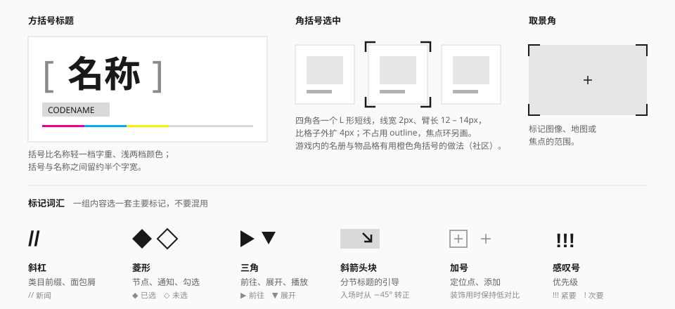

# 括号与标记

括号把东西"框出来"，标记给东西"打记号"。它们是这套语言里最轻的强调手段——不占面积、不用颜色。



## 方括号标题

把名称包在一对方括号里：`[ 名称 ]`。官网的干员姓名就是这样排的（实测）。

| 项 | 规范 | 来源 |
| --- | --- | --- |
| 括号字重 | 比名称轻一档（Medium 对 Bold） | 实测 |
| 括号颜色 | `ink-tertiary`（官网为 `#797979` – `#999999`） | 实测 |
| 括号字号 | 与名称相同，或略小（官网：3.375rem 对 4.875rem，约 0.7 倍） | 实测 |
| 间距 | 括号与名称之间约半个字宽 | 观察 |
| 伴饰 | 名称下方可接一个灰底的英文名小块、一条注册色条 | 观察 |

```html
<h3 class="flex items-baseline gap-[0.4em] text-4xl">
  <span aria-hidden="true" class="font-medium text-ink-tertiary">[</span>
  <span class="font-bold">名称</span>
  <span aria-hidden="true" class="font-medium text-ink-tertiary">]</span>
</h3>
```

括号是装饰，对辅助技术隐藏。

已经做成组件 `<BracketTitle level>`：默认是 `<h3>`、`text-4xl`，字号用 `className` 改。它把括号和名称排在同一行内，而不是上面草稿里的弹性盒——名称换行时，右括号跟在最后一个字后面，不会停在第一行的行尾。

**用于**：人物、地点、物品的名称——"一个被归档的条目"。**不用于**：普通的分节标题（那是 [分节标题](section-title.md) 的事）、按钮文字、正文里的强调。

行内的小括号 `[ 奖励预览 ]` 可以用作文字链接的外观（社区），同样只用于"条目"性质的内容。

## 角括号选中

四个角各一个 L 形短线，把选中的格子框起来。

| 项 | 规范 | 来源 |
| --- | --- | --- |
| 线宽 | 2px | 推断 |
| 臂长 | 12 – 14px | 推断 |
| 位置 | 比格子外扩约 4px | 推断 |
| 颜色 | `ink`；游戏内的名册与贵重品格用橙色 | 社区 |

用背景渐变画，不占用 `outline`（焦点环要另外画）。工具类 `corner-brackets` 已经在 [utilities.css](../../../packages/ui/src/styles/utilities.css) 里，四个变量可以在宿主上改：

| 变量 | 默认 | 含义 |
| --- | --- | --- |
| `--bracket-color` | `ink` | 颜色，跟着主题走 |
| `--bracket-width` | 2px | 线宽 |
| `--bracket-arm` | 12px | 臂长 |
| `--bracket-offset` | 4px | 画在宿主之外多远；取景角设成 0 |

```html
<li
  class="relative aria-selected:corner-brackets aria-selected:after:animate-bracket-in"
  aria-selected="true"
>
  …
</li>
```

- 括号画在 `::after` 上，**宿主要自己定位**（`relative` 或 `absolute`）。工具类不替它设 `position`：宿主本来是绝对定位的时候会被改掉。
- 括号在宿主之外 4px：宿主和它的裁切祖先（`overflow: clip` 的卡面、滚动容器）之间要留出这段空隙，否则被切掉。
- 选中的格子同时被键盘聚焦时，焦点环外移到括号之外（偏移 6px），两圈不重叠。
- **出现时落位**（推断）：再加一个 `after:animate-bracket-in`，八段短线各自从角的顶点伸到满长，200ms。取消选中时直接消失——视线已经跟着新选中的那一格走了。
  - 只动背景的尺寸，括号不会比平时多占一点地方。没有做成"从外面收进来"：括号本来就画在宿主之外 4px，再往外就伸出了留给它的空隙，放在滚动容器里会闪一下滚动条。
  - 这个类是另加的，不在 `corner-brackets` 里：[取景角](#取景角) 用的是同一个工具类，它是静态的装饰，不该一挂载就动一下。物品格、`<CornerBrackets>`、文件上传拖入时的那一层已经带上了。

不用 Tailwind 的项目用 `<CornerBrackets visible size>`：它包住内容并画括号，`size` 两档臂长（12 / 16px），`visible` 传选中状态。括号只是给眼睛看的，选中态另外要有 `aria-selected` 或 `aria-pressed`。

**用于**：矩阵里的单选——物品格、名册卡、图鉴。**不用于**：列表行（用左缘色条）、页签（用底色）、按钮。

## 取景角

和角括号是同一个形状，但含义不同：它标的是**范围**，不是选中。框住一张图、一片地图区域、一个焦点。

- 臂长更长（16 – 24px），线更细（1.5px）。
- 中心可以配一个小准星。
- 是装饰层，不响应交互。

每张图都加取景角会显得刻意。一屏一处，或者只在"正在查看 / 正在瞄准"的语境里用。

已实现为 `<Viewfinder size crosshair readouts>`，见 [测绘叠层](hud-overlays.md)。

## 标记词汇

| 标记 | 含义 | 写法 | 来源 |
| --- | --- | --- | --- |
| `//` | 类目前缀、面包屑 | `// 新闻`、`// 模块 / 子页` | 观察 |
| ◆ ◇ | 节点、选中 / 未选、通知 | 实心 = 已发生，空心 = 未发生 | 社区 |
| ▶ ▼ | 前往、展开 | 也是按钮悬停时竖条变成的形状 | 实测 |
| ↘ | 分节引导 | 放在灰色滑块的右端，入场时从 −45° 转正 | 实测 |
| ＋ | 定位点 | 网格交点、图像中心、标签组里的小方框 | 观察 |
| `!!!` `!` | 优先级 | 三个 = 紧要，一个 = 次要 | 社区 |
| `‹ n / N ›` | 分页 | 斜杠两侧留空格 | 实测 |
| `»` `※` 【】「」 | 档案、注释语气 | 编辑物料里用，界面里少用 | 社区 |

规则：

- **一组内容选一套。** 列表用了菱形，就不要再混三角和方点。
- **标记必须有含义。** `//` 后面跟的是真实的类目名；没有类目就不要写 `//`。
- **英文要准确。** 不要给普通按钮加虚构的系统术语。

## 宜 / 忌

**宜**

- 用括号和标记代替颜色做轻量强调。
- 给装饰性的括号、标记加 `aria-hidden`。
- 让选中态除了角括号之外还有一个非视觉的表达（`aria-selected`）。

**忌**

- 把所有标题都包进方括号。
- 角括号和黄色填充、粗描边同时用在一个选中态上。
- 用括号和斜杠堆砌"科技感"：`[//SYS::READY//]` 这类东西。

## 来源

- 方括号姓名的字号与颜色：[measurements.md](../references/measurements.md) 第 9 节。
- 角括号选中的画法思路、标记语法：[Statrue/endfield-design-skill](https://github.com/Statrue/endfield-design-skill)。
