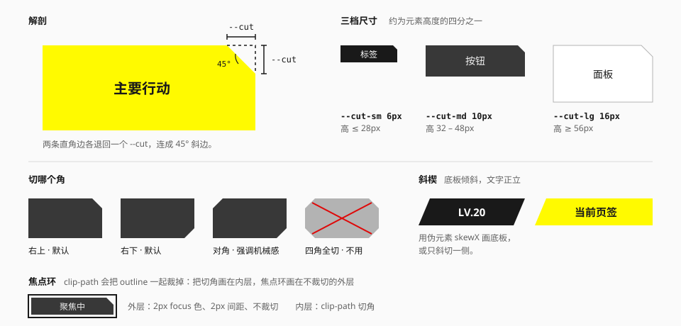

# 切角与斜楔

把矩形的一个角沿 45° 切掉，或者把一条边斜切。它们表达**机械、行动、权限**。



## 在哪里出现

| 载体 | 情况 | 来源 |
| --- | --- | --- |
| 官网 | 几乎不用切角。斜切只出现在局部：干员版块背后的黄色旗形、按钮悬停时的三角箭头 | 实测 |
| 游戏界面 | 常见。主行动区的楔形、等级带、选中页签的斜切、养成界面里作为整页结构的巨型斜楔 | 社区 |
| 宣传物料 | 标题块、日期块、类目角标 | 社区 |

所以切角是**游戏界面的语言**。做官网气质的页面时可以完全不用。

## 规格

| 项 | 值 | 来源 |
| --- | --- | --- |
| 角度 | 45° | 观察 |
| 尺寸 | `--cut-sm` 6px / `--cut-md` 10px / `--cut-lg` 16px，约为元素高度的四分之一 | 推断 |
| 位置 | 右上或右下；需要更强的机械感时切一组对角 | 推断 |
| 斜楔角度 | 按构图定，常见 −10° 到 −15° | 社区 |

## 什么时候用

| 用 | 不用 |
| --- | --- |
| 界面里唯一的主要行动 | 普通的次要按钮 |
| 导航中的当前项、权限或等级标识 | 正文卡片、文章容器 |
| 需要"这是一个机械部件"语气的面板 | 聊天气泡、筛选项、输入框 |
| 角标、类目标签 | 头像、缩略图 |

一屏里切角的元素控制在两三种以内。如果每个按钮、每张卡片都切角，它就不再表达任何东西。

## 实现

### 切角

用 `clip-path`。切口大小由 `--cut` 控制。下面这几个工具类已经在 [utilities.css](../../../packages/ui/src/styles/utilities.css) 里，用 Tailwind 的项目可以直接写：

```css
@utility cut-* {
  --cut: --value(--cut-*, [length]);
}

@utility cut-tr {
  clip-path: polygon(
    0 0,
    calc(100% - var(--cut, var(--cut-md))) 0,
    100% var(--cut, var(--cut-md)),
    100% 100%,
    0 100%
  );
}

@utility cut-br {
  clip-path: polygon(
    0 0,
    100% 0,
    100% calc(100% - var(--cut, var(--cut-md))),
    calc(100% - var(--cut, var(--cut-md))) 100%,
    0 100%
  );
}

@utility cut-diagonal {
  clip-path: polygon(
    var(--cut, var(--cut-md)) 0,
    100% 0,
    100% calc(100% - var(--cut, var(--cut-md))),
    calc(100% - var(--cut, var(--cut-md))) 100%,
    0 100%,
    0 var(--cut, var(--cut-md))
  );
}
```

```html
<button class="cut-tr cut-md bg-action px-6 py-3 text-on-action">确认</button>
<span class="cut-br cut-sm bg-surface-inverse px-2 text-sm text-ink-inverse">NEW</span>
```

### 焦点环

`clip-path` 会把 `outline` 和 `box-shadow` 一起裁掉。两种解决办法：

**把切角画在内层。** 外层负责焦点环，内层负责形状：

```html
<!-- 外层：2px 内边距充当间距，焦点环画在这里，不裁切 -->
<button class="p-0.5 focus-visible:outline-2 focus-visible:outline-focus">
  <!-- 内层：切角 -->
  <span class="cut-tr block bg-action px-6 py-3 text-on-action">确认</span>
</button>
```

**或者用伪元素画底。** 元素本身不裁切，`::before` 画带切角的背景：

```css
.cut-surface {
  position: relative;
  isolation: isolate;
}
.cut-surface::before {
  content: "";
  position: absolute;
  inset: 0;
  z-index: -1;
  background: var(--color-action);
  clip-path: polygon(0 0, calc(100% - 10px) 0, 100% 10px, 100% 100%, 0 100%);
}
```

后一种更通用：文字溢出、角标、焦点环都不会被裁。

**本库的控件统一用后一种**，写成工具类是：

```html
<button
  class="relative isolate px-8 text-on-action
         before:absolute before:inset-0 before:-z-10 before:content-['']
         before:cut-tr before:bg-action
         focus-visible:outline-2 focus-visible:outline-offset-2 focus-visible:outline-focus"
>
  确认出发
</button>
```

不可聚焦的小东西（角标、类目签）没有焦点环要保，直接把 `cut-*` 写在元素上。

### 带描边的切角

`clip-path` 裁掉角的同时也裁掉了那一段边框，斜边上没有线。需要完整描边时，叠两层：外层是描边色，内层缩进 1px 是填充色，两层用同一个切角。

### 斜楔

让底板倾斜、文字保持正立。和切角是同一套 `clip-path` 多边形：

```css
/* 两侧都斜切 */
@utility wedge {
  clip-path: polygon(
    var(--wedge, var(--cut-md)) 0,
    100% 0,
    calc(100% - var(--wedge, var(--cut-md))) 100%,
    0 100%
  );
}

/* 只斜切左边，右边贴边 */
@utility wedge-l {
  clip-path: polygon(var(--wedge, var(--cut-md)) 0, 100% 0, 100% 100%, 0 100%);
}

/* 只斜切右边，左边贴边 */
@utility wedge-r {
  clip-path: polygon(
    0 0,
    100% 0,
    calc(100% - var(--wedge, var(--cut-md))) 100%,
    0 100%
  );
}
```

`--wedge` 是斜边的**水平宽度**，默认取 `--cut-md`（10px），所以倾角跟着元素的高度变：40px 高时约 14°，落在上表的范围里。

最初的草稿是在伪元素上用 `skewX`。实现时改成了多边形：斜边的起止点是确定的像素位置，相邻的楔形（页签）能严丝合缝地对上；单侧斜切和双侧斜切也是同一种写法。和切角一样，可聚焦的元素把它画在 `before:` 的底上（`before:wedge-r before:bg-action`）。

### 点击区域

`clip-path` 同时裁掉了被切部分的点击区域，这通常没问题。但斜楔如果倾斜得厉害，文字两侧会出现"看起来在按钮里、其实点不到"的区域——让真实的可点击元素保持矩形，只让视觉层倾斜。

## 宜 / 忌

**宜**

- 切角尺寸跟随元素大小。
- 同一类控件切同一个角。
- 先确认焦点环可见，再提交。

**忌**

- 四角全切、八边形按钮。
- 给文本框和下拉框切角——它们需要完整的描边来表达边界。
- 用切角代替层级：重要性应该先由位置、大小、颜色决定。
- 在官网气质的浅色页面上大量使用切角。

## 来源

- 官网的 `clip-path` 用法：[measurements.md](../references/measurements.md) 第 8.3 节。
- 切角的语义与"不要默认应用到所有组件"的提醒：[Statrue/endfield-design-skill](https://github.com/Statrue/endfield-design-skill)。
- 相关规范：[形状](../foundations/shape.md)。
