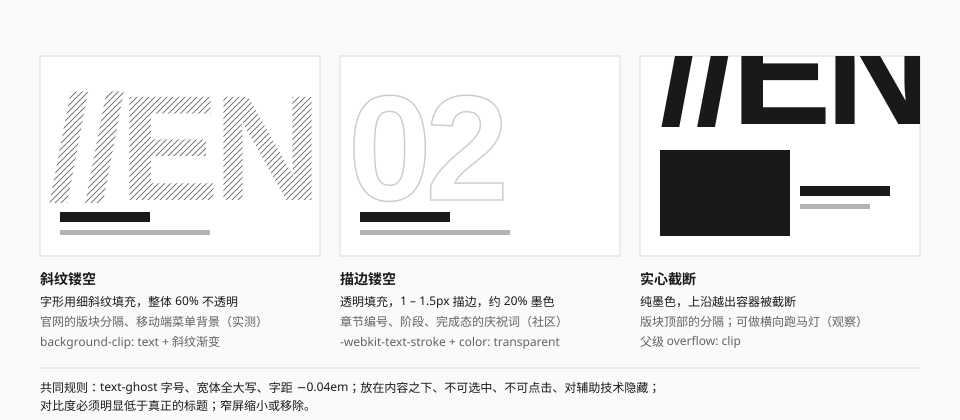

# 镂空字与微文字

两种"不是用来读的字"：一种极大，一种极小。它们构成版面的技术副层。

## 巨字



| 形态 | 画法 | 出处 | 来源 |
| --- | --- | --- | --- |
| 斜纹镂空 | 字形透明，用细斜纹填充，整体 60% 不透明 | 官网版块分隔、移动端菜单背景、干员区背景 | 实测 |
| 描边镂空 | 字形透明，只有 1 – 1.5px 的浅色描边 | 游戏内的章节编号、阶段、完成态的庆祝词 | 社区 |
| 实心截断 | 纯墨色，越过容器边界被截断 | 官网玩法版块顶部的 `//ENDFIELD` | 观察 |

### 规格

| 项 | 值 | 来源 |
| --- | --- | --- |
| 字体 | 宽体全大写（官网：Novecento Sans Wide Bold） | 实测 |
| 字号 | 15.6rem 起，干员区到 30rem；约为正文的 10 – 20 倍 | 实测 |
| 字距 | −0.04em；更大的字到 −0.08em | 实测 |
| 行高 | 1 | 实测 |
| 内容 | 短：一个词、一个编号、`//` 加一个词 | 观察 |

令牌：`font-display text-ghost font-extrabold uppercase`。

### 实现

**斜纹镂空**——把斜纹作为背景，用文字形状裁切：

```css
@utility text-hatch {
  color: transparent;
  background-image: repeating-linear-gradient(
    -45deg,
    var(--ghost-ink, var(--color-ink)) 0 0.75px,
    transparent 0 calc(var(--hatch-size) * 0.7071)
  );
  -webkit-background-clip: text;
  background-clip: text;
  opacity: 0.6;
}
```

斜纹颜色不能写 `currentColor`：文字颜色已经设成透明，`currentColor` 也会跟着透明。用 `--ghost-ink` 在容器上指定颜色。

**描边镂空**：

```css
@utility text-outline {
  color: transparent;
  -webkit-text-stroke: 1.5px
    var(--ghost-ink, color-mix(in srgb, var(--color-ink) 22%, transparent));
}
```

**容器**：

```html
<div class="relative overflow-clip">
  <span
    aria-hidden="true"
    class="text-hatch pointer-events-none absolute -top-4 left-0 select-none
           font-display text-ghost font-extrabold uppercase whitespace-nowrap"
  >
    //Section
  </span>
  <div class="relative">真正的内容</div>
</div>
```

### 规则

- **它是背景，不是标题。** 对比度必须明显低于真正的标题；不能是页面上唯一的标题。
- **对辅助技术隐藏**（`aria-hidden="true"`），不可选中、不可点击。
- **裁切在自己的容器里**（`overflow: clip`），不能撑出横向滚动条。
- **允许被截断。** 越过边界正是它"属于背景层"的信号。
- **一个版块一个。** 内容要短，写与版块相关的真实词语或编号。
- **窄屏缩小或移除。** `text-ghost` 自带 `clamp()`，但小屏上往往直接去掉更好。
- 可以用 `animate-marquee` 做成横向跑马灯，见 [动效](../foundations/motion.md)。

## 微文字

很小的英文标签：站名、栏目、编号、坐标、版本号。

| 项 | 规范 | 来源 |
| --- | --- | --- |
| 字号 | `text-micro`（10px）或 `text-xs`（12px） | 实测（官网 1rem，部分再缩到 0.5 – 0.8 倍） |
| 字体 | `font-latin` Medium 或 `font-tech` | 实测 |
| 颜色 | `ink-tertiary`；深色底上用 `neutral-400` | 观察 |
| 大小写 | 全大写 | 观察 |
| 字距 | 0 – 0.05em | 推断 |

### 写什么

官方的微文字是**可读的固定句式**，在加载页、人物备忘、周边目录之间复用，不是随机字符（社区）。

| 可以写 | 不要写 |
| --- | --- |
| 站名、产品名：`ENDFIELD-UI` | 乱码、伪十六进制：`0x7F3A::SYS` |
| 栏目名：`// NOTICE` | 和内容无关的"科技词"：`QUANTUM LINK ESTABLISHED` |
| 真实的编号：`SECTION 03 OF 05` | 编造的序列号、坐标、遥测读数 |
| 真实的版本与日期：`REV 2026.10` | 假的法律声明、假的警告 |
| 真实的状态：`LOADING`、`SCROLL` | 照抄官方的固定句式 |

判断标准：把这行字翻译成中文读出来，它在说一件真事吗？

### 常见位置

- 分节标题上方的一行（`▼ // 站名`）。
- 分节标签组里的两行说明。
- 图像角落的坐标与比例。
- 页脚的版本、构建信息。
- 滚动提示上方的 `SCROLL`。

### 无障碍

- 纯氛围的微文字加 `aria-hidden="true"`。
- 承载信息的（版本号、状态）必须可读：不要小于 12px，对比度按正文要求。
- 10px 的文字不要求读者读到；如果一段信息重要到必须被读到，就不该用微文字。

## 两者的关系

巨字和微文字总是成对出现在同一个版面上，形成极端的尺度对比：一个 200px，一个 10px，中间是 16 – 40px 的真实内容。这种"三级跳"是官网版面的节奏来源。

但两者都是可选的。工具类界面（表单、列表、设置）通常一个都不需要。

## 宜 / 忌

**宜**

- 巨字写一个词，微文字写一句真话。
- 两者都用低对比。
- 在窄屏上先去掉它们。

**忌**

- 巨字和真正的标题用同样的对比度并排。
- 用微文字填满空白处。
- 伪造数据。
- 把巨字做成可点击的链接。

## 来源

- 镂空字的参数：[measurements.md](../references/measurements.md) 第 2、6 节。
- 描边字的写法、微文字"写真话"的原则：[Statrue/endfield-design-skill](https://github.com/Statrue/endfield-design-skill)。
