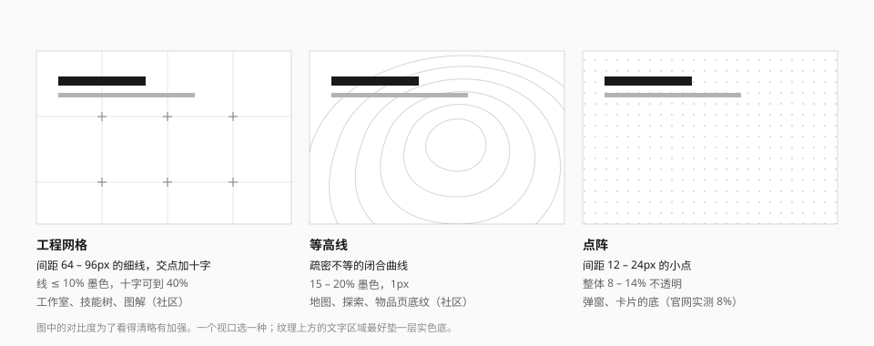

# 网格、等高线、点阵

三种铺在内容之下的底纹。它们的共同点是**极低的对比度**和**规则的几何**。



| 底纹 | 语气 | 适合 | 来源 |
| --- | --- | --- | --- |
| 点阵 | 印刷网点 | 弹窗、卡片、面板的底 | 实测 |
| 工程网格 | 图纸、坐标 | 工作室、技能树、图解、文档站背景 | 社区 |
| 等高线 | 测绘、地形 | 地图、探索、物品页 | 社区 |

一个视口选一种。

## 点阵

官网弹窗的底：`#FAFAFA` 上叠一层点阵图，方格 1.5em，8% 不透明度（实测）。

| 项 | 值 |
| --- | --- |
| 间距 | 12 – 24px |
| 点径 | 1 – 2px |
| 强度 | 整体 8 – 14% |

```css
@utility dot-grid {
  background-image: radial-gradient(
    circle,
    var(--dot-color, rgb(0 0 0 / 0.1)) var(--dot-size, 1px),
    transparent calc(var(--dot-size, 1px) + 0.5px)
  );
  background-size: var(--dot-gap, 16px) var(--dot-gap, 16px);
}
```

用在**面**上（弹窗内容区、空状态的背景），不用在窄条上——窄条用斜纹。

暗色主题下把 `--dot-color` 换成白色 10% 左右。

## 工程网格

大间距的细线，交点处加一个小十字。

| 项 | 值 | 来源 |
| --- | --- | --- |
| 间距 | 64 – 96px | 社区（72px） |
| 线 | 1px，≤ 10% 墨色 | 社区取 3%，但在多数屏幕上几乎不可见 |
| 十字 | 臂长 5px，可到 40% 墨色 | 推断 |

```css
@utility blueprint-grid {
  background-image:
    linear-gradient(var(--grid-color, rgb(0 0 0 / 0.06)) 1px, transparent 1px),
    linear-gradient(90deg, var(--grid-color, rgb(0 0 0 / 0.06)) 1px, transparent 1px);
  background-size: var(--grid-gap, 72px) var(--grid-gap, 72px);
}
```

交点的十字用一张小 SVG 平铺，或者只在关键位置手工放几个，不必每个交点都有。

规则：

- 网格线必须**弱于**界面里任何真实的线：表格线、分隔线、连接线。
- 内容不需要对齐到网格。它是背景，不是栅格系统。
- 界面里有真实的坐标系（图表、地图）时不要再铺装饰网格。

游戏内的百科与索引页有"蓝图网格上放图纸式图标"的做法（社区）：网格成为图标的展示底板。

## 等高线

疏密不等的闭合曲线，像地形图。

| 项 | 值 |
| --- | --- |
| 线 | 1px，15 – 20% 墨色 |
| 形态 | 5 – 8 圈，间距不均匀，局部贴近 |
| 位置 | 偏在一角，让曲线被容器边缘截断 |

等高线没法用 CSS 渐变画，需要一张 SVG。画原创等高线的办法：

- 手绘几圈不规则的闭合贝塞尔曲线，由内向外逐圈放大并微调形状；
- 或用噪声函数生成高度场再取等值线（社区项目 dsh-theme-endfield 做了一个可动的版本，线条会缓慢流动）。

规则：

- 等高线与真实的地图内容同时出现时，等高线要更淡，并且不能和路径、区域边界混淆。
- 做成动态时速度要非常慢，并且遵守"减少动态效果"。
- 浅底的物件页可以用很淡的等高线做纹理（社区）。

## 共同规则

| 规则 | 说明 |
| --- | --- |
| 低对比 | 强度见上；经验下限约 1.06:1，低于它等于没有 |
| 不抢内容 | 文字区域下方最好垫一层实色，或把纹理在文字区域淡出 |
| 独立图层 | 画在伪元素或绝对定位层上，`pointer-events: none` |
| 局部裁切 | 在自己的容器里 `overflow: clip` |
| 可关闭 | 高对比模式和打印时隐藏 |

```html
<section class="relative">
  <div aria-hidden="true" class="dot-grid pointer-events-none absolute inset-0"></div>
  <div class="relative bg-surface-raised p-6">垫了实色底的内容</div>
</section>
```

## 宜 / 忌

**宜**

- 根据内容的语气选：印刷感用点阵，图纸感用网格，地理感用等高线。
- 把底纹放在大片留白里。
- 在最暗和最亮的屏幕上各看一眼，确认它既看得见又不抢眼。

**忌**

- 三种一起用。
- 把网格线画得和表格线一样重。
- 让底纹穿过正文。
- 用六边形蜂窝网格——那不是这套语言里的东西。

## 来源

- 弹窗点阵的参数：[measurements.md](../references/measurements.md) 第 8.10 节。
- 网格、等高线在游戏界面中的用法：[Statrue/endfield-design-skill](https://github.com/Statrue/endfield-design-skill)。
- 72px 网格：[LaoBiDeng321/Endfield-Style-Skill](https://github.com/LaoBiDeng321/Endfield-Style-Skill)。
- 动态等高线：[ymh0000123/dsh-theme-endfield](https://github.com/ymh0000123/dsh-theme-endfield)。
- 相关规范：[纹理与装饰](../foundations/texture.md)。
