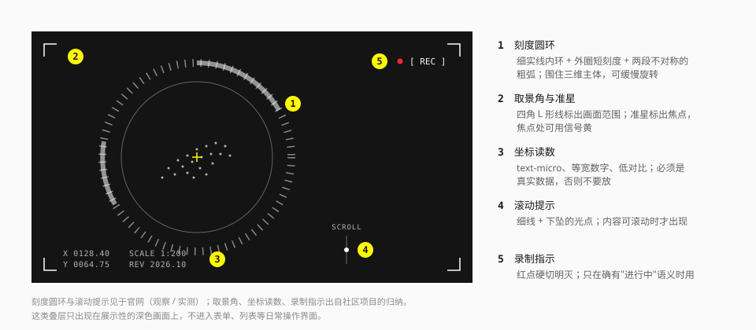

# 测绘叠层

叠在展示性画面上的仪表与取景元素：刻度圆环、取景角、准星、坐标读数、滚动提示。它们让画面看起来像"正在被某个设备观测"。



## 先说边界

这是最容易用过头的一组元素。

- **只用在展示性画面上**：首屏、三维模型展示、地图、媒体播放。
- **不进入日常操作界面**：表单、列表、设置、文档。
- **每个读数都必须是真的。** 没有真实数据就不放读数。

## 刻度圆环

官网世界观版块围绕点云模型的那组圆环（观察）。

| 部件 | 画法 |
| --- | --- |
| 内环 | 1px 细实线，白色 35% |
| 外圈刻度 | 沿圆周均匀分布的短线，约 40 – 60 根 |
| 粗弧 | 两段不对称的粗线（5 – 6px），各占圆周的 10% – 20% |
| 旋转 | 整体可缓慢匀速旋转（官网有一个匀速旋转一周的关键帧） |

用 SVG 画，刻度用 `stroke-dasharray`：

```html
<svg viewBox="0 0 240 240" aria-hidden="true" class="text-ink">
  <circle cx="120" cy="120" r="96" fill="none" stroke="currentColor" stroke-opacity=".35" />
  <!-- pathLength 把周长归一化成 400，短线 1.5、间隔 8.5，共 40 根刻度 -->
  <circle
    cx="120" cy="120" r="114"
    fill="none" stroke="currentColor" stroke-opacity=".5" stroke-width="8"
    pathLength="400" stroke-dasharray="1.5 8.5"
  />
  <path d="M120 6A114 114 0 0 1 219 63" fill="none" stroke="currentColor" stroke-opacity=".55" stroke-width="5" />
</svg>
```

规则：

- 圆环**围住一个主体**（模型、头像、地图焦点）。空转的圆环没有意义。
- 弧段不对称。两段等长、对称摆放的弧看起来像加载指示。
- 只用白与灰（深色底）或墨与灰（浅色底）。

圆环也用于真实的仪表：进度环、冷却弧。那时它承载数据，画法见 [反馈](../components/feedback.md)。

## 取景角与准星

- **取景角**：画面四角的 L 形线，臂长 16 – 24px，线宽 1.5px。标出"取景范围"。
- **准星**：画面焦点处的小十字，臂长 6px。焦点可以用信号黄。

画法与 [角括号](brackets-and-markers.md) 相同，区别在含义：角括号 = 选中，取景角 = 范围。

游戏内的图鉴用准星占位符表示"未获得"的条目（社区）。

## 坐标读数

画面角落的小号等宽文字：坐标、比例、版本、时间。

| 项 | 规范 |
| --- | --- |
| 字体 | `font-tech`，等宽数字 |
| 字号 | `text-micro` |
| 颜色 | 深色底上 `neutral-400`，浅色底上 `ink-tertiary` |
| 位置 | 贴画面的角，与取景角对齐 |

**内容必须真实**：

| 可以放 | 不要放 |
| --- | --- |
| 地图的真实坐标与比例尺 | 随机数字 |
| 模型的真实旋转角度 | 每帧跳动的假读数 |
| 当前日期、版本号、构建号 | 假的经纬度、假的信号强度 |
| 媒体的真实时间码 | `SYS.OK` `LINK.STABLE` 这类伪状态 |

游戏内常驻角落的小字是延迟、版本、UID 这些真实的运行信息（社区）。

## 滚动提示

一条细竖线 + 一个下坠的光点，上方一行 `SCROLL`（实测）。

- 光点的动画：下移 1.5rem 并淡出，循环。`animate-scroll-hint`。
- 只在**确实可以向下滚动**时出现；滚动开始后淡出。
- 放在首屏底部中央或右下。

移动端的变体是一个向下的折线箭头加 `SCROLL` 小字。

## 录制指示

一个硬切明灭的红点，旁边 `[ REC ]`。官网干员版块的进度条旁有 `[ REC ]` 字样（观察）；配闪烁红点的做法出自社区项目。

只在确有"进行中"语义时用：正在录制、直播中、实时数据。不要当成氛围装饰——红色在这套语言里是危险与紧急。

## 键位提示

PC 游戏界面里遍布的白色小方块键帽（社区）：一个白底墨字的小方块，写着按键字母，贴在对应的控件旁。

- 只用于**真的支持键盘快捷键**的桌面应用。
- 触屏界面和普通网页不要伪造键帽。
- 用 `<kbd>` 元素。

```html
<kbd class="inline-grid size-5 place-items-center bg-surface-inverse font-tech text-xs font-medium text-ink-inverse">
  F
</kbd>
```

## 实现要点

- 所有叠层放在一个 `pointer-events: none` 的绝对定位层里，`aria-hidden="true"`。
- 承载真实信息的读数（时间码、坐标）例外：它们需要可读，放在可访问的元素里。
- 旋转、下坠等循环动画遵守"减少动态效果"。
- 窄屏上先去掉取景角和读数，保留主体。

## 宜 / 忌

**宜**

- 一个画面只用两三种叠层。
- 让叠层和主体有空间关系：圆环围住模型，准星对准焦点。
- 读数用真实数据源。

**忌**

- 在表单页、文档页的四角画取景角。
- 满屏跳动的假数字。
- 霓虹辉光的圆环、扫描线、全息故障效果。
- 六边形、蜂窝、雷达扫描扇面——这些是通用科幻的符号，不是终末地的。
- 用红色录制点做装饰。

## 来源

- 滚动提示的关键帧、旋转动画：[measurements.md](../references/measurements.md) 第 7 节。
- 键位提示、准星占位符、"读数必须真实"：[Statrue/endfield-design-skill](https://github.com/Statrue/endfield-design-skill)。
- 取景角、录制指示：[LaoBiDeng321/Endfield-Style-Skill](https://github.com/LaoBiDeng321/Endfield-Style-Skill)。
