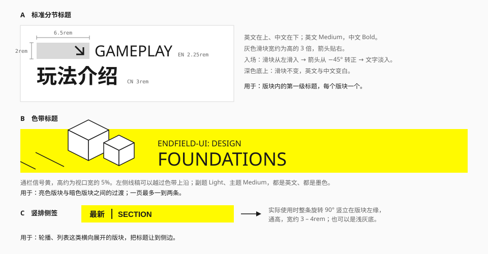

# 分节标题

版块开头的标题。官网有三种形态，分工明确。



| 形态 | 结构 | 用在哪 |
| --- | --- | --- |
| A 标准 | 灰色滑块 + 斜箭头 + 英文，下接中文 | 版块内的第一级标题 |
| B 色带 | 通栏信号黄 + 线稿 + 英文副题与主题 | 亮暗版块之间的过渡 |
| C 竖排侧签 | 竖立的色带，文字旋转 90° | 横向展开的版块（轮播、列表） |

## A 标准分节标题

### 结构

```
▼ // 微文字行                    ← 可选
[███ ↘] GAMEPLAY                ← 滑块 + 英文
玩法介绍                         ← 中文
```

| 部件 | 规格 | 令牌 | 来源 |
| --- | --- | --- | --- |
| 滑块 | 6.5 × 2rem，`#D9D9D9`；宽约为高的 3 倍 | `bg-neutral-300` | 实测 |
| 斜箭头 | 高约 1.44rem，`#231815`，贴滑块右端 | `text-ink` | 实测 |
| 英文 | Gilroy Medium 2.25rem，行高与滑块等高 | `font-latin text-xl font-medium` | 实测 |
| 中文 | 黑体 Bold 3rem，`#141414` | `font-sans text-2xl font-bold` | 实测 |
| 顶部小图标 | 高 0.375rem，灰色 | — | 实测 |

英文与中文的字号比约 3:4；英文比中文轻一档。

### 入场

进入视口时依次发生（实测 + 观察）：

1. 滑块从左侧滑入：`translateX(-100%)` → `0`，外层用 `clip-path` 或 `overflow: hidden` 遮住；
2. 滑块内的箭头从 −45° 转到 0°；
3. 英文、中文从 `opacity: 0` 淡入。

每步约 0.3 秒。只播放一次。

### 深色底

滑块保持浅灰，英文与中文变白（实测）。

### 伴饰

标题下方可以跟一组小装饰：加号框、两行微文字、点阵、注册色条。它们的构成见 [斜纹与色条](stripes-and-strips.md) 里的"分节标签组"图。伴饰在窄屏上去掉。

### 实现

```html
<header>
  <div class="flex items-center gap-2">
    <span class="relative block h-8 w-[6.5rem] overflow-hidden" aria-hidden="true">
      <span class="absolute inset-0 flex items-center justify-end bg-neutral-300 pr-2">
        <!-- 斜箭头图标 -->
      </span>
    </span>
    <p class="font-latin text-xl font-medium uppercase">Gameplay</p>
  </div>
  <h2 class="mt-1 text-2xl font-bold">玩法介绍</h2>
</header>
```

语义上，中文是真正的标题（`h2`）；英文是它的装饰性副题。如果英文只是中文的翻译，可以对辅助技术隐藏，避免重复朗读。

## B 色带标题

一条通栏的信号黄，是全站黄色面积最大的地方。

| 部件 | 规格 | 来源 |
| --- | --- | --- |
| 色带 | 通栏，`#FFFA00` | 实测 |
| 副题 | Gilroy Light 1.875rem，如 `ARKNIGHTS: ENDFIELD` | 实测 |
| 主题 | Gilroy Medium 3.75rem，如 `LORE` | 实测 |
| 插图 | 等距线稿，黑线白面，压在色带左侧并越过上沿 | 观察 |
| 文字颜色 | 墨色 | 实测 |

子页面的头部是它的放大版：整个头部高 31.6rem，上半白、下半黄，硬切，没有渐变；标题压在一块白色矩形上（实测）。

```css
/* 上白下黄的硬切 */
background-image: linear-gradient(
  var(--color-surface) 50%,
  var(--color-action) 0
);
```

规则：

- 一页最多一到两条。它是版块之间的"换气"，不是每个标题的样式。
- 色带上只放墨色文字和线稿，不放按钮、不放图片。
- 主题接管时，色带跟着换成主题色。

## C 竖排侧签

把标题竖起来贴在版块左缘，给横向展开的内容让出宽度。

| 部件 | 规格 | 来源 |
| --- | --- | --- |
| 色带 | 通高；信号黄或浅灰 | 观察 |
| 文字 | 旋转 90°，中文小标 + 英文大字 | 观察 |
| 插图 | 顶部可放一个等距线稿 | 观察 |

```css
.side-tab {
  writing-mode: vertical-rl;
  text-orientation: mixed;
}
```

用 `writing-mode` 而不是 `transform: rotate()`：前者参与布局，容器宽度会自动贴合文字。

窄屏下，竖排侧签改回横向的标准标题。

## 怎么选

| 情况 | 用 |
| --- | --- |
| 普通版块 | A |
| 从浅色版块进入深色版块，或一个大章节的开始 | B |
| 版块主体是横向轮播或宽表格 | C |
| 卡片内、弹窗内的小标题 | 都不用。直接用一行 `text-lg font-medium` |
| 文档、设置这类工具页面 | A 的简化版：只留中文标题和左侧一条短竖条 |

## 宜 / 忌

**宜**

- 一个版块一个分节标题。
- 英文写真实的栏目名，全大写。
- 让入场动画只播一次。

**忌**

- 一页里每个标题都带滑块和入场动画。
- 把色带标题当普通的黄色背景块用，在上面堆内容。
- 英文副题写成和内容无关的装饰词。
- 中文标题用宽体英文字体的回退字形。

## 来源

- 各部件的尺寸与入场变换：[measurements.md](../references/measurements.md) 第 8.8、8.9、9 节。
- 相关规范：[字体](../foundations/typography.md) 的"中英搭配"。
