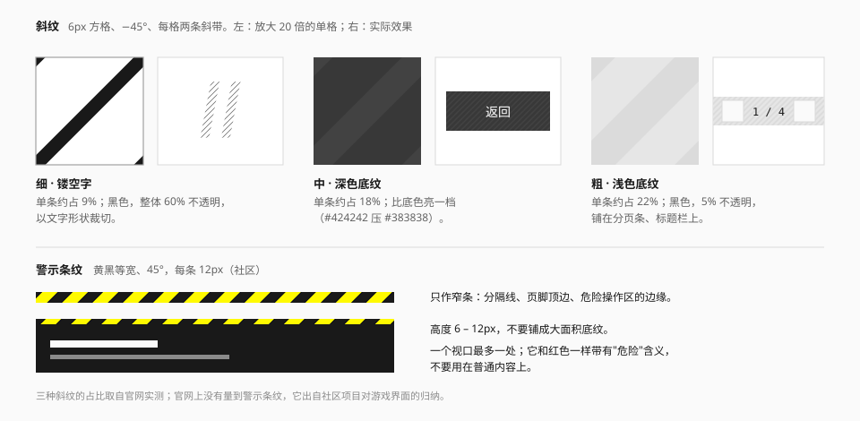
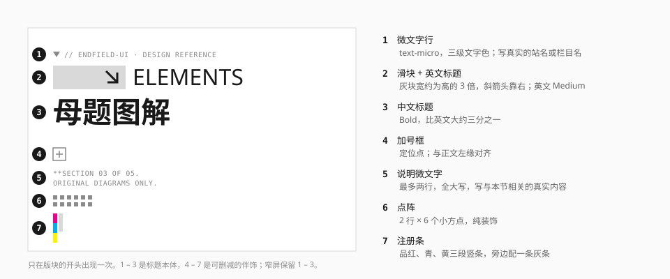

# 斜纹与色条

三种"条"：铺在表面上的 **45° 斜纹**、表示危险的**警示条纹**、来自印刷校准的**注册色条**。



## 斜纹

官网用得最多的纹理（实测）。统一的画法：6px 方格、−45°、每格两条斜带。

| 档 | 单条占比 | 颜色 | 用在哪 |
| --- | --- | --- | --- |
| 细 | 约 9% | 黑，整体 60% 不透明 | 以文字形状裁切，做镂空巨字 |
| 中 | 约 18% | 比底色亮一档（`#424242` 压 `#383838`） | 深色按钮的底纹（官网的返回按钮） |
| 粗 | 约 22% | 墨色（`ink`），5% 不透明 | 跟随主题的条带：分页条、弹窗标题栏 |

三档的区别只是斜带的宽度和颜色，方格大小与角度不变。

### 实现

```css
@utility hatch {
  background-image: repeating-linear-gradient(
    -45deg,
    var(--hatch-color, color-mix(in srgb, var(--ef-ink) 5%, transparent)) 0
      var(--hatch-width, 1.9px),
    transparent 0 calc(var(--hatch-size) * 0.7071)
  );
}
```

`--hatch-size` 是方格边长（令牌值 6px）；45° 斜纹的重复周期是边长的 0.7071 倍。默认值是"粗"档。

"粗"档实测是黑 5%（官网只有浅色的条带）。实现里换成了墨色的 5%：亮色下 `ink` 是 `#191919`，和黑 5% 看不出差别；暗色下 `ink` 是近白，斜带变成比底色亮一档的浅带，条带放进暗色主题不用另写一套。三档对应的 `--hatch-width`（斜带的垂直厚度）：

| 档 | `--hatch-width` | `--hatch-color` |
| --- | --- | --- |
| 细 | 0.75px | `rgb(0 0 0 / 0.6)` |
| 中 | 1.5px | `var(--color-neutral-700)` 或比底色亮一档的值 |
| 粗 | 1.9px | `color-mix(in srgb, var(--ef-ink) 5%, transparent)` |

```html
<!-- 分页条 -->
<div class="hatch bg-surface-muted">…</div>

<!-- 深色按钮底纹 -->
<button class="hatch bg-control [--hatch-color:#424242] [--hatch-width:1.5px]">返回</button>
```

斜纹非常细，在 1 倍屏上可能出现摩尔纹或亮度不均。如果效果不稳定，改用一张 6 × 6 的 SVG 平铺。

### 什么时候用

- 给**条带状**的表面一点质感：工具条、分页条、标题栏。
- 区分"可点的深色块"和"不可点的深色块"：官网的返回按钮带斜纹，普通深色面板不带。
- 游戏内用斜纹填充未探索的地图区域、最高稀有度的卡面（社区）。

不要铺满整个页面背景，也不要压在正文下面。

## 警示条纹

黄黑相间的 45° 宽条，每条约 12px。

官网上没有量到它；它出自社区项目对游戏界面与工业主题的归纳，等级是**社区**。

```css
@utility hazard {
  background-image: repeating-linear-gradient(
    -45deg,
    var(--color-signal) 0 12px,
    var(--color-neutral-900) 12px 24px
  );
}
```

规则：

- 只做**窄条**，高 6 – 12px：分隔线、页脚顶边、危险操作区的边缘。
- 一个视口最多一处。
- 它和红色一样带"危险 / 施工"含义。删除确认、不可逆操作的区域可以用；普通内容不要用。
- 不要做成按钮背景或卡片描边。

## 注册色条

印刷品边缘用来校准套色的小色块。官网把它做成一条很短的品红 – 青 – 黄三色微条，放在分节标签旁边和名称下方（观察）。



| 项 | 规范 | 来源 |
| --- | --- | --- |
| 颜色 | 品红、青、黄，通常再配一段灰 | 观察 |
| 取值 | `reg-magenta` `#EC008C`、`reg-cyan` `#00AEEF`、`reg-yellow` `#FFF200` | 推断（印刷三原色的常用屏幕近似值；官网的色条是图片，没有可读的值） |
| 形态 | 竖条：每段约 6 × 14px 叠放；横条：高 3px，每段等长 | 观察 |
| 位置 | 分节标签组的末尾、名称下方的分隔线 | 观察 |

```html
<!-- 横向：名称下方的分隔线 -->
<div aria-hidden="true" class="flex h-[3px]">
  <span class="w-16 bg-reg-magenta"></span>
  <span class="w-16 bg-reg-cyan"></span>
  <span class="w-16 bg-reg-yellow"></span>
  <span class="flex-1 bg-line"></span>
</div>
```

规则：

- **纯装饰**，不承担任何数据或状态含义。
- **不要和图表配色混用。** 页面里有图表时，注册色条离图表远一点，或者不用。
- 一个版块最多一处。它是"印刷品"语气的点缀，不是每个标题的标配。
- 这三个颜色不要用在别处：不做按钮色、不做标签色。

## 宜 / 忌

**宜**

- 全站的斜纹用同一个方格大小和角度。
- 把斜纹限制在条带和控件上。
- 把注册色条当成签名：小、少、固定位置。

**忌**

- 斜纹的方向一会儿左倾一会儿右倾。
- 用警示条纹装饰普通内容。
- 把注册色条放大成彩虹色的页眉。
- 在同一个视口里同时用斜纹、警示条纹和注册色条。

## 来源

- 斜纹的参数：[measurements.md](../references/measurements.md) 第 6 节。
- 警示条纹：[LaoBiDeng321/Endfield-Style-Skill](https://github.com/LaoBiDeng321/Endfield-Style-Skill)。
- 注册色条不作通用页眉、不与数据色混用：[Statrue/endfield-design-skill](https://github.com/Statrue/endfield-design-skill)。
- 相关规范：[纹理与装饰](../foundations/texture.md)。
