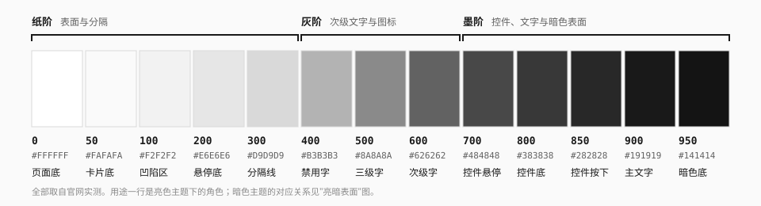
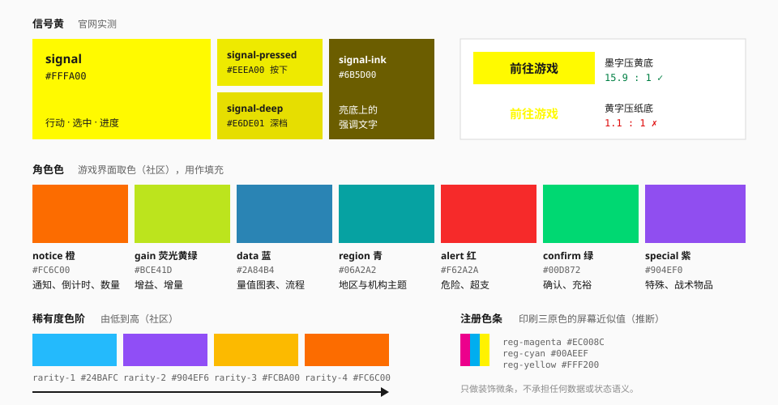
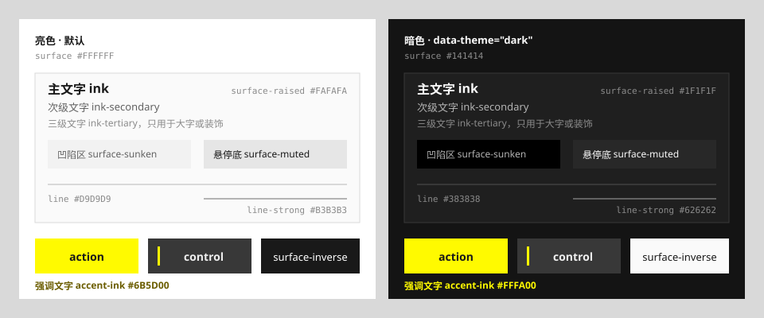

# 色彩

## 定位与原则

终末地的配色是**一套中性灰阶 + 一个信号色**，游戏界面在此之上再加一组分工明确的角色色。

1. **大面积只用中性色。** 白、浅灰、深灰、近黑构成全部的表面与文字。
2. **黄色是信号，不是装饰。** 它只标记行动、选中与进度。
3. **颜色有角色。** 橙、蓝、青、红、绿、紫各管一件事，不互相替代，也不拿来点缀。
4. **主题色可以接管，语义色不能丢。** 角色、活动、地区可以把黄换成自己的主题色，但危险仍然是红，成功仍然是绿。
5. **每个颜色都要对它实际所在的底色验算对比度。**

## 中性色阶



十三级，全部取自官网实测。官网的灰是**纯灰**（R = G = B），不带冷暖倾向。

| 令牌 | 值 | 亮色主题下的用途 | 来源 |
| --- | --- | --- | --- |
| `neutral-0` | `#FFFFFF` | 页面底、导航轨底 | 实测 |
| `neutral-50` | `#FAFAFA` | 卡片、弹窗、圆形翻页钮 | 实测 |
| `neutral-100` | `#F2F2F2` | 凹陷区、标签值底、图标钮底 | 实测 |
| `neutral-200` | `#E6E6E6` | 悬停底、激活底、分页条 | 实测 |
| `neutral-300` | `#D9D9D9` | 分隔线、未激活图标 | 实测 |
| `neutral-400` | `#B3B3B3` | 强分隔线、禁用文字、装饰线稿 | 实测 |
| `neutral-500` | `#8A8A8A` | 三级文字、括号 | 实测 |
| `neutral-600` | `#626262` | 次级文字 | 实测（官网用作返回按钮悬停底） |
| `neutral-700` | `#484848` | 中性控件悬停 | 实测 |
| `neutral-800` | `#383838` | 中性控件底、深色标签 | 实测 |
| `neutral-850` | `#282828` | 中性控件按下 | 实测 |
| `neutral-900` | `#191919` | 主文字、反转块 | 实测 |
| `neutral-950` | `#141414` | 标题文字、暗色页面底 | 实测 |

纯黑 `#000000` 只用于暗色主题里最深的凹陷区（官网的世界观与影像版块）。

> 官网的次级文字实际用的是 `#808080` – `#999999`，在白底上不到 4:1，达不到正文的对比度要求。本规范把次级文字定为 `neutral-600`（6.1:1），把 `neutral-500` 降为"三级"，只用于大字号或装饰性文字。这一条是**推断**。

## 信号黄



| 令牌 | 值 | 用途 | 来源 |
| --- | --- | --- | --- |
| `signal` | `#FFFA00` | 行动按钮底、当前导航项、选中环、进度填充 | 实测 |
| `signal-pressed` | `#EEEA00` | 黄色控件的按下态 | 实测（分页按钮按下） |
| `signal-deep` | `#E6DE01` | 黄底上的分隔线、更深一档的按下 | 实测 |
| `signal-ink` | `#6B5D00` | 亮色表面上"强调色作文字"时的深档 | 社区（dsh-theme-endfield） |

### 黄色只做底，不做亮底上的字

`#FFFA00` 在白底上的对比度只有 **1.11:1**，等于看不见。所以：

- 黄色作**填充**时，上面压 `neutral-900` 的墨字（15.9:1）。
- 亮色表面上需要"黄色文字"的地方，用 `signal-ink`（白底 6.6:1，`neutral-100` 上 5.9:1）。
- 暗色表面上可以直接用 `signal` 作文字（`#141414` 上 16.6:1）。

语义令牌 `accent-ink` 已经按主题切好：亮色取 `signal-ink`，暗色取 `signal`。

### 官网黄与游戏黄不是同一个值

| 出处 | 值 | 来源 |
| --- | --- | --- |
| 官网主黄 | `#FFFA00` | 实测 |
| 官网局部变体 | `#FFF500`、`#FFF000`、`#FDFD1F` | 实测 |
| 游戏内选中、进度条 | `#FCEA00` – `#FCEC00` | 社区（取色） |
| 游戏内技能树节点 | `#F7C506` | 社区（取色） |
| ReEnd 组件库 | `#FFD429` | 社区（作者取值） |
| endfield-design-skill 的"行动黄" | `#F8D34D` | 社区（作者取值） |

官网的黄偏冷、接近纯黄；游戏内的黄更暖、略偏金。本规范取官网值作为 `signal`。如果要做贴近游戏内观感的界面，可以在项目里把 `--ef-action` 覆盖成 `#FCEA00`，其余规则不变。

## 角色色

游戏界面里，黄色之外的颜色各有固定分工。以下取值来自 `endfield-design-skill` 对实机截图的取色，本仓库没有独立验证，等级为**社区**。

| 令牌 | 值 | 角色 | 不要用来 |
| --- | --- | --- | --- |
| `notice` | `#FC6C00` | 通知角标、倒计时、等级带、数量与折扣 | 表示危险 |
| `gain` | `#BCE41D` | 增益标签（`+6%`）、经验增量 | 填充进度条（进度归黄） |
| `data` | `#2A84B4` | 量值图表、流程连线 | 表示"完成了多少"（那是进度，归黄） |
| `region` | `#06A2A2` | 地区、机构的主题色 | 当通用数据色 |
| `alert` | `#F62A2A` | 危险、紧急、超支 | 当普通装饰 |
| `confirm` | `#00D872` | 确认、充裕、通用标签 | — |
| `special` | `#904EF0` | 特殊与战术物品、特定角色主题 | — |

`gain` 的社区取色范围是 `#E4FC00` – `#BCE41D`。本规范取偏绿的一端，是为了和 `signal` 拉开距离（**推断**）。

**进度与量值的区别**值得单独记：表达"完成了多少"的轨道条用黄（灰轨 + 黄填充），表达"数量有多少"的图表用蓝。

### 稀有度色阶

由低到高四档：蓝 → 紫 → 金 → 橙。

| 令牌 | 值 |
| --- | --- |
| `rarity-1` | `#24BAFC` |
| `rarity-2` | `#904EF6` |
| `rarity-3` | `#FCBA00` |
| `rarity-4` | `#FC6C00` |

用法是卡片**底部的渐变或底边条**，不是整圈描边；最高档可以在渐变上叠细斜纹。见 [卡片](../components/card.md)。

### 角色色作文字

上面的角色色是按"填充"取的，直接当文字用大多达不到对比度。需要用文字表达状态时，用按主题切好的语义令牌：

| 令牌 | 亮色 | 暗色 | 对比度（亮 / 暗） |
| --- | --- | --- | --- |
| `danger` | `#DE0909` | `#F74040` | 4.5:1 / 4.5:1 |
| `success` | `#007F43` | `#00D872` | 4.6:1 / 8.7:1 |
| `warning` | `#B74E00` | `#FC6C00` | 4.6:1 / 5.7:1 |
| `info` | `#25759F` | `#2D8FC2` | 4.5:1 / 4.6:1 |

对比度按各主题里最不利的常用表面计算：亮色是 `surface-sunken`（`#F2F2F2`），暗色是 `surface-raised`（`#1F1F1F`）。

这些值是把对应的角色色沿明度方向调到刚好达标得出的（**推断**）。状态不能只靠颜色表达，必须同时有图标或文字。

### 色块上放什么字

角色色作填充、上面要压文字时：

| 填充 | 压墨字（`neutral-900`） | 压白字 | 建议 |
| --- | --- | --- | --- |
| `notice`、`rarity-4` | 6.1:1 | 2.9:1 | 墨字 |
| `gain` | 11.9:1 | 1.5:1 | 墨字 |
| `confirm` | 9.3:1 | 1.9:1 | 墨字 |
| `region` | 5.6:1 | 3.1:1 | 墨字 |
| `rarity-1` | 8.0:1 | 2.2:1 | 墨字 |
| `rarity-3` | 10.2:1 | 1.7:1 | 墨字 |
| `special`、`rarity-2` | 3.8:1 | 4.6:1 | 白字 |
| `data` | 4.2:1 | 4.2:1 | 都不够：只放图标或大号粗体，或改用 `#25759F` 作底配白字（5.1:1） |
| `alert` | 4.4:1 | 4.0:1 | 都不够：只放图标或大号粗体，或改用 `#DE0909` 作底配白字（5.1:1） |

## 亮色与暗色



官网和游戏里亮、暗两套基底都存在，都算"正统"。本规范默认亮色，在根元素上加 `data-theme="dark"` 切到暗色。

`data-theme="dark"` 与 `data-theme="light"` 也可以加在局部容器上：亮色页面里嵌一个深色版块，或者反过来。

| 语义令牌 | 亮色 | 暗色 | 用途 |
| --- | --- | --- | --- |
| `surface` | `#FFFFFF` | `#141414` | 页面底 |
| `surface-raised` | `#FAFAFA` | `#1F1F1F` | 卡片、弹窗、浮层 |
| `surface-sunken` | `#F2F2F2` | `#000000` | 凹陷区、输入框底 |
| `surface-muted` | `#E6E6E6` | `#282828` | 悬停、激活、分页条 |
| `surface-inverse` | `#191919` | `#FAFAFA` | 反转块（标签名、强调条） |
| `ink` | `#191919` | `#FAFAFA` | 主文字 |
| `ink-secondary` | `#626262` | `#B3B3B3` | 次级文字 |
| `ink-tertiary` | `#8A8A8A` | `#8A8A8A` | 大字号或装饰性文字 |
| `ink-disabled` | `#B3B3B3` | `#626262` | 禁用文字 |
| `ink-inverse` | `#FFFFFF` | `#191919` | 反转块上的文字 |
| `line` | `#D9D9D9` | `#383838` | 分隔线、描边 |
| `line-strong` | `#B3B3B3` | `#626262` | 强调分隔、输入框描边 |
| `action` | `#FFFA00` | `#FFFA00` | 行动与选中的填充 |
| `action-pressed` | `#EEEA00` | `#EEEA00` | 按下 |
| `on-action` | `#191919` | `#191919` | 黄底上的文字 |
| `accent-ink` | `#6B5D00` | `#FFFA00` | 强调文字 |
| `accent-ink-inverse` | 同 `action` | `#6B5D00` | 反转块（`surface-inverse`）上的强调记号 |
| `control` | `#383838` | `#383838` | 中性按钮底 |
| `control-hover` | `#484848` | `#484848` | 悬停 |
| `control-pressed` | `#282828` | `#282828` | 按下 |
| `on-control` | `#EEEEEE` | `#EEEEEE` | 中性按钮上的文字 |
| `disabled` | `#B3B3B3` | `#282828` | 禁用控件的填充 |
| `on-disabled` | `#626262` | `#626262` | 禁用填充上的文字与记号 |
| `focus` | `#191919` | `#FFFA00` | 焦点环 |
| `scrim` | 黑 50% | 黑 70% | 弹窗遮罩 |

亮色各值与暗色的 `#141414`、`#1F1F1F`、`#000000`、`#383838` 来自官网实测；暗色主题的其余取值是按同一套中性阶反向映射的**推断**。

中性按钮（`control`）在两个主题下取值相同：官网的深色版块里按钮仍是 `#383838`。

三个在实现组件时补上的令牌（**推断**）：

- **`accent-ink-inverse`**——`surface-inverse` 在亮色主题下是墨色、在暗色主题下是近白，压在它上面的强调记号（面板标题带的竖条、反转图标钮的图标）要跟着换档：亮色下直接用行动色，暗色下用强调色的文字档。它和 `accent-ink` 正好相反。
- **`disabled` / `on-disabled`**——官网的禁用按钮是 `#888888` 底配 `#666666` 字（实测）。这个底色在暗色页面上比正常的 `control` 还亮，所以禁用填充按主题取值：亮色取 `neutral-400`，暗色取 `neutral-850`；文字两边都是 `neutral-600`。

### 哪些颜色有意不随主题变

组件里随主题翻转的颜色一律走上表的语义令牌。只有"本来就是为某一种底色设计"的填充才直接用 `neutral-*`，在两个主题下保持不变：

| 位置 | 取值 | 理由 |
| --- | --- | --- |
| `light` 按钮 | `neutral-0` 底、`neutral-900` 字 | 规范里它就是"用在深色底上"的白按钮 |
| 圆形图标钮 | `neutral-50` 底、`neutral-900` 图标 | 要压在图像和深色版块上（官网的黑底版块里它仍是白的） |
| 分节标题的滑块 | `neutral-300` 底、`neutral-900` 箭头 | 官网：深色底上滑块保持浅灰 |
| `control` 系列 | 见上表 | 官网深色版块里按钮仍是 `#383838` |

## 对比度

| 组合 | 对比度 | 结论 |
| --- | --- | --- |
| `ink` / `surface`（亮） | 17.6:1 | 通过 |
| `ink-secondary` / `surface`（亮） | 6.1:1 | 通过 |
| `ink-secondary` / `surface-sunken`（亮） | 5.5:1 | 通过 |
| `ink-tertiary` / `surface`（亮） | 3.5:1 | 仅限 ≥ 24px 或装饰 |
| `ink-disabled` / `surface`（亮） | 2.1:1 | 仅限禁用态 |
| `on-action` / `action` | 15.9:1 | 通过 |
| `on-action` / `action-pressed` | 13.7:1 | 通过 |
| `on-control` / `control` | 10.1:1 | 通过 |
| `accent-ink` / `surface`（亮） | 6.6:1 | 通过 |
| `signal` / `surface`（亮） | 1.1:1 | **不可用作文字** |
| `ink` / `surface`（暗） | 17.7:1 | 通过 |
| `ink-secondary` / `surface`（暗） | 8.8:1 | 通过 |
| `ink-tertiary` / `surface-raised`（暗） | 4.8:1 | 通过 |
| `accent-ink` / `surface`（暗） | 16.6:1 | 通过 |
| `accent-ink-inverse` / `surface-inverse`（亮） | 15.9:1 | 通过 |
| `accent-ink-inverse` / `surface-inverse`（暗） | 6.3:1 | 通过 |
| `on-disabled` / `disabled`（亮） | 2.9:1 | 仅限禁用态 |
| `on-disabled` / `disabled`（暗） | 2.4:1 | 仅限禁用态 |
| `line` / `surface`（亮） | 1.4:1 | 仅作分隔，不能单独表示控件边界 |

`line` 的对比度很低，这是有意的：官网的分隔线就是"刚好看得见"。但输入框这类必须看清边界的控件要用 `line-strong` 或底色区分。

## 主题色接管

版本、角色、地区可以有自己的主题色，把整页的强调色换掉。官网的版本日历就是例子：某个版本用红黑白，下一个版本换成冰蓝，结构不变（观察）。

实现上只需要在局部覆盖语义变量：

```css
.theme-region-wuling {
  --ef-action: #14d0d0;
  --ef-action-pressed: #10b8b8;
  --ef-accent-ink: #006a6a; /* 浅色表面上的文字档 */
  --ef-accent-ink-inverse: #14d0d0; /* 深色表面上直接用行动色 */
}

/* 暗色主题下表面的明暗反过来，两个文字档对调 */
[data-theme="dark"] .theme-region-wuling {
  --ef-accent-ink: #14d0d0;
  --ef-accent-ink-inverse: #006a6a;
}
```

规则：

- 一个界面只有一个主导主题色。
- 换的是 `action`、`action-pressed` 和两个强调文字档（`accent-ink`、`accent-ink-inverse`）；`danger`、`success`、`warning` 不动。
- 强调文字档按"所在表面是深是浅"取值，所以暗色主题下要对调，如上例。只在亮色主题下用的接管可以省掉第二段。
- 新主题色同样要过对比度：填充上压墨字 ≥ 4.5:1，文字档在所在表面上 ≥ 4.5:1。
- 主题接管时，字体、纹理也可以跟着换，不只是换色。

上例的青色取值出自 dsh-theme-endfield 的"武陵青"（社区）。

## 用法

```html
<!-- 表面与文字 -->
<section class="bg-surface text-ink">
  <p class="text-ink-secondary">次级说明</p>
  <div class="bg-surface-raised border border-line">卡片</div>
</section>

<!-- 行动：黄底墨字 -->
<button class="bg-action text-on-action active:bg-action-pressed">前往游戏</button>

<!-- 中性按钮 -->
<button class="bg-control text-on-control hover:bg-control-hover">更多情报</button>

<!-- 强调文字：自动按主题取深档或原色 -->
<span class="text-accent-ink">NEW</span>

<!-- 角色色作填充 -->
<span class="bg-notice text-neutral-900">×12</span>
```

## 宜 / 忌

**宜**

- 先用中性色把层级做出来，最后再放黄色。
- 一屏只有一个黄色的主要行动。
- 用明暗反转（黑底白字的小块）做次一级的强调，把黄色留给最重要的地方。
- 状态同时用颜色 + 图标或文字。

**忌**

- 给每张卡片加黄色描边或黄色标题。
- 在白底上用黄色文字、黄色细线。
- 把 `alert` 红当装饰色，或用 `notice` 橙表示错误。
- 用彩虹色图例。图表优先用 `data` 蓝的明度变化，其次才是角色色。
- 在组件属性里出现颜色名（`color="yellow"`）。用语义名（`variant="action"`）。

## 来源

- 实测数据：[measurements.md](../references/measurements.md) 第 3 节。
- 颜色角色表与取色：[Statrue/endfield-design-skill](https://github.com/Statrue/endfield-design-skill)。
- 强调色在亮底下沉、对比度验算的做法：[ymh0000123/dsh-theme-endfield](https://github.com/ymh0000123/dsh-theme-endfield)。
- 令牌定义：[theme.css](../../../packages/ui/src/styles/theme.css)。
