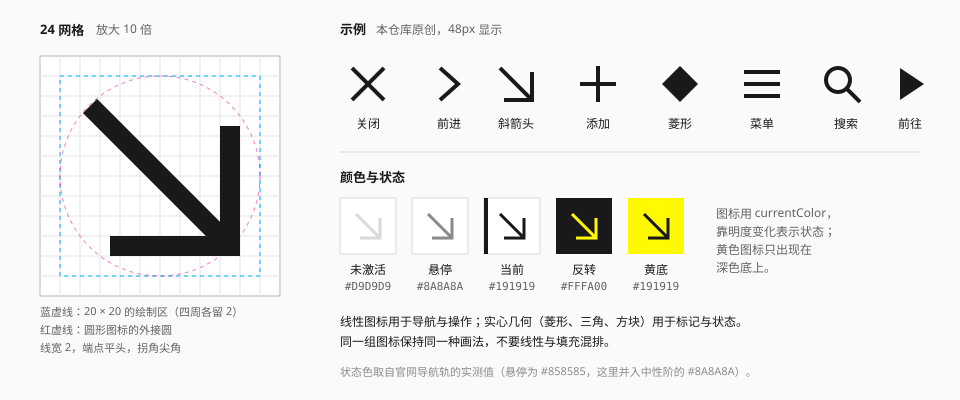

# 图标

## 定位与原则

1. **几何、克制、同一家族。** 图标由直线、45° 斜线和正圆构成，线宽一致。
2. **图标先于文字。** 官网的主导航只显示图标，文字在悬停时才出现——图标必须在没有文字的情况下可辨认。
3. **靠明度表示状态。** 未激活是浅灰，当前项是墨色；不靠换图标、不靠彩色。
4. **只用原创图标。** 不收录、不描摹官方图标。

本仓库不包含任何官方图标。下文描述的是画法上的共性，示例是按这些共性重新画的。

## 网格与画法



| 项 | 规范 | 来源 |
| --- | --- | --- |
| 画布 | 24 × 24 | 推断 |
| 绘制区 | 20 × 20，四周各留 2 | 推断 |
| 线宽 | 2（在 24 画布上） | 推断 |
| 端点 | 平头（`butt`） | 观察 |
| 拐角 | 尖角（`miter`） | 观察 |
| 角度 | 0°、45°、90° 为主 | 观察 |
| 圆 | 正圆与正圆弧，不用自由曲线 | 观察 |
| 颜色 | `currentColor` | — |

官网的导航图标偏"实心块面 + 局部镂空"，装饰图标（箭头、加号、圆点）偏线性；两类都是硬朗的几何形（观察）。本规范把线性作为默认画法，因为它在小尺寸下更容易保持一致。

### 尺寸

| 显示尺寸 | 用在哪 |
| --- | --- |
| 16px | 标签内、行内、紧凑按钮 |
| 20px | 普通按钮、输入框 |
| 24px | 导航、工具栏——**默认** |
| 32px 以上 | 空状态、功能入口 |

图标随容器放大时线宽等比放大。不要为大尺寸单独做细线版本。

官网导航轨：轨宽 7.5rem，图标字号 1.5rem，即图标约占轨宽的五分之一（实测）。图标周围要留足空白。

## 线性与实心的分工

| 画法 | 用途 | 例子 |
| --- | --- | --- |
| 线性 | 导航、操作 | 关闭、箭头、搜索、菜单、分享 |
| 实心几何 | 标记、状态、列表符号 | 菱形、三角、方块、圆点 |
| 实心块面 | 需要强识别的功能入口 | 主导航项 |

同一组里不要混排。一排工具按钮要么全线性，要么全实心。

### 几何标记

小型实心几何是这套语言的"标点符号"：

| 形状 | 含义 |
| --- | --- |
| 菱形 ◆ ◇ | 节点、选中 / 未选、通知 |
| 三角 ▶ ▼ | 前往、展开、播放 |
| 斜箭头 ↘ | 分节引导、"查看详情" |
| 方点 ▪ | 装饰点阵、列表符号 |
| 加号 + | 定位点、添加 |

用法见 [括号与标记](../elements/brackets-and-markers.md)。

社区组件库 ReEnd 把菱形发展成了一套表单语法——复选框选中是 ◆，单选是 ◇ → ◆，开关的滑块是菱形（社区）。这是很好的延伸，但它是作者的设计，不是官方界面的直接对应；本规范在 [表单](../components/form.md) 里把它列为可选方案。

## 状态

导航图标的三个状态（官网实测）：

| 状态 | 颜色 | 令牌 |
| --- | --- | --- |
| 未激活 | `#D9D9D9` | `neutral-300` |
| 悬停 | `#858585` | 近似 `neutral-500` |
| 当前 | `#191919` | `ink` |

工具类图标（用户、声音）：默认 `#7C7C7C`，悬停 `#424242`。

注意未激活的 `#D9D9D9` 在白底上只有 1.4:1。这在官网上成立，是因为导航项很少且位置固定；通用组件里的图标按钮**不要**用这么浅的默认色，建议默认 `ink-secondary`、悬停 `ink`（推断）。

黄色图标只出现在深色底上（分享按钮激活时：墨黑底 + 黄图标）。浅底上不用黄色图标。

## 无障碍

- 纯图标按钮必须有可访问名称：`aria-label` 或视觉隐藏的文字。
- 装饰性图标加 `aria-hidden="true"`。
- 点击区域不小于 40 × 40px，即使图标只有 16px。
- 不要用 emoji 充当图标。

## 实现要点

```tsx
// 约定：每个图标一个组件，颜色继承，尺寸可控
type IconProps = React.SVGProps<SVGSVGElement> & { size?: number };

export function ArrowCorner({ size = 24, ...props }: IconProps) {
  return (
    <svg
      width={size}
      height={size}
      viewBox="0 0 24 24"
      fill="none"
      stroke="currentColor"
      strokeWidth={2}
      strokeLinecap="butt"
      strokeLinejoin="miter"
      aria-hidden="true"
      {...props}
    >
      <path d="M5 5l14 14M19 7v12H7" />
    </svg>
  );
}
```

图标组件放在 [packages/ui/src/icons](../../../packages/ui/src/icons/README.md)。

## 宜 / 忌

**宜**

- 用最少的笔画表达含义。
- 在 16px 下检查是否仍然清晰。
- 让箭头、关闭、加号这些高频图标先定型，其他图标向它们看齐。

**忌**

- 圆头端点、圆润拐角——那是另一种（更柔和的）风格。
- 细线（1px）图标配粗体文字。
- 彩色图标、渐变图标、带阴影的图标。
- 把官方的阵营徽记、游戏内图标描一遍放进来。
- 用图标库里画风不同的图标混搭。

## 来源

- 导航图标的颜色与尺寸：[measurements.md](../references/measurements.md) 第 8.1 节。
- 菱形表单语法：[VBeatDead/ReEnd-Components](https://github.com/VBeatDead/ReEnd-Components)。
