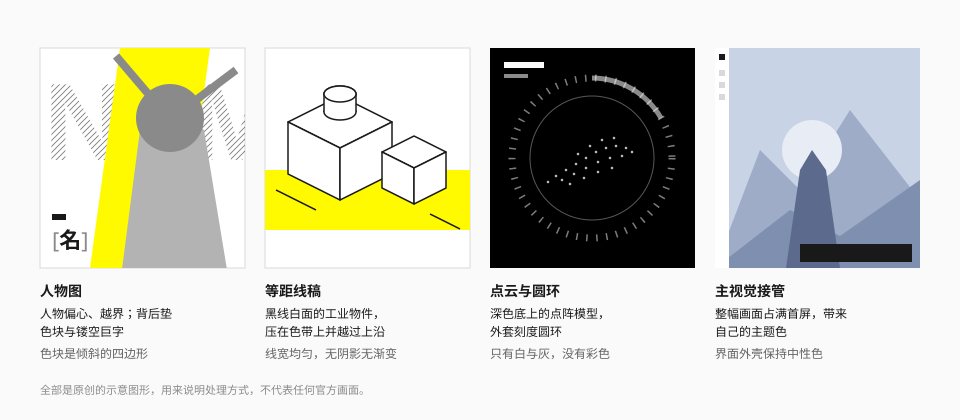

# 图像

## 定位与原则

终末地的界面里，图像是主角，界面是画框。

1. **图像带来颜色，界面保持中性。** 人物、场景、主视觉可以很鲜艳；包住它们的外壳只用黑白灰和一点黄。
2. **图像可以越界。** 人物越过卡片边缘、线稿越过色带、巨字被容器截断。
3. **用几何形状衬托，不用渐变蒙版。** 图像背后垫实色块、斜切的旗形、巨字，而不是柔和的光晕。
4. **图解用线稿。** 需要说明"这是什么东西"时，用等距线稿，不用照片或写实渲染。

本仓库不包含任何官方图像。下图是原创示意，原貌请看 [官网](https://endfield.hypergryph.com/)。

## 四种处理方式

### 人物图

官网干员版块的做法（观察 + 实测）：

- 人物立绘占据版块右侧的大部分面积，**偏离中心**，四肢与武器越过版块边界。
- 背后垫一块信号黄的**倾斜四边形**（样式表里是一个用 `clip-path: polygon()` 切出来的色块）。
- 再往后是 26 – 30rem 的透明**巨字**，只露出斜纹。
- 文字信息（方括号姓名、标签对、简介）停靠在左侧，压在人物之上。
- 提供 2D / 3D 切换时，切换器是一个半透明的深色胶囊。

要点：人物本身不加描边、不加投影、不裁成圆角矩形。

### 等距线稿

色带标题和子页面头部的装饰插图（观察）：

- 等距视角（约 30°）的工业物件：螺栓、型材、支架、泵。
- **黑色均匀线宽 + 白色填充**，没有阴影、没有渐变、没有灰阶。
- 压在信号黄的色带上，并越过色带的上沿。
- 局部可以有少量黄色填充，与色带呼应。

这种画法适合做空状态、功能说明、文档配图。它传达的是"工业图解"的语气。

画原创线稿时：

| 项 | 建议 |
| --- | --- |
| 视角 | 等距，三个轴向各 120° |
| 线宽 | 全图统一，1.5 – 2px |
| 填充 | 白；最多一种强调色 |
| 端点与拐角 | 圆角连接（`round`），避免尖角溢出 |
| 复杂度 | 一个主体 + 一两个配件，不画场景 |

### 点云与圆环

世界观版块的做法（观察）：

- 纯黑底上，由白色小点构成的三维模型，缓慢旋转。
- 外面套一圈刻度圆环与两段不对称的粗弧。
- 只有白与灰，没有彩色；标题与分页器停靠在右侧。

这是全站"科幻感"最强的地方，但它用的是点、线、圆这些最基本的元素，没有辉光和霓虹色。

### 主视觉接管

首页首屏的做法（观察）：

- 当期版本的主视觉占满整个首屏，带来自己的色调（观察时是青紫色的雪景）。
- 导航轨、下载坞这些界面外壳**保持中性色**，不跟着主视觉换色。
- 版本标题用该版本专属的艺术字，不用系统字体。

主视觉每个版本都换，所以"终末地官网是什么颜色"没有固定答案——固定的是外壳。

## 图像与界面的关系

| 层 | 内容 | 颜色 |
| --- | --- | --- |
| 最上 | 导航、按钮、标签 | 中性 + 信号黄 |
| 中 | 文字信息块 | 中性；必要时垫实色底 |
| 图像 | 人物、场景、主视觉 | 自由 |
| 衬底 | 色块、巨字、线稿 | 中性或信号黄 |

文字压在图像上时：

- 优先把文字放在图像的空白处；
- 其次给文字垫一块实色底（白或墨黑），官网的子页面标题就是压在一块白色矩形上；
- 最后才考虑遮罩。遮罩用纯黑的半透明（官网：`rgba(0,0,0,.5)` – `.7`），不用彩色渐变。

## 媒体缩略图

影像资料与公告版块的做法（实测 + 观察）：

- 缩略图是直角或 6px 以内的微圆角。
- 标签（类型、日期）压在缩略图之外或紧贴其下，不叠在图上。
- 日期用信号黄（深色底上）或次级文字色（浅色底上）。
- 播放按钮是一个小的黄色方块，不是半透明的圆形大按钮。规格见 [卡片](../components/card.md#播放钮)。

## 截图与图解

展示游戏画面或界面截图时（观察）：

- 截图保持原始比例，直角，配一条细描边或不描边。
- 用圆形翻页钮和 `1 / 5` 计数来翻页，不用缩略图条。
- 说明文字在截图下方：小号计数 + 标题 + 一段正文。

宣传物料里常见的截图标注方式（社区）：数字圆圈标出位置、红笔圈注、黄色荧光笔划重点。这些属于编辑物料的语言，见 [宣传物料](../surfaces/promotional.md)。

## 占位图

组件库的文档站和示例不能用官方图像。占位图的做法：

- 人物位：中性灰的几何剪影，或一个带对角线的矩形，标注"IMAGE"。
- 场景位：两三层不同明度的灰色多边形。
- 需要颜色时用色板里的角色色，不要随手取色。
- 不要用网络图库的照片冒充最终素材。

## 宜 / 忌

**宜**

- 让图像占最大面积，界面元素贴边。
- 用实色几何形状衬托图像。
- 让图像的一部分越过容器边界。
- 文字压图时垫实色底。

**忌**

- 把人物裁进圆角卡片。
- 给图像加彩色渐变蒙版、光晕、玻璃拟态面板。
- 让界面外壳跟着图像换成彩色。
- 在仓库、文档站、示例里使用官方立绘、截图或主视觉。
- 用 AI 生成"仿官方"的角色图并暗示其为官方内容。

## 来源

- 干员版块的色块与巨字、媒体标签：[measurements.md](../references/measurements.md) 第 9 节。
- 各版块的原貌：[official-sources.md](../references/official-sources.md)。
