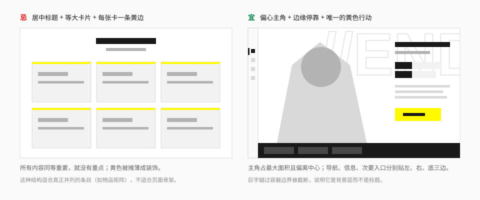
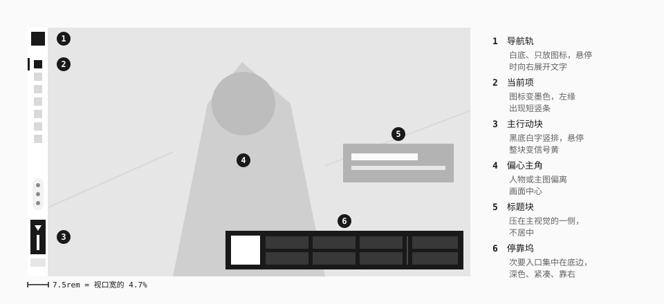
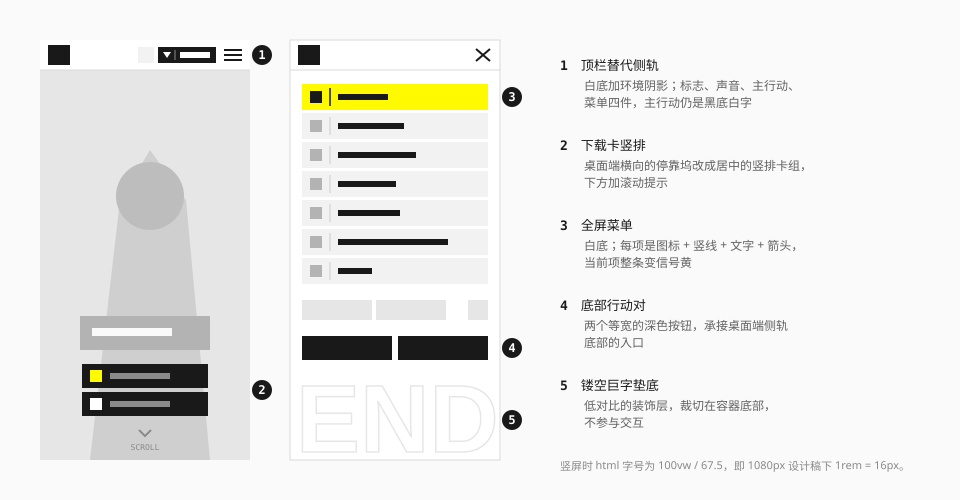

# 布局与空间

## 定位与原则

1. **主角偏心。** 人物、地图、主图或大字占据最大的一块面积，并且偏离画面中心。
2. **信息靠边。** 导航、标签、说明、次要入口停靠在边缘、侧轨或细带上，各占一条边。
3. **分三个平面。** 前景行动、主要内容、技术背景在明度和面积上明显分开。
4. **结构跟着内容走。** 没有固定的"页眉 – 三卡 – 页脚"骨架；时间线就排成时间线，流程就画成流程。
5. **允许不整齐。** 不等宽分栏、被截断的大字、越界的图像是有意的，但可操作的元素必须对齐、可预测。

## 偏心构图



判断一个页面骨架是否"对味"，先看这三点：

- 有没有一个明显最大的主角？它是不是不在正中间？
- 导航、信息、次要入口是不是各贴一条边，而不是都堆在顶部？
- 黄色是不是只出现在一处主要行动上？

等大卡片的网格并不是禁用——物品矩阵、新闻列表这类真正并列的内容就该用网格。问题在于把它当成**页面骨架**。

### 三个平面

| 平面 | 内容 | 做法 |
| --- | --- | --- |
| 背景 | 镂空巨字、网格、线稿、点阵 | 低对比，可越界、可截断，不可交互 |
| 内容 | 主图、正文、数据 | 占最大面积，中等对比 |
| 前景 | 导航、行动、选中态 | 面积小，对比最高，带环境阴影或实色底 |

## 官网的页面骨架

### 桌面端



| 区域 | 规格 | 来源 |
| --- | --- | --- |
| 导航轨 | 宽 7.5rem（视口宽的 4.7%），通高，白底，环境阴影 | 实测 |
| 导航项 | 高 4.5rem；只显示图标，悬停时向右展开约 19.5rem 的文字底块 | 实测 |
| 主行动块 | 4.5 × 9.75rem，黑底，竖排文字，位于轨道底部 | 实测 |
| 主舞台 | 除轨道外的全部宽度；每个版块约一屏高 | 实测 |
| 停靠坞 | 底部靠右的深色带，容纳二维码与各平台入口 | 观察 |

整站是单页长滚动，八个版块依次排列，亮暗交替：

```
首页（主视觉） → 干员（白） → 世界观（黑） → 影像（黑）
→ 版本日历（白） → 玩法（白） → 集成工业（白） → 公告（白）
```

亮暗切换处用一条**色带**过渡：世界观版块前是一条信号黄的通栏，带标题与等距线稿（观察）。

### 移动端



| 区域 | 规格 | 来源 |
| --- | --- | --- |
| 顶栏 | 高 9.625rem（视口宽的 14%），白底，阴影 `0 0 2rem` 黑 30% | 实测 |
| 顶栏内容 | 标志、声音钮、主行动（黑底白字）、菜单钮 | 观察 |
| 菜单 | 全屏白底；导航项高 6.75rem，当前项黄底 | 实测 |
| 首屏底部 | 竖排下载卡组 + 滚动提示 | 观察 |

桌面到移动不是简单堆叠：侧轨变成顶栏加全屏菜单，横向停靠坞变成竖排卡组，版块内媒体与说明的上下顺序也会调换。

## 游戏界面的分区


运行界面（HUD）的原则是**中心留空、四角成组**（社区）。每组内部用形状区分角色：地图是圆，资源是胶囊，技能是圆环，任务标题左侧是黄色短竖条。

其他界面家族的结构见 [游戏界面](../surfaces/game-ui.md)。

## 尺寸体系

### 官网：流式 rem

官网把根字号绑在视口宽度上，整页等比缩放：

| 方向 | 根字号 | 设计稿 |
| --- | --- | --- |
| 横屏 | `100vw / 160` | 1920px 宽，`1rem = 12px` |
| 竖屏 | `100vw / 67.5` | 1080px 宽，`1rem = 16px` |

这种做法能让构图在任何屏幕上保持一致，适合以大图为主的展示站；但文字会随屏幕缩放，小屏上偏小，也不响应用户的字号设置。

### 组件库：固定 rem + 断点

组件库用常规做法：`1rem = 16px`，间距以 4px 为基本单位（Tailwind 默认的 `--spacing: 0.25rem`），用断点做响应式。需要整体缩放的展示页，由使用方在页面层自己实现。

把官网尺寸换算到固定像素时，用"1920 稿的像素值 × 0.75"左右作为起点（因为常见笔记本视口约 1440px）：

| 官网（rem / 1920 稿） | 换算参考 | 用途 |
| --- | --- | --- |
| 7.5rem / 90px | 64 – 72px | 导航轨宽度 |
| 4.5rem / 54px | 40 – 44px | 按钮、导航项高度 |
| 3.75rem / 45px | 36px | 页签高度 |
| 6.25rem / 75px | 56px | 大按钮高度 |
| 8.75rem / 105px | 72 – 80px | 弹窗标题栏高度 |
| 109rem / 1308px | 最大 1040px | 弹窗宽度（约为视口的 68%） |

这些是**推断**，具体数值在实现组件时定，见 [组件规范](../components/README.md)。

### 间距

官网的间距没有量到统一的阶梯。建议（推断）：

| 场景 | 间距 |
| --- | --- |
| 图标与文字、标签内部 | 4 – 8px |
| 控件内边距 | 水平 16 – 24px |
| 同组控件之间 | 8 – 12px |
| 卡片内边距 | 16 – 24px |
| 版块内的大块之间 | 48 – 64px |
| 版块之间 | 96px 以上，或直接换底色 |

**紧的地方很紧，松的地方很松。** 标签对、按钮组之间几乎不留缝（官网的"名 / 值"标签是贴在一起的），版块之间则留出大片空白。不要让所有间距都是 16px。

## 栅格

官网不是按 12 栏栅格搭的，而是按构图定位。组件库与文档站可以用栅格，但建议：

- 用**不等宽分栏**，如 `minmax(0, 1.6fr) minmax(16rem, 0.8fr)`，不要对半分。
- 可能装长内容的栅格子项加 `min-width: 0`。
- 装饰层（巨字、线稿）单独放在 `pointer-events: none` 的容器里并局部裁切；不要用全局 `overflow-x: hidden` 掩盖溢出。

## 断点

| 断点 | 宽度 | 布局变化 |
| --- | --- | --- |
| 默认 | < 768px | 顶栏 + 全屏菜单；单栏；装饰巨字缩小或隐藏 |
| `md` | ≥ 768px | 可出现双栏；仍用顶栏 |
| `lg` | ≥ 1024px | 侧轨出现；主舞台 + 侧栏 |
| `xl` | ≥ 1280px | 完整的偏心构图 |

官网只区分横屏与竖屏（`orientation`），没有中间档；上表是给组件库的**推断**。至少检查 375、768、1280、1920 四个宽度。

## 层叠顺序

| 层 | 内容 |
| --- | --- |
| 背景装饰 | 巨字、网格、线稿 |
| 内容 | 正文、媒体 |
| 悬浮控件 | 翻页钮、切换器 |
| 常驻导航 | 侧轨、顶栏 |
| 遮罩 | 弹窗遮罩 |
| 弹窗 | 弹窗、抽屉 |
| 轻提示 | Toast |

具体的 `z-index` 数值在实现浮层组件时定。

## 宜 / 忌

**宜**

- 先决定主角是谁、放在哪，再安排其他内容。
- 让次要信息贴边，用细带、窄栏、侧轨承载。
- 用底色切换来分版块。
- 让背景巨字越过边界被截断。

**忌**

- 把所有内容放进居中的等宽容器。
- 每个版块都用"居中标题 + 三张卡片"。
- 为了"错落"让按钮、输入框这类可操作元素不对齐。
- 桌面三栏在手机上直接堆成一列——想清楚哪些变抽屉、哪些变分页。
- 装饰层挡住点击或撑出横向滚动条。

## 来源

- 侧轨、顶栏、弹窗尺寸与根字号：[measurements.md](../references/measurements.md) 第 1、8 节。
- 游戏界面的分区：[Statrue/endfield-design-skill](https://github.com/Statrue/endfield-design-skill)。
