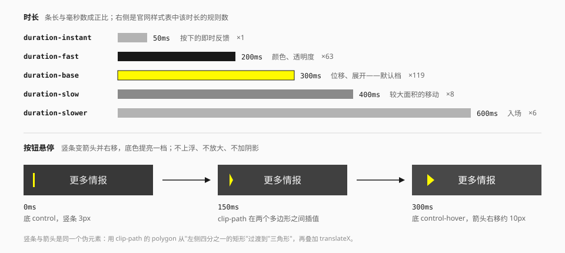
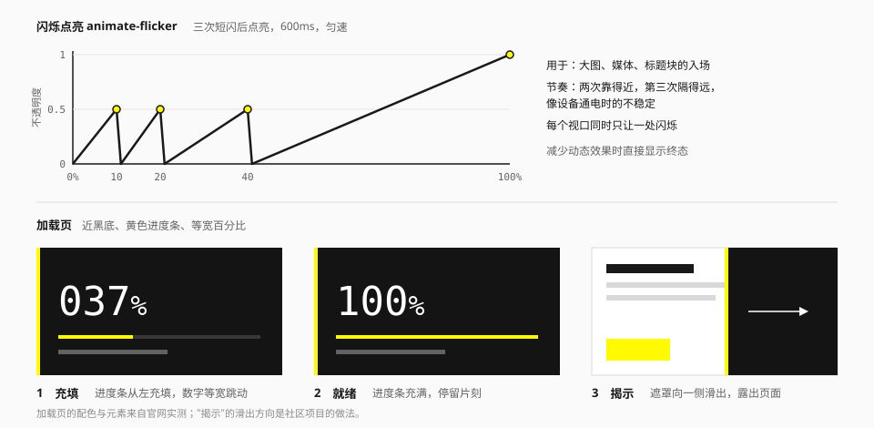

# 动效

## 定位与原则

1. **短。** 交互反馈在 0.2 – 0.3 秒内完成。
2. **硬。** 用位移、擦入、形变和明暗反转；不用弹跳、不用回弹、不用持续漂浮。
3. **有因果。** 动效解释"什么变了、从哪来"：底块从左滑入、文字让位给箭头、遮罩向一侧退出。
4. **戏剧性留给入场。** 闪烁点亮、加载页这类效果只在进入时出现一次，日常交互保持安静。
5. **可以关。** 尊重"减少动态效果"的系统设置。

## 时长与缓动



| 令牌 | 值 | 用途 | 官网出现次数 |
| --- | --- | --- | --- |
| `--duration-instant` | 50ms | 按下的即时反馈 | 1 |
| `--duration-fast` | 200ms | 颜色、透明度变化 | 63 |
| `--duration-base` | 300ms | 位移、展开、形变——**默认档** | 119 |
| `--duration-slow` | 400ms | 较大面积的移动 | 8 |
| `--duration-slower` | 600ms | 入场 | 6（0.5s 与 0.6s 合计） |

官网的过渡九成集中在 0.2s 和 0.3s 两档（实测）。超过 0.6s 的只有个别的入场与循环动画。

| 令牌 | 值 | 用途 |
| --- | --- | --- |
| `ease-standard` | `ease` | 默认。官网多数过渡没有显式声明缓动，用的就是浏览器默认值 |
| `ease-emphasis` | `ease-in-out` | 往返的位移、面板展开 |
| `ease-exit` | `ease-out` | 入场、从屏幕外进入 |
| `ease-linear` | `linear` | 旋转、跑马灯、闪烁（Tailwind 内置，不在 `theme.css` 里） |

官网**没有使用任何自定义贝塞尔曲线**（实测）。不要引入带过冲的缓动（如 `cubic-bezier(0.34, 1.56, 0.64, 1)`），它会让界面显得"弹"。

不带过冲的减速曲线也没有加。补完入场之后拿两条和 `ease-out` 并排比过一次：4 – 8px 的浮层位移看不出差别；大面积的擦入用它们会"先出来一大半、再慢慢收尾"，擦的过程反而看不清。所以进场一律是 `ease-exit`（`ease-out`），不用再找更"顺"的曲线。（推断）

在 Tailwind 里：

```html
<button class="transition-colors duration-(--duration-fast) ease-standard">…</button>
<div class="transition-transform duration-(--duration-base) ease-emphasis">…</div>
```

## 交互反馈的套路

以下都来自官网实测。

### 悬停：换色，不上浮

| 控件 | 悬停时 |
| --- | --- |
| 深色按钮 | 底 `#383838` → `#484848`，字 `#EEEEEE` → 白 |
| 浅色按钮 | 底白 → `#F0F0F0` |
| 分页方钮 | 底 `#FAFAFA` → 信号黄 |
| 导航图标 | `#D9D9D9` → `#858585` |
| 页签 | 底透明 → `#F3F3F3` |
| 主行动块（黑） | 黄色底层淡入，文字由白变墨 |
| 分享按钮 | 底变墨黑，图标变黄 |

没有任何控件在悬停时放大、上浮或加重阴影。

### 悬停：竖条变箭头

深色按钮左侧的黄色竖条，在悬停时变成一个向右的三角并右移——"这里可以前往"的暗示。做法是让同一个伪元素的 `clip-path` 在两个多边形之间过渡：

```css
.btn::after {
  content: "";
  position: absolute;
  left: 1rem;
  top: 22.5%;
  width: 0.75rem;
  height: 55%;
  background: var(--color-action);
  clip-path: polygon(0 0, 25% 0, 25% 100%, 0 100%);
  transition:
    clip-path var(--duration-base) var(--ease-standard),
    transform var(--duration-base) var(--ease-standard);
}

@media (hover: hover) {
  .btn:hover::after {
    clip-path: polygon(0 20%, 100% 50%, 0 80%, 0 80%);
    transform: translateX(0.625rem);
  }
}
```

两个 `polygon` 的顶点数必须相同才能插值，所以三角形写成四个点（最后两个重合）。

组件库把这两个形状做成了工具类 `marker-bar` 与 `marker-arrow`（见 [utilities.css](../../../packages/ui/src/styles/utilities.css)），写法是 `marker-bar group-hover:marker-arrow`。竖条的宽度用 `--marker-bar` 调，默认 3px。

### 激活：让位

页签被选中时，文字向左平移一小段，右侧淡入一个箭头块。导航轨的项在悬停时，一块灰色底向右展开，文字随之出现。共同点是：**新元素出现时，旧元素挪开一点给它腾位置**，而不是凭空叠上去。

### 入场：滑块揭示

分节标题进入视口时，一个灰色块从左侧滑入（`translateX(-100%)` → `0`），块内的箭头从 −45° 转正，随后标题文字淡入。顺序是"块 → 箭头 → 字"，每步错开约 0.1 秒（错开量为推断）。

对应三个工具类：`animate-slide-in`、`animate-turn-in`、`animate-fade-in`，各 300ms、`ease-out`，错开量用 `[animation-delay:100ms]` 这样的写法加。

### 关闭：转 90°

弹窗的关闭图标在悬停时旋转 90°。这是全站少有的旋转动效。

### 按下

按下态只换更深一档的颜色（黄 → `#EEEA00`，深灰 → `#282828`），不缩小。

## 补的几条约定

上面的套路都来自官网实测。下面这几条官网上没有逐条量到，是把同一套原则用到规范没写到的地方（推断）。逐个控件怎么补，清单在 [动效补全计划](../../motion-plan.md)。

### 状态的记号要有过渡

勾、圆点、细线、括号这类"状态的记号"，出现时不硬切：状态变了，画面要让人看得出是"变过来的"。记号是小件，进出都用 `duration-fast`。

| 控件 | 什么变了 | 怎么动 |
| --- | --- | --- |
| 复选、单选 | 勾、半选的短横、圆点 | 淡入淡出，200ms，和方格换底色同时走 |
| 滑块 | 按住时正中的细线；按键或外部改值后的位置 | 细线淡入淡出；滑块头和走过的一段滑过去，200ms。拖动、点轨道时不过渡 |
| 步骤条 | 走完一步：连接线、节点 | 连接线的墨色从起点一端充到头，300ms；节点换色 200ms |
| 物品格、角括号、文件上传的投放区；图片查看的取景角 | 选中 / 拖到上面时四角的括号；大图层打开时的取景角 | 八段短线各自从角的顶点伸到满长，200ms；消失是直接消失 |
| 验证码输入 | 填进去的那一位 | 字从透明淡入到墨色，200ms；粘贴一整串时各格一起到 |

### 进出不对称

进入用 `duration-base`（300ms），退出用 `duration-fast`（200ms）：来的时候看得清从哪来，走的时候不挡路。记号、文字提示这类小件，进出都用 `duration-fast`。

### 方向位移

浮层从触发它的那一侧来，位移 4px；大面积的（全屏菜单的栏目、横幅）和贴着视口边缘出来的（轻提示）8px。位移只是提示方向，不是滑行——距离再长就成了"飞进来"。

| 令牌 | 值 | 用途 |
| --- | --- | --- |
| `--motion-shift` | 4px | 贴着触发元素出来的浮层：菜单面板、气泡卡片、悬浮卡、文字提示 |
| `--motion-shift-lg` | 8px | 大面积的，和贴着视口边缘出来的：弹窗、全屏菜单的栏目、底部的轻提示、完成横幅的标题 |

- 位移只写在进场的起点上，退场只淡出：走的时候不用再交代一遍"回哪去"。
- 透明度和位移各走各的时长——透明度 `duration-fast`，位移 `duration-base`、`ease-exit`，正是时长表里两档各自的用途。面板因此先看得清、再落稳，"进出不对称"也由此而来，不用另写退场的时长。
- 浮层面板的写法收在 [`lib/motion.ts`](../../../packages/ui/src/lib/motion.ts) 的 `enterFromSide` 里：按基元给的 `data-side`（面板在触发元素的哪一侧）决定起点往哪边偏。

| 浮层 | 从哪来 | 怎么动 |
| --- | --- | --- |
| 菜单面板一族：下拉菜单与子菜单、右键菜单、下拉选择、组合框、日期选择、气泡卡片、悬浮卡、侧轨收起时的二级 | 触发元素那一侧，4px；子菜单从它那一行的侧面来 | 淡入 200ms，位移 300ms，和顶上那条强调条同一拍；退场只淡出 200ms |
| 弹窗、确认弹窗 | 下面，8px | 遮罩淡入 200ms；面板淡入 200ms，位移 300ms。退场只淡出 200ms。不放大 |
| 轻提示（底部） | 下面，8px | 淡入 200ms，位移 300ms；退场只淡出。正中的那一种是官网实测的做法，只有透明度 |
| 全屏菜单 | 整层原地淡入；栏目从左，8px | 整层 200ms；栏目每条 300ms，[错开](#错开)。退场整层淡出 200ms |
| 图片查看的大图层 | 整层原地淡入 | 整层 200ms；随后取景角落位 200ms；大图取到了淡入 200ms。退场整层淡出 200ms |
| 文字提示 | 触发元素那一侧，4px | 小件：淡入和位移都是 200ms；退场只淡出。键盘聚焦、从相邻的提示移过来时立刻出现，不过渡 |

### 错开

一组东西逐项入场时，每项错开 50 – 100ms，最多错开前五六项，后面的一起到。整组从第一项开始动到最后一项停下，不超过 600ms。

- 用 `animate-shift-in`（见 [标志性动画](#标志性动画)）加 `[animation-delay:…]`；第几项用 `nth-*` 变体写在每一项自己身上，不用在外面数。
- [全屏菜单](../components/navigation.md#全屏菜单) 的栏目：从左 8px；第一项等 100ms（整层的淡入过半），之后每项晚 50ms，第六项起一起到（350ms）。从第一项动到最后一项停下 550ms。
- 错开只用在"整屏换掉"这样的入场上。列表、时间线、步骤条不做成默认的逐项入场。

### 入场

只播一次的入场，留给"这一块刚出现"的时候。分节标题的那一种是官网实测的（见上面的"入场：滑块揭示"）；下面这些是照它的节奏补的。

| 控件 | 怎么动 | 多久 | 什么时候播 |
| --- | --- | --- | --- |
| [完成横幅](../components/feedback.md#完成与庆祝) | 整块从左擦入；标题那一组从左 8px 淡入归位，右边的行动淡入，都比色带晚 200ms | 色带 300ms；从开始到停下 500ms | 进视口 |
| [方括号标题](../elements/brackets-and-markers.md#方括号标题) | 两个括号淡入，名称晚 100ms 淡入。不位移：行内的字做不了 | 各 300ms；一共 400ms | 进视口 |
| [小型面积图](../components/data-display.md#小型面积图) | 整张图从左擦出来，面积和折线一样。同一屏的几张一起画，不逐张错开 | 600ms | 进视口 |
| [空状态](../components/feedback.md#空状态) | 整块淡入，不位移：只是为了不"啪"地一下出现 | 300ms | 挂上 |
| [滚动数字](../components/data-display.md#滚动数字) | 数字从 0 滚到终值，先快后慢；宽度由终值占着。值后来变了直接换，不再滚 | 600ms | 进视口 |
| [页头](../components/navigation.md#页头) | 微文字行 → 标题 → 说明，各自从左 8px 淡入归位，依次晚 100ms。面包屑、返回、行动区不动 | 各 300ms；一共 500ms | 挂上；吸顶的不播 |

- **进视口才播的**用 [`useInView`](../../../packages/ui/src/hooks/useInView.ts)：没进视口时停在起点（裁掉，或者透明），进了播一次，滚走再回来不重播。
- **挂上就播的**是纯 CSS 的动画：给那些挂上的那一刻就在眼前的东西。
- 都带一个 `animate` 属性，默认开；关掉之后没有等待态，也不播。
- 能点的东西（按钮、链接）不做位移入场，最多跟着所在的那一块淡入：位置在动的东西不好点。
- 一组入场从第一样开始动到最后一样停下，不超过 600ms（同 [错开](#错开)）。

### 展开与增删

内容多出来、少下去的时候不硬切：多出来的把位置撑开或者淡入，少下去的先收起、再从页面里拿掉。（推断）

- **退场后再卸载。** 要走的东西先留在页面里把退场走完，再卸载。共用的是内部钩子 `usePresence`（见 [hooks](../../../packages/ui/src/hooks/README.md)）：它等的是这个元素身上**正在跑的**过渡和动画，不另抄一份时长；一个都没有就当场卸载——测试环境里没有动效，东西撤掉就是撤掉了。[加载页](#加载页) 的滑出用的就是它。
- **状态先变，画面后到。** `aria-expanded`、`aria-describedby`、`aria-invalid` 这些在状态变的那一刻就改，不等退场走完；退场中的东西点不到、`Tab` 不进去，对读屏是隐藏的。
- **一开始就在的不播。** 载入时就展开着的、就带着错误的、就选中的，都是静止的；后来才出现的才播。

| 控件 | 什么变了 | 怎么动 | 多久 |
| --- | --- | --- | --- |
| [页签](../components/navigation.md#页签) | 换了一块面板 | 新的那一块淡入，不位移；旧的直接换掉 | 200ms |
| [表格的行展开](../components/data-display.md#行展开) | 多出一行明细，或者明细收回去 | 明细区按高度长出来、收回去，只动高度不淡；几行一起开时同时、同速 | 展开 300ms，收起 200ms |
| [字段](../components/form.md#行为与无障碍) 的错误说明 | 出错了，或者改对了 | 按高度长出来并淡入，撤掉时反过来；下面的内容被推着走 | 小件：进出都是 200ms |
| [提示条](../components/feedback.md#提示条) | 关掉了（`open` 置为假） | 高度收到 0 并淡出，连它占的间距一起收；后面的内容跟着补上来。只做了关闭 | 200ms |
| [标签输入](../components/form.md#标签输入)、[文件上传](../components/form.md#文件上传) 的列表 | 加了一项 | 新的那一项淡入；一次加几个一起到，不错开。删掉的直接消失 | 200ms |

- **按高度收放不量高度。** 外面一层是只有一行的网格，行高在 `0fr` 和 `1fr` 之间过渡，里面一层裁掉还放不下的那一截（[`lib/motion.ts`](../../../packages/ui/src/lib/motion.ts) 的 `collapse`）。展开的起点写在 `@starting-style` 里：展开到一半又收起，过渡从半路折回去。不支持它的旧浏览器只是没有展开的过程，收起照常。
- **提示条是量着收的。** 它不能多包一层（`className` 是给带边线的那一层的），所以收起时量一次自己的高度，把高度、上下的内边距和边线、外边距一起过渡到 0；父容器纵向排着、带行间距时，下外边距收到负的行间距。过渡仍然是 CSS 的，"减少动态效果"照常管得到。

### 选中指示的滑动

几项里选一项的控件，选中的那块底、那段粗条不是"在这一项上消失、在那一项上出现"，而是**同一块东西滑过去**：换的是位置，东西没换。（推断）

| 控件 | 指示是什么 | 怎么动 |
| --- | --- | --- |
| [分段选择](../components/form.md#分段选择) | 选中那一段的墨色底 | 沿轨道滑到新的一段；各段等宽，只走位置 |
| [页内目录](../components/navigation.md#页内目录) | 引线上那一段 3px 的粗条 | 沿引线滑到新的一项，长度跟着那一项的高度变。一项都不亮时原地淡出，再亮时原地淡入 |
| [页签](../components/navigation.md#页签) 的胶囊变体 | 选中那一个的墨色底 | 滑到新的那一个，宽度跟着变；盖在路过的胶囊的轮廓线上面。页签栏横向滚动时跟着内容走 |

- **200ms，`ease-standard`**，和各项换字色同一拍——时长表里"位移"那一档是 300ms，两个并排比过：300ms 时字先反过来、墨块晚 100ms 才到，定的是 200ms。状态（`aria-checked`、`aria-selected`、`aria-current`）和字色在选中的那一刻就变，不等它滑到。
- **只有"换了一项"才滑。** 第一次到位、同一项挪了地方或变了大小（容器宽了、字体到了、前面多了一项）都直接到位：那不是选中变了。中途又换了一项，过渡从半路改道，不排队。
- **从没有到有是原地出现。** 一项都没选中时指示淡出，留在原地；再有的时候位置直接到、原地淡入，不从上一个位置滑来。
- **量位置的是内部钩子 `useIndicator`**（见 [hooks](../../../packages/ui/src/hooks/README.md)）：量出当前项相对容器的位置和尺寸，写成容器上的四个变量。指示画在容器的 `::after` 上（[`lib/motion.ts`](../../../packages/ui/src/lib/motion.ts) 的 `indicator`），不多一个元素；位置走 `translate`，宽和高只在各项大小不一时才变。
- **量不到就照旧。** 服务端渲染、还没排版、容器藏着的时候，各项照原来的样子自己画选中态；量到了才换成滑动的那一块。任何时候都不会有一帧没有选中态。
- 官网实测的那几种不改：格子式页签的 [让位](#激活让位)、楔形页签。

### 跟手的不加过渡

拖动、滑动手势进行中，位置必须贴着指针：这时候加过渡，东西会追着手指跑。过渡只给"跳过去"的那种变化——按键、点一下、外部改值。

## 标志性动画



| 工具类 | 内容 | 用途 | 来源 |
| --- | --- | --- | --- |
| `animate-flicker` | 三次短闪后点亮，600ms | 大图、媒体、标题块入场 | 关键帧节奏：实测；时长：推断 |
| `animate-fill` | `scaleX(0)` → `scaleX(1)`，600ms | 进度条、色块充填（需设 `transform-origin: left`） | 实测 |
| `animate-scroll-hint` | 下坠 1.5rem 并淡出，循环 | 滚动提示 | 实测 |
| `animate-breathe` | 缩放 1 → 1.2 → 1，循环 | 提示点、等待态 | 实测 |
| `animate-marquee` | 平移 −50% 后停顿，循环 | 巨字跑马灯、过长的单行文字 | 实测 |
| `animate-spin` | 匀速旋转，1 秒一圈 | 加载指示 | 实测 |
| `animate-spin-slow` | 同一个关键帧，60 秒一圈 | 刻度圆环 | 推断（官网只量到"匀速旋转一周"，没有量到时长） |
| `animate-blink` | 硬切的明灭 | 输入光标、录制指示 | 观察 |
| `animate-slide-in` | `translateX(-100%)` → `0`，300ms | 分节标题的滑块（外层要 `overflow: hidden`） | 实测；时长为推断 |
| `animate-turn-in` | `rotate(-45deg)` → `0`，300ms | 滑块里的斜箭头 | 实测；时长为推断 |
| `animate-fade-in` | 不透明度 0 → 1，300ms | 分节标题的文字；方括号标题、完成横幅的行动、空状态；页签切过来的面板、新加的标签和文件（它们用 200ms） | 实测；时长为推断 |
| `animate-indeterminate` | 平移自身宽度的 150% 再返回，匀速，1.2s 一程，循环 | 不确定进度的色块（色块宽为轨道的 40%） | 推断 |
| `animate-pulse` | 不透明度 1 → 0.6 → 1，2s，循环 | 骨架的明度往返 | 推断 |
| `animate-shift-in` | 从偏着的地方淡入归位，300ms。往哪边偏由用的地方给：`[--shift-x:…]` / `[--shift-y:…]`，量用 `--motion-shift` 那两档；不给就只是淡入 | 一组东西 [错开](#错开) 入场：全屏菜单的栏目；[入场](#入场)：完成横幅的标题、页头的三行字 | 推断 |
| `animate-wipe-in` | `clip-path` 从左往右露出来，300ms。有东西画到盒子外面一点的，用 `[--wipe-bleed:…]` 把另外几边让出来 | [入场](#入场)：完成横幅的色带、小型面积图（它用 600ms） | 推断 |
| `animate-bracket-in` | 八段短线各自从角的顶点伸到满长，200ms | [角括号](../elements/brackets-and-markers.md#角括号选中) 出现。画在 `::after` 上，所以写成 `after:animate-bracket-in` | 推断 |

### 闪烁点亮

不透明度的时间线是 0 → 0.5 → 0 → 0.5 → 0 → 0.5 → 0 → 1，三次闪烁分别落在 10%、20%、40%。前两次挨得近、第三次隔得远，模拟设备通电时的不稳定。

- 只用于入场，播放一次。
- 同一视口同时只让一个元素闪烁。
- 不要用在文字段落和可交互控件上。

### 跑马灯

内容复制一份首尾相接，匀速移动到 −50% 后**停顿一下**再循环（关键帧在 80% 到位，80% – 100% 静止）。这个停顿让它看起来像机械装置，而不是无休止的滚动。

已实现为 `<Marquee duration gap pauseOnHover paused overflowOnly>`：

- 复制那一份由组件来做，副本对读屏隐藏、不可聚焦；两份之间的间隔用 `gap` 调，默认 2rem。
- 一程默认 20 秒，用 `duration` 调：内容越长给得越大，速度才不会变快。
- **要能停下来。** 鼠标悬停或焦点落到里面时暂停（默认开）；键盘和触屏用户靠 `paused`——在旁边放一个"暂停滚动"的按钮。
- `overflowOnly`：内容放得下就是一行普通的文字，放不下才动起来，容器宽度变了会重新判断。用在"可能过长的单行文字"上。
- 系统开启"减少动态效果"时不动、不显示副本，内容静止在起点，放不下的部分被裁掉。

### 加载页

近黑底（`#141414`）、左缘或底部的黄色进度条、大号等宽百分比、一行小字标语。百分比的数字与 `%` 用两种字号。

完整流程是三个阶段：**充填**（进度条从左充填，数字跳动）→ **就绪**（充满后停留片刻）→ **揭示**（遮罩向一侧滑出）。前两步的元素来自官网实测，第三步的滑出方向参考了社区项目。

加载期间锁定输入；内容就绪后不要为了播完动画而拖延。

组件里"揭示"是整块遮罩向上滑出，600ms（`--duration-slower`）、`ease-emphasis`；"就绪"没有内置的停留。详见 [反馈](../components/feedback.md) 的"加载"。

## 滚动

- 官网是整屏切换的长滚动，每个版块进入时触发各自的入场动画。
- 组件库不提供滚动劫持。入场动画用 `IntersectionObserver` 触发，播放一次，不随滚动反复重播。
- 不做视差。巨字可以用跑马灯横向移动，但不跟滚动联动。

## 减少动态效果

[theme.css](../../../packages/ui/src/styles/theme.css) 末尾已包含全局降级：系统开启"减少动态效果"时，所有动画与过渡的时长压到接近 0、延迟归零，循环动画只播一次。延迟不归零的话，错开的入场会变成一项一项蹦出来——比动着进来更扎眼。

那条规则只管得到 CSS 的动画和过渡。**脚本驱动的动效要自己看**：一帧一帧自己算的（[滚动数字](../components/data-display.md#滚动数字)）用 `useReducedMotion`，开了就直接给终值；脚本里显式要的平滑滚动（回到顶部）同理。

写组件时仍要自查：

- 降级后内容必须**停在终态**（`animation-fill-mode: both`），不能停在透明或屏幕外。
- 状态变化不能只靠动效表达：页签选中除了位移还有底色变化。
- 跑马灯降级后要保证文字可读（静止在起点，溢出部分可省略）。

## 宜 / 忌

**宜**

- 默认用 `duration-base` + `ease-standard`，不确定时不要调。
- 用 `transform` 和 `opacity` 做动画。
- 让新元素的出现伴随旧元素的让位。
- 给 `:hover` 套 `@media (hover: hover)`，避免触屏上粘住悬停态。Tailwind v4 的 `hover:` 变体默认就是这样，组件里直接用它。

**忌**

- 弹跳、回弹、果冻式的缓动。
- 悬停时放大卡片、上浮加阴影。
- 元素持续漂浮、呼吸、发光（提示点除外）。
- 每张卡片都带入场动画，或每次滚动都重播。
- 用动效拖延用户：超过 0.6 秒的过渡要有充分理由。
- 给跟手的位置加过渡：拖动中的滑块、被手指带着走的抽屉和轻提示。

## 来源

- 时长统计、关键帧、各控件的悬停变化：[measurements.md](../references/measurements.md) 第 7、8 节。
- 加载的三阶段流程：[LaoBiDeng321/Endfield-Style-Skill](https://github.com/LaoBiDeng321/Endfield-Style-Skill)。
- 令牌定义：[theme.css](../../../packages/ui/src/styles/theme.css)。
