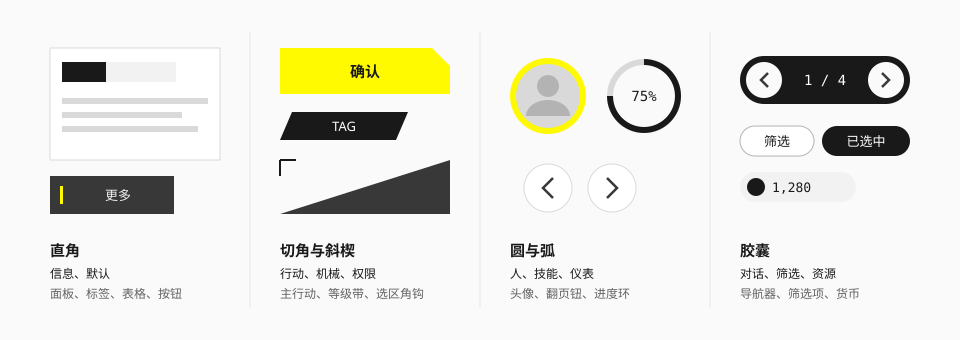

# 形状

## 定位与原则

1. **默认是直角。** 面板、标签、表格、普通按钮都不倒角。
2. **形状有含义。** 换一种形状，就是在说"这是另一类东西"。
3. **不要把任何一种形状推到极致。** 全直角显得呆板，全切角显得做作。直角、切角、圆、胶囊之间的对比才是这套语言的味道。
4. **阴影是环境光，不是投影。** 所有阴影零偏移。

## 四类形状



| 形状 | 表达什么 | 用在哪 | 来源 |
| --- | --- | --- | --- |
| **直角** | 信息、默认状态 | 面板、卡片、标签、表格行、普通按钮、页签、弹窗 | 实测 |
| **切角、斜楔** | 行动、机械、权限、导航 | 主要行动按钮、等级带、选区角钩、养成界面的斜向结构 | 社区（游戏界面）；官网只在局部用斜切 |
| **圆、弧** | 人、技能、仪表、范围 | 头像、圆形翻页钮、进度环、刻度圆环、切换器旋钮 | 实测 |
| **胶囊** | 对话、筛选、资源、短状态 | 胶囊导航器、筛选项、货币与资源条、倒计时、切换器轨道 | 实测 + 社区 |

同一屏可以混用，但**同一语义全站保持同一种形状**：如果筛选项是胶囊，那所有筛选项都是胶囊。

## 圆角

官网实测：绝大多数元素圆角为 0；小控件有 3 – 6px 的轻微倒角；头像与翻页钮是正圆；导航器与切换器是胶囊。

| 令牌 | 值 | 用途 |
| --- | --- | --- |
| `rounded-none` | 0 | **默认。** 面板、卡片、按钮、输入框、弹窗 |
| `rounded-xs` | 2px | 小标签、播放钮、紧凑按钮 |
| `rounded-sm` | 4px | 小型列表按钮、缩略图 |
| `rounded-md` | 6px | 新闻卡片的图片 |
| `rounded-full` | 无限大 | 胶囊与正圆 |

没有 8px、12px、16px 这类"现代卡片圆角"。需要柔和感的地方直接用胶囊或圆，不要用中等圆角折中。

微圆角（2 – 6px）的作用是消除像素级的生硬，肉眼几乎看不出是圆角。拿不准时用 0。

## 切角

切角是把矩形的一个角沿 45° 切掉。它在游戏界面里很常见，在官网上几乎不出现。

| 令牌 | 值 | 适用的元素高度 |
| --- | --- | --- |
| `--cut-sm` | 6px | 标签、角标（≤ 28px） |
| `--cut-md` | 10px | 按钮、输入框（32 – 48px） |
| `--cut-lg` | 16px | 面板、大按钮（≥ 56px） |

三档取值是**推断**（社区项目的取值在 10 – 14px 之间）。规则：

- 切角尺寸跟元素大小走，约为高度的四分之一，不要全站统一一个值。
- 一个元素只切**一个角**，通常是右上或右下；对角各切一个用于更强的"机械感"，四角全切不用。
- 只给行动、导航、权限类控件切角。正文卡片、聊天气泡、筛选项不切。

画法、焦点环的处理、斜楔的写法见 [切角与斜楔](../elements/corner-and-wedge.md)。

## 线

| 用途 | 粗细 | 颜色 | 来源 |
| --- | --- | --- | --- |
| 发丝分隔线 | 1px | `line` | 实测 |
| 控件之间的竖向分隔 | 2px | `line` | 实测（官网约 2.25px） |
| 黄底或深底上的分隔线 | 2 – 3px | `signal-deep` 或白 30% | 实测 |
| 强调竖条（按钮内、列表项左缘） | 3 – 4px | `signal` | 实测（0.25 – 0.375rem） |
| 角括号、角钩 | 2px | `ink` 或 `ink-tertiary` | 推断 |
| 镂空字描边 | 1 – 1.5px | `ink` 20% | 社区 |

**竖向分隔线不通顶。** 官网页签之间的竖线高度约为容器的三分之二（2.5rem 对 3.75rem），上下留空。

**强调竖条**是最常用的"低成本强调"：一条 3 – 4px 的黄色短竖线，放在按钮文字左侧或列表项左缘，长度约为容器高度的一半。

## 阴影

官网的阴影全部是 `0 0 <模糊> rgba(0,0,0,α)`——没有 X、Y 偏移，像物体四周均匀的环境遮蔽，而不是从上方打光的投影。

| 令牌 | 值 | 用途 | 官网对应 |
| --- | --- | --- | --- |
| `shadow-xs` | `0 0 4px` 黑 25% | 按钮 | 通用按钮的 `drop-shadow` |
| `shadow-sm` | `0 0 8px` 黑 25% | 小型浮层、翻页钮 | 0.5 – 0.625rem |
| `shadow-md` | `0 0 12px` 黑 30% | 主要行动按钮、弹出面板 | 0.75rem 黑 40% |
| `shadow-lg` | `0 0 24px` 黑 30% | 顶栏、弹窗 | 2rem 黑 30% |
| `shadow-rail` | `0 0 12px` 黑 10% | 侧轨、常驻面板 | 1rem 黑 10% |

规则：

- 阴影用来把**浮在内容之上的东西**（按钮、浮层、导航）从背景上分出来，不用来做卡片的层次。卡片靠底色差和 1px 线。
- 悬停时不加大阴影、不上浮。悬停用颜色变化与位移表达。
- **辉光几乎不用。** 官网全站只有两处黄色辉光和两处白色辉光。不要给选中态加发光描边。

## 选中与强调的形状语言

选中不靠发光，靠以下几种手段（按使用频率）：

| 手段 | 说明 | 例子 |
| --- | --- | --- |
| **填充反转** | 底色变黄，或由浅变深、由深变浅 | 导航激活项变黄底；页签激活变灰底 |
| **边条** | 左缘或底边出现一条实色短条 | 列表选中项左缘黄条；分页的黄色刻度 |
| **角括号** | 四角各一个 L 形短线，框住选中物 | 物品格选中 |
| **选中环** | 圆形元素外加一圈实色环 | 头像选中的黄环 |
| **位移** | 文字或图标平移一小段，让出位置给箭头 | 页签激活时文字左移、箭头出现 |

见 [括号与标记](../elements/brackets-and-markers.md)。

## 用法

```html
<!-- 默认：直角 -->
<div class="border border-line bg-surface-raised">面板</div>

<!-- 小标签：微圆角 -->
<span class="rounded-xs bg-control px-2 py-0.5 text-sm text-on-control">PV</span>

<!-- 胶囊导航器 -->
<div class="flex items-center gap-4 rounded-full bg-surface-inverse p-1.5 text-ink-inverse">…</div>

<!-- 圆形翻页钮：环境阴影 -->
<button class="size-12 rounded-full bg-surface-raised shadow-sm">‹</button>

<!-- 强调竖条 -->
<button class="relative bg-control pl-6 text-on-control">
  <span class="absolute left-3 top-1/4 h-1/2 w-[3px] bg-action"></span>
  更多情报
</button>
```

## 宜 / 忌

**宜**

- 先全部用直角搭出界面，再判断哪些地方需要换形状。
- 让形状对比发生在不同语义之间：直角面板里放一排圆形头像。
- 用底色差和 1px 线分层。

**忌**

- 给卡片加 8 – 16px 圆角。
- 给所有按钮切角，或给一个元素四角全切。
- 用带偏移的投影（`0 4px 12px`）和悬停上浮。
- 用发光描边表示选中或焦点。
- 让锐角背景缩小了真实的点击区域。

## 来源

- 圆角、阴影、线宽的实测：[measurements.md](../references/measurements.md) 第 4、5、8 节。
- 形状语义表：[Statrue/endfield-design-skill](https://github.com/Statrue/endfield-design-skill)。
- 令牌定义：[theme.css](../../../packages/ui/src/styles/theme.css)。
