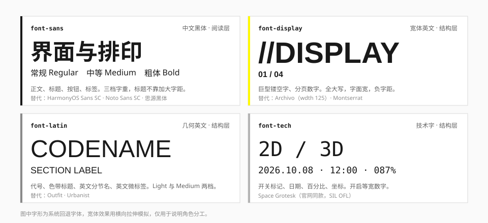
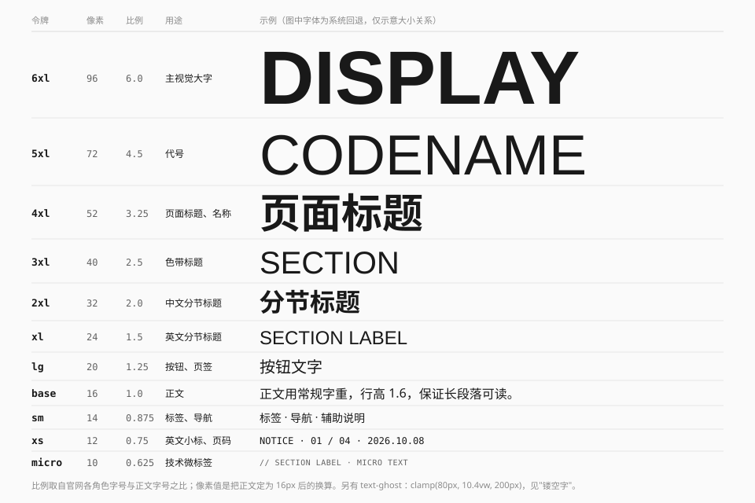

# 字体

## 定位与原则

1. **两种文字，两个层次。** 中文黑体是阅读层；英文是结构层，负责分节名、编号、坐标和微标签。
2. **靠字号和字重拉层级，不靠颜色。** 标题和正文几乎都是同一种墨色，差别在大小与粗细。
3. **英文分三种脾气。** 宽体用于巨型字，几何体用于标题与标签，技术字用于数字。
4. **数字等宽。** 百分比、页码、日期、计数在变化时不能左右抖动。
5. **微文字必须是真话。** 小号英文是技术副层，写真实的分节名、版本号、坐标；不要用乱码和编造的读数充数。

## 四种字体角色



| 令牌 | 角色 | 官网用的字体 | 本规范的替代 | 来源 |
| --- | --- | --- | --- | --- |
| `font-sans` | 中文与通用正文 | 自托管黑体，Regular / Medium / Bold / Black 四档 | HarmonyOS Sans SC → Noto Sans SC → 系统黑体 | 字族：实测；具体字体：推断 |
| `font-display` | 巨型英文、分页数字 | Novecento Sans Wide（Medium / DemiBold / Bold） | Archivo，宽度轴设为 125；回退 Montserrat | 实测；替代为推断 |
| `font-latin` | 英文标题、英文标签、代号 | Gilroy（Light / Medium） | Outfit；回退 Urbanist | 实测；替代为推断 |
| `font-tech` | 数字、开关标记、技术微标 | Space Grotesk | Space Grotesk（同款，SIL OFL） | 实测 |
| `font-mono` | 代码、需要严格等宽的表格 | — | JetBrains Mono → 系统等宽 | 推断 |

关于字体的三点说明：

- **官网的中文字体**以 `SansRegular` 等改写后的名字加载。样式表里有一处直接写了 `HarmonyOS_Sans_SC_Bold`，所以推断整组是 HarmonyOS Sans SC，但没有做字形比对。
- **Novecento Sans Wide 和 Gilroy 是商业字体**，本仓库不分发，也不在令牌里引用。替代字体是按"宽体全大写""几何无衬线"这两个特征挑的开源字体，观感接近但不相同。
- 社区项目里常见的 Bender、Orbitron 等字体**官网没有使用**，那是《明日方舟》本体或作者个人的选择。

### 加载

令牌只声明字体栈，不负责加载。使用方按需自行引入，例如：

```css
@import url("https://fonts.googleapis.com/css2?family=Archivo:wdth,wght@125,500..800&family=Outfit:wght@300;500&family=Space+Grotesk:wght@400;500&display=swap");
```

中文字体体积大，建议只在确有需要时自托管子集；不加载时会回退到系统黑体，层级关系仍然成立。

## 字阶



官网全站用随视口缩放的 `rem`（横屏 `100vw / 160`），所以没有固定的像素字号。本规范取的是**各角色字号与正文字号的比例**，再把正文定在 16px。

| 令牌 | 尺寸 | 行高 | 比例 | 用途 | 官网对应（rem，正文 1.5） |
| --- | --- | --- | --- | --- | --- |
| `text-ghost` | `clamp(5rem, 10.4vw, 12.5rem)` | 1 | 10.4 | 镂空巨字 | 15.625 |
| `text-6xl` | 6rem / 96px | 1 | 6 | 主视觉大字 | — |
| `text-5xl` | 4.5rem / 72px | 1 | 4.5 | 代号 | 6 – 7.5 |
| `text-4xl` | 3.25rem / 52px | 1 | 3.25 | 页面标题、名称 | 4.5 – 4.875 |
| `text-3xl` | 2.5rem / 40px | 1 | 2.5 | 色带标题 | 3.75 |
| `text-2xl` | 2rem / 32px | 1.1 | 2 | 中文分节标题 | 3 |
| `text-xl` | 1.5rem / 24px | 1.1 | 1.5 | 英文分节标题 | 2.25 |
| `text-lg` | 1.25rem / 20px | 1.2 | 1.25 | 按钮、页签 | 1.75 – 1.875 |
| `text-base` | 1rem / 16px | 1.6 | 1 | 正文 | 1.5 |
| `text-sm` | 0.875rem / 14px | 1.4 | 0.875 | 标签、导航 | 1.25 – 1.375 |
| `text-xs` | 0.75rem / 12px | 1.25 | 0.75 | 英文小标、页码 | 1 – 1.125 |
| `text-micro` | 0.625rem / 10px | 1 | 0.625 | 技术微标签 | 1rem 再缩放 0.5 – 0.8 |

比例一列是实测，像素值和行高是推断。官网标题与按钮普遍是 `line-height: 1`；正文行高没有量到，1.6 是按中文长段落的可读性定的。

这套字阶的特点是**跨度大、中间档少**：正文到分节标题直接翻倍，再往上是 3 倍、4.5 倍、10 倍。不要在 16px 和 32px 之间塞很多档。

### 字重

| 字重 | 用在哪 |
| --- | --- |
| Regular 400 | 正文、说明、弹窗标题 |
| Medium 500 | 按钮、页签、导航、标签、英文分节名 |
| Bold 700 | 中文分节标题、页面标题、名称 |
| Light 300 | 只用于 `font-latin` 的大号代号 |
| ExtraBold 800 | 只用于 `font-display` 的巨型字 |

官网的中文标题用 Bold 而不是 Black，页面上最重的是宽体英文巨字。

### 字距

| 令牌 | 值 | 用途 | 来源 |
| --- | --- | --- | --- |
| `tracking-ghost` | −0.04em | 镂空巨字 | 实测 |
| — | −0.08em | 干员区的背景巨字 | 实测 |
| `tracking-label` | 0.05em | 竖排按钮文字、短标签 | 实测 |
| — | −0.02em ~ −0.03em | 长外文在窄容器里的收紧 | 实测 |

**字越大，字距越紧。** 中文正文不加字距。

## 中英搭配

官网的标题组合有固定的套路（实测 + 观察）：

**分节标题**——英文在上、中文在下，英文更轻、中文更重：

```
GAMEPLAY          font-latin Medium  text-xl
玩法介绍           font-sans Bold     text-2xl
```

**色带标题**——小号副题 + 大号主题，都是英文：

```
ARKNIGHTS: ENDFIELD     font-latin Light   text-lg
LORE                    font-latin Medium  text-3xl
```

**名称**——中文名包在方括号里，括号比名字轻、颜色更浅：

```
[ 名称 ]     括号 font-sans Medium, ink-tertiary
             名称 font-sans Bold,   ink
```

**微标行**——斜杠 + 类目 + 日期：

```
// 新闻   2026.10.07     text-xs, ink-secondary
```

结构见 [分节标题](../elements/section-title.md) 与 [括号与标记](../elements/brackets-and-markers.md)。

## 数字

- 变化的数字（进度、倒计时、计数）用 `font-tech` 并开启等宽数字：`font-variant-numeric: tabular-nums`。令牌里已为 `font-tech` 设了 `"tnum"`。
- 页码写成 `01 / 04` 或 `1 / 4`，斜杠两侧留空格。
- 日期用点分隔：`2026.10.07`。
- 百分比的数字与 `%` 用不同字号：加载页的数字是 4.375rem、`%` 是 3.25rem，约 4:3（实测）。

## 响应式

官网的做法是整页等比缩放，在超宽屏和小笔记本上字号差异很大。组件库不采用这种做法：

- 字号用固定 `rem`，只有 `text-ghost` 用 `clamp()` 跟随视口。
- 页面级的大标题由使用方按需写 `clamp()`，例如 `clamp(2rem, 4vw, 3.25rem)`。
- 窄屏下优先缩小装饰性大字或直接隐藏，不要缩小正文。

## 用法

```html
<!-- 分节标题 -->
<header>
  <p class="font-latin text-xl font-medium">GAMEPLAY</p>
  <h2 class="font-sans text-2xl font-bold">玩法介绍</h2>
</header>

<!-- 微标行 -->
<p class="font-tech text-xs text-ink-secondary">// 新闻　2026.10.07</p>

<!-- 页码 -->
<span class="font-display text-xs font-medium tabular-nums">01 / 04</span>

<!-- 镂空巨字（装饰，对辅助技术隐藏） -->
<span aria-hidden="true" class="font-display text-ghost font-extrabold uppercase">//SECTION</span>
```

## 宜 / 忌

**宜**

- 中文标题用字重和字号建立层级，颜色保持墨色。
- 英文全大写时用 `font-latin` 或 `font-display`，不要用中文字体里的拉丁字形。
- 给纯装饰的英文加 `aria-hidden="true"`。
- 测试长文本：长名称、外文翻译、换行。

**忌**

- 给中文加大字距或全角空格来"撑"标题。
- 用乱码、伪十六进制、编造的坐标当装饰。
- 把 `text-micro` 用在需要阅读的内容上。10px 只适合可有可无的标记。
- 在一个界面里同时用三种以上英文字体做标题。
- 引入官网的商业字体文件。

## 来源

- 字族、字号、字距：[measurements.md](../references/measurements.md) 第 2 节。
- 令牌定义：[theme.css](../../../packages/ui/src/styles/theme.css)。
