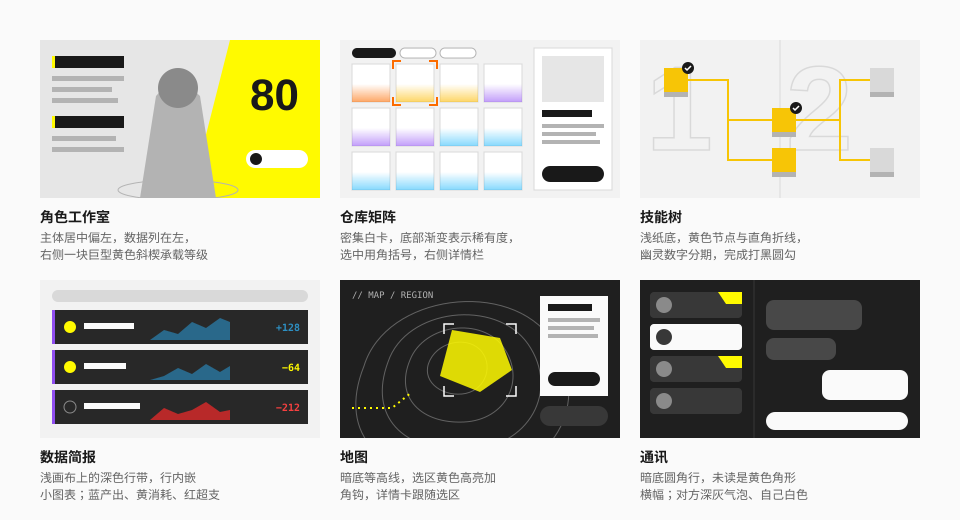
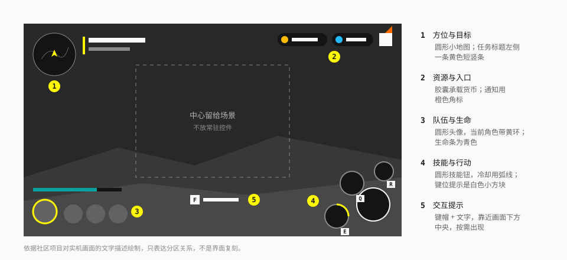

# 游戏界面

游戏客户端内的界面。

> **证据等级：社区。** 本仓库没有实机截图，也没有对客户端做任何测量。本页的内容来自开源项目 [Statrue/endfield-design-skill](https://github.com/Statrue/endfield-design-skill) 对实机画面的文字归纳（该项目的截图同样不公开），以及 [VBeatDead/ReEnd-Components](https://github.com/VBeatDead/ReEnd-Components) 的组件实践。请把它当作"有依据的二手描述"：方向可信，细节待校。校正方法见 [official-sources.md](../references/official-sources.md)。

## 和官网的区别

| | 官网 | 游戏界面 |
| --- | --- | --- |
| 任务 | 展示、吸引 | 操作、查找、比较 |
| 密度 | 低 | 高 |
| 基底 | 白为主 | 亮暗并存，按界面功能选 |
| 强调色 | 一种黄 | 黄 + 橙、蓝、青、红、绿、紫，各有分工 |
| 形状 | 直角为主 | 切角、斜楔、圆弧、胶囊按语义混用 |
| 选中 | 填充反转、边条 | 另有角括号、白色反转、选中环 |
| 输入 | 鼠标、触屏 | 另有键盘与手柄，带键位提示 |

共同的底层逻辑没有变：中性基底、颜色有角色、主角偏心、信息靠边、形状有含义。

## 界面家族

游戏界面不是一个模板套到底。按"用户在做什么"分成几类，每类有自己的结构。**先选家族，再选母题。**

选家族时问四件事：

1. 用户是在行动、查找、比较、阅读，还是被画面吸引？
2. 主角是空间、人物、物品矩阵、流程关系、对话，还是数据？
3. 信息需要持续操作，还是一次性阅读？
4. 主题来自系统功能，还是某个角色、地区或活动？

### A. 运行界面与系统枢纽

实时状态、战斗、导航、主菜单。

- **主角**：场景本身。
- **结构**：中心留空；生命、技能、任务、交互分成四组停靠四角。主菜单是"径向枢纽"：中央圆形地图，功能磁贴沿弧线排在两侧，顶部是胶囊货币，底部是黄色楔形的行动区。
- **形状**：圆形技能钮带冷却弧，短角钩，细状态条，少量斜翼行动块。
- **颜色**：图标以中性白为基础；黄用于目标与选中；通知是橙色菱形；生命条是青色。
- **特有元素**：键位提示（白色小方块）、黄色点状的导航路径。
- **避免**：把所有控件做成同尺寸的黑黄磁贴；用装饰线遮挡场景；为了"科幻感"加无意义读数。

### B. 地图与区域

空间探索、区域状态、路线、任务点。

- **主角**：地图区域、路线或当前选区。
- **结构**：全幅地形画布 + 边缘的区域导航 + 跟随选区的详情卡。
- **形状**：等高线、轮廓填充、范围圆、节点、路径、角钩框。
- **颜色**：未选区域保持灰阶；高亮集中在当前路径和选区。未探索区用斜纹填充。
- **地区主题**：一个地区可以有整套主题色（例如一个地区青蓝、另一个青柠），接管该地区的全部管理页面，结构不变。
- **特有元素**：`//` 面包屑；右下角的地区切换胶囊。
- **避免**：普通仪表盘网格；所有区域同时高亮；装饰性的地图标记和真实任务点混淆。

### C. 角色与装备

干员、武器、装备、属性、养成。

- **主角**：人物、装备模型，或关键的等级数字。
- **结构**：主体占最大空间，属性与导航停靠侧边。养成类页面可以让一块**巨型黄色斜楔或扇面**成为整页的组织结构——等级、装备槽、技能条沿斜轴排布。
- **背景**：浅灰的"摄影棚"，带透视网格、站位刻度圈、幽灵大数字。
- **形状**：头像与技能是圆；属性板、标签、行动区是直角或斜楔。主行动是**白色胶囊 + 圆形图标章**，次行动是深色胶囊。
- **颜色**：系统黄标记当前选择；角色主题色可以接管局部背景。技能与增益文字用行内语义着色。
- **数据列**：分组标题是深色横带，左端一条黄色短竖条。
- **避免**：每项属性一张独立卡；人物被界面切碎；把巨型黄色斜楔当作每个详情页的标配。

### D. 仓库、商城与矩阵

大量物品、分类、筛选、比较。

- **主角**：矩阵本身是工作区；焦点是当前物品。
- **结构**：稳定的密集网格 + 清晰的筛选与资源条 + 局部详情栏。
- **物品卡**：白卡；稀有度用**底部向上消散的渐变**或底边条，色阶蓝 → 紫 → 金 → 橙；最高档在渐变上叠细斜纹。
- **选中**：角括号（橙色）或白描边。
- **未获得**：图鉴格用准星占位符；列表卡在左下角放锁图标，卡面不变灰。
- **徽章**：各司其职——绿 = 充裕的倒计时，红 = 紧迫，橙 = 折扣，深色 = 限购，压黑 = 售罄。
- **筛选**：横向胶囊，选中反转为黑。
- **避免**：为了风格破坏扫描效率；每张卡都带大型装饰；把稀有度色当纯装饰。

### E. 技能树与流程

科技树、生产关系、设施链路。

- **主角**：路径、当前节点、阶段门槛。
- **结构**：让连线和依赖关系支配版式，侧栏只负责解释和操作。
- **官方范式**：浅纸底 + 黄色图标板节点（带灰色底座）+ 黄色直角折线；阶段用幽灵大数字分区；类目列用细竖线分隔；完成的节点打黑色圆勾。
- **状态**：高亮色沿可达路径流动；锁定、完成、缺资源各有独立表达。
- **避免**：把流程塞进卡片列表；装饰线和真实连接线用同样的强度。

### F. 数据简报与监控

产耗统计、排行、监控列表。

- **主角**：主结论或异常项，不是图表装饰。
- **官方范式**：浅色画布 + **深色数据行带**，每行内嵌一个小型面积图；行左是收藏星与名称，行右是当前值与理论值。
- **列头**：灰色胶囊带，用竖线分隔。
- **颜色**：数字语义固定——蓝 = 产出，黄 = 消耗与进度，红 = 超支。类目用左缘色条。
- **避免**：套通用后台模板；每个指标一张等大卡片；用彩虹图例代替语义色。

### G. 通讯与信息工具

对话、百科、任务、邮件。

- **主角**：当前人物、主题或文档标题。
- **结构**：清晰的阅读列 + 列表 / 索引。
- **对话**：暗底；会话列表是深色圆角行，未读用**黄色角形横幅**；气泡是圆角矩形，对方深灰、自己白色。
- **任务**：优先级用图标语义（黄色 `!!!` = 紧要，白色 `!` = 次要）；选中行白色反转；正文关键词黄色强调；左缘类型色条。完成的任务变成深底 + 黄色庆祝区 + 巨型描边词。
- **百科**：极简浅底；蓝图网格上的图纸式图标 + 幽灵编号；选中项展开成整条黑色竖带。
- **进度**：任务、经验、通行证的进度条都是**灰轨 + 黄填充**；增益用荧光绿的小标签（`+6%`）。
- **避免**：为了"风格"牺牲行长、对比度和阅读节奏；强行给段落切角。

### 其他

- **活动与主视觉**：角色或活动的主题色整页接管；系统外壳保持中性；抽取类的"×1 / ×10"是一白一黄的按钮对，带巨型描边数字。
- **官网**：见 [官网](website.md)。
- **编辑物料**：见 [宣传物料](promotional.md)。

## 颜色角色

游戏界面里，黄色之外的颜色各有固定职责。完整的表与取值在 [色彩](../foundations/color.md)，这里只列判断规则：

| 想表达 | 用 |
| --- | --- |
| 可以点、已选中、有新内容 | 黄 |
| 完成了多少（进度） | 黄填充 + 灰轨 |
| 提醒你看、还剩多久、有多少 | 橙 |
| 涨了多少（增益） | 荧光黄绿 |
| 数量有多少（图表） | 蓝 |
| 这是哪个地区 / 机构 | 青（或该地区的主题色） |
| 危险、超支 | 红 |
| 确认、充裕 | 绿 |
| 特殊、战术 | 紫 |
| 有多稀有 | 蓝 → 紫 → 金 → 橙 |

容易混的两组：

- **进度 vs 量值**：进度条归黄，图表归蓝。
- **橙 vs 红**：橙是"注意"，红是"危险"。倒计时充裕时是绿，紧迫时才红。

## 形状语义

| 语义 | 形状 | 可选强调 |
| --- | --- | --- |
| 主行动（工具面） | 白色胶囊 + 圆形图标章 | — |
| 次行动 | 深色胶囊或深色小块 | 图标章 |
| 强调行动对 | 白条 + 黄条并列 | 巨型描边数字 |
| 导航、权限、机械面板 | 直角、切角、斜楔 | 黄或主题色实底、角钩 |
| 技能、头像、仪表、范围 | 圆、环、弧 | 冷却弧、选中环、刻度 |
| 对话、筛选、资源、短状态 | 圆角矩形、胶囊 | 轻底色、状态点 |
| 物品、属性、文档、任务 | 矩形或轻切角面板 | 稀有度渐变、标题轨 |
| 地图区域、工业路径 | 自由轮廓、节点、连线 | 局部填充、路径流向 |

注意这里的主行动是**白色胶囊**，不是黄色切角按钮——和很多人的印象相反。

## 系统外壳

跨界面复用的小部件：

| 部件 | 做法 |
| --- | --- |
| 面包屑 | `// 模块 / 子页`，左上角 |
| 分组标题 | 左侧短竖条（黄或主题色）+ 标签；或深色横带 |
| 通知 | 橙色菱形 / 方块角标 |
| 未读 | 黄色角形横幅 |
| 倒计时 | 胶囊，绿 = 充裕、红 = 紧迫 |
| 货币与资源 | 顶部胶囊，圆形图标 + 等宽数字 |
| 键位提示 | 白色小方块键帽，独立成层 |
| 系统页脚 | 延迟、版本、UID 等真实运行信息，角落小字 |

## 状态

| 状态 | 表达 |
| --- | --- |
| 选中 | 角括号、边条、白色反转、选中环、位置变化——至少一种，按组件选 |
| 禁用 | 降低强调但保持可读 |
| 锁定 / 未获得 | 锁图标或准星占位符；不靠整体变灰 |
| 完成 | 明暗反转：深底 + 黄色区 + 描边大词 + 领取章；同列表的未完成项降为浅灰 |
| 新内容 | 黄色 `NEW` 小签 |
| 加载 | 保持布局稳定，不伪造数据 |
| 空 | 解释为什么为空、下一步做什么 |

## 用组件库做游戏风格的界面

1. 切到暗色主题（`data-theme="dark"`），或保持亮色——取决于界面家族，不是"游戏就得暗"。
2. 如果想贴近游戏内的黄，把 `--ef-action` 覆盖为 `#FCEA00`。
3. 启用角色色：`bg-notice`、`bg-gain`、`bg-data`、`bg-rarity-*`。
4. 按上面的形状语义选择控件形态：行动用胶囊或切角，筛选用胶囊，物品用直角卡。
5. 选中态换成角括号或白色反转。
6. 先确定家族的宏观结构（斜楔、径向、矩阵、行带），再往里填组件。

## 验收

1. 五秒内能看出主要任务和当前选中项吗？
2. 去掉黄色之后，结构和交互还成立吗？
3. 形状是在表达语义，还是所有组件共用一个外形？
4. 能指出这个界面属于哪个家族吗？
5. 颜色遵守了角色分工吗？有没有把红当装饰、把橙当错误？
6. 键盘、触屏、长文案、加载和错误状态可用吗？

## 待校正

以下内容在获得实机观察后应当复核，并把等级从"社区"改为"观察"：

- 各角色色的准确取值（现用值是社区的像素取色）；
- 游戏内系统黄与官网黄的差异；
- 切角的常见尺寸与位置；
- 游戏内使用的字体；
- 各家族的典型布局比例。

## 来源

- 界面家族、颜色角色、形状语义、状态表达：[Statrue/endfield-design-skill](https://github.com/Statrue/endfield-design-skill)（MIT）。本页是用自己的话做的归纳，结构上参考了它的家族划分。
- 组件层面的实践：[VBeatDead/ReEnd-Components](https://github.com/VBeatDead/ReEnd-Components)。
