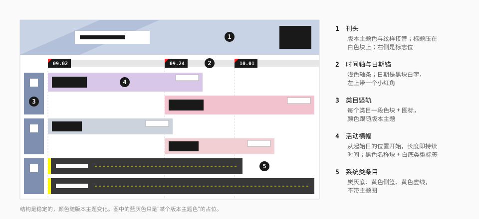

# 宣传物料

主视觉、版本日历、前瞻长图、干员档案、公告、周边目录等对外发布的静态物料。

> **证据等级：观察 + 社区。** 版本日历与首页主视觉是在官网直接看到的（观察）；其余体裁的描述来自 [Statrue/endfield-design-skill](https://github.com/Statrue/endfield-design-skill) 对官方社区账号物料的归纳（社区）。原图请到 [官方渠道](../references/official-sources.md) 查看，本仓库不转存。

## 和界面的区别

宣传物料是**最自由**的一类载体。

| | 界面 | 宣传物料 |
| --- | --- | --- |
| 强调色 | 系统黄 | 版本、角色、地区的主题色可以整页接管 |
| 字体 | 系统字体 | 标题可以用毛笔、手写、符文、故障等展示字 |
| 装饰 | 一到两种纹理 | 可以更密，按章节分配 |
| "人的痕迹" | 没有 | 手写批注、荧光笔、印章、胶带、贴纸 |
| 结构 | 跟着任务走 | 跟着**体裁**走 |

不变的是骨架：中性的信息平面、清晰的层级、有含义的形状、克制的系统外壳。主题怎么换，日期块、类型标签、章节头这些"公文部件"的样子基本不变。

## 主题接管

理解宣传物料的关键：**结构保留，皮肤替换。**

官网的版本日历是最清楚的例子（观察 + 社区）。某一期用红、黑、白与墨刷；下一期换成冰蓝渐变与淡色纹样。两期共同保留的是时间轴、日期锚、类目竖轨、错落的横幅。

主题通常来自：

| 来源 | 例子 |
| --- | --- |
| 版本的主地区 | 雪山地区的版本用冰蓝与青 |
| 角色 | 某个角色的档案用她的代表色 |
| 活动 | 运动主题用跑道弧线与速度斜纹 |
| 栏目 | 某个期刊系列有固定的刊头与吉祥物 |

接管时换掉的不只是颜色，还有展示字体、纹理和图形节奏。但**危险仍是红、成功仍是绿**这类语义不能丢。

主题专属的东西不要带到别处。某个活动的品红、某张主视觉的微缩模型、某个版本的符文字——离开那个主题就不该出现。

## 主视觉

官网首屏与活动头图。社区归纳了四种图像模式：

| 模式 | 特征 |
| --- | --- |
| 整幅绘画 | 角色与场景的完整插画，版本标题用专属艺术字 |
| 微缩模型 | 场景做成微缩景观，带测绘线、准星、尺寸标 |
| 照片拼贴 | 拍立得、打印品、证卡叠放 |
| 扁平宣传画 | 大色块与几何图形 |

共同点：

- 标题不居中，放在画面一侧。
- 系统外壳（导航、按钮、标志）保持中性，不染上主题色。
- 画面上的技术叠层很少。场景本身足够时，不强加界面框和读数。

## 版本日历

一张表达"什么时候有什么"的时间轨图。

| 部件 | 做法 | 来源 |
| --- | --- | --- |
| 刊头 | 版本主题色与纹样；标题压在白色块上；右侧标志位 | 观察 |
| 时间轴 | 浅色轴条横贯；日期锚是**黑块白字**，左上带一个小红角 | 观察 |
| 类目竖轨 | 左侧，每个类目一段色块 + 图标 + 竖排小字 | 观察 |
| 活动横幅 | 从起始日的位置开始，长度即持续时间；自带主题图 | 观察 |
| 名称与类型 | 横幅上是黑色名称块 + 白底类型小标签 | 观察 |
| 系统类条目 | 炭灰底 + 黄色侧签 + 黄色虚线，不带主题图 | 观察 |
| 空档 | 没有活动的时段用淡色斜纹填充 | 社区 |

要点：

- **位置就是信息。** 横幅的左端对齐起始日，不需要再写"开始于"。
- 每条横幅保留自己的识别色，但名称块、类型标签、日期锚的样式全表统一。
- 多条并行时按类目分轨，不要挤在一条轨上。

做时间相关的组件（时间线、甘特、排期）时，这是首选的参照。

## 编辑体裁

官方的长图物料有相当稳定的体裁。选对体裁比选对颜色重要。以下均为社区归纳。

| 体裁 | 结构特征 |
| --- | --- |
| **人物备忘 / 档案** | 身份信息做成表格式的标签块；`//` 章节头；访谈问答带；留言板；红圈批注；`START` / `END` 标记；角色主题色的肖像区 |
| **版本前瞻** | 白底；章节板；横幅样机；荧光笔划重点；继承关系图。或全幅截图卷轴配 `‹‹ ››` 标题带 |
| **活动串烧** | 每个活动保留识别色，日期标签全篇统一；签到是 `01` – `07` 的日签卡行；通行证是梯度奖励卡行 |
| **更新说明** | `NEW` 小签 + 物品卡行 + 证据截图 |
| **系统优化说明** | 类目色签 + 截图上的数字圆圈标注 + 说明条 |
| **通告** | 黄黑白；标签行；大号日期；Q 方块引导的问答；荧光笔；价格卡 |
| **工业说明图** | 编号章节带（`001` – `005`）；截图证据；红笔手写批注；黄色荧光笔 |
| **威胁 / 敌人档案** | 水墨 + 红黑白；竖排大字；印章与红胶带；标本卡矩阵；`WARNING` 红带 |
| **武器档案** | 主题色接管；竖排刊头；规格铭牌；效果条；【】「」引用 |
| **商品目录** | 标题与价格位固定；商品大图；包装与本体对照；圆形局部特写；编号配件说明 |
| **主持问答** | 嘉宾头像 + 问题条 + 回答；细框与顶栏分隔每组问答 |
| **期刊** | 固定刊头、`VOL` 编号、吉祥物主持、贴纸印章、落款 |
| **参与招募** | 更活泼：Q 版群像、描边大字、贴纸与彩屑；步骤用黑色章头 + 黄色重点 |
| **连载漫画** | 封面有话数胶囊与系列字；内页是手绘分镜，技术副层不进入画格 |

### 跨体裁复用的"公文部件"

| 部件 | 样子 |
| --- | --- |
| 日期块 | 黑底白字，等宽数字 |
| 类型标签 | 白底细边的小矩形 |
| 章节头 | 黑色横带，或编号 + `//` + 标题 |
| `NEW` 签 | 黄底墨字的小块 |
| 引用 | 【】「」，或左侧一条竖线 |
| 截图标注 | 数字圆圈 + 引线 |
| 问答 | `Q` 方块开头 |

这些部件和界面里的 [标签](../components/data-display.md)、[分节标题](../elements/section-title.md) 是同一套语言，可以直接用组件库实现。

## 人的痕迹

让版面像"一份被人读过、批过的文件"：

| 痕迹 | 用途 |
| --- | --- |
| 黄色荧光笔 | 划出真正要强调的一两句 |
| 红笔圈注、手写旁批 | 指向截图上的具体位置；补一句口语化的说明 |
| 印章 | 档案、认证、完成 |
| 胶带、回形针 | 把"照片""卡片"固定在版面上 |
| 贴纸 | 活泼的栏目与参与类活动 |
| 拍立得、证卡、打印品 | 把内容做成实物 |

规则：

- **只用在叙事性的静态物料上。** 不进入功能界面，不进入组件库。
- **只标真正重要的。** 满篇荧光笔等于没有重点。
- **手写内容要可读且准确。** 它是正文的一部分，不是花纹。
- 实物道具属于它所在的主题，不自动成为整张图的风格。

## 纹理与图形

宣传物料可以使用更多的纹理，但仍然要有主次：

| 纹理 | 语气 |
| --- | --- |
| 半调网点、注册标 | 印刷、档案 |
| 斜纹 | 机械、警示 |
| 墨刷、水墨 | 叙事、地域 |
| 故障细条、像素抖动 | 高能活动、数字通讯 |
| 红青双色错位 | 战斗、竞技 |
| 等高线、测绘线 | 地理、探索 |

一张长图按章节分配纹理，不要让所有纹理同时出现在每一屏。

## 排印

- **刊头可以张扬。** 高反差的黑体、毛笔字、压扁或拉宽的展示字、符文字，只要主题支持。
- **正文保持克制。** 刊头之下回到清晰的黑体，行长与行距按阅读来定。
- **数字做大。** 日期、编号、价格、倒计时常常是版面上最大的字。
- **竖排**用于章节侧签、档案刊头、东方主题。
- **微文字**仍然要写真话，见 [镂空字与微文字](../elements/ghost-and-micro-text.md)。

## 做一张物料

1. **定体裁。** 这是日历、档案、说明、通告，还是目录？体裁决定结构。
2. **定主题锚。** 默认系统黄，或者内容自带的角色 / 地区 / 活动色。只有一个主导色。
3. **搭骨架。** 刊头、章节、时间或类目的轴线。先不上装饰。
4. **放公文部件。** 日期块、类型标签、章节头——用统一的样式。
5. **分配纹理。** 每章一到两种。
6. **最后加痕迹。** 荧光笔、批注，只标最重要的几处。
7. **检查。** 阅读顺序、最小字号、导出尺寸；所有日期、数字、名称是真实的或明确标注为占位。

## 边界

- **不要伪造官方物料。** 不要做会被误认为官方公告、官方活动、官方周边的图。
- 不使用官方标志、立绘、截图与专有字体，除非你确有权利。
- 同人与二创内容请注明"非官方"，并遵守鹰角网络的相关政策。详见 [NOTICE](../../../NOTICE.md)。

## 宜 / 忌

**宜**

- 让位置和长度表达时间关系。
- 全篇统一日期块、类型标签这类部件的样式。
- 主题色只接管刊头与重点区域，正文区保持中性。
- 用真实内容排版；占位内容明确标出。

**忌**

- 把所有体裁都做成同一个"黑黄长图"模板。
- 借用不相关主题的专属元素。
- 编造数据、奖励、日期、合作方。
- 在功能界面里使用荧光笔、贴纸、胶带。
- 让装饰压过正文的可读性。

## 来源

- 版本日历：官网 [版本日历版块](https://endfield.hypergryph.com/#calendar)（观察，2026-10-08）。
- 体裁目录、主题接管、人的痕迹：[Statrue/endfield-design-skill](https://github.com/Statrue/endfield-design-skill)。
- 世界观内公文版式的另一个参照：[Naptie/endfield-docmaker](https://github.com/Naptie/endfield-docmaker)。
